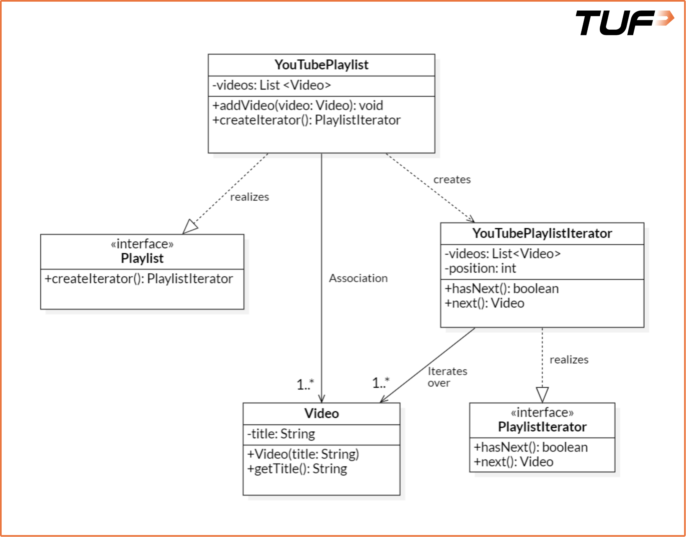
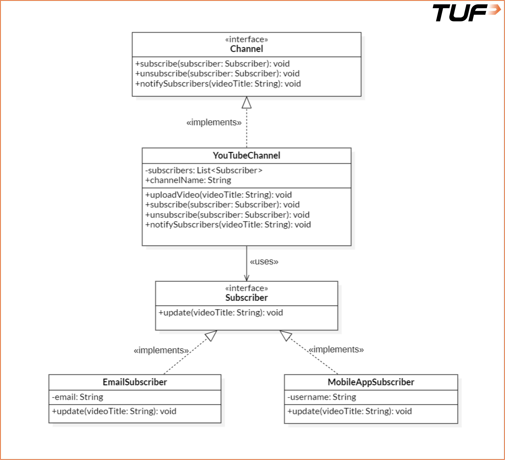
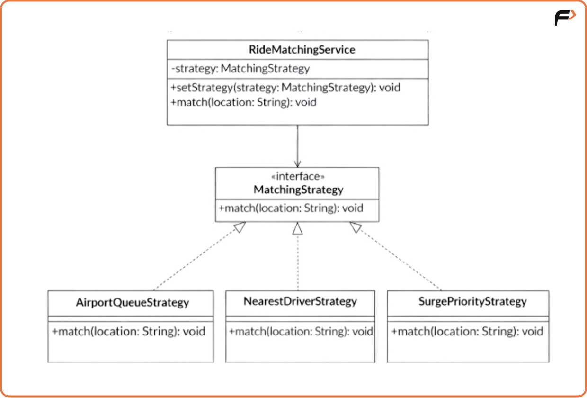
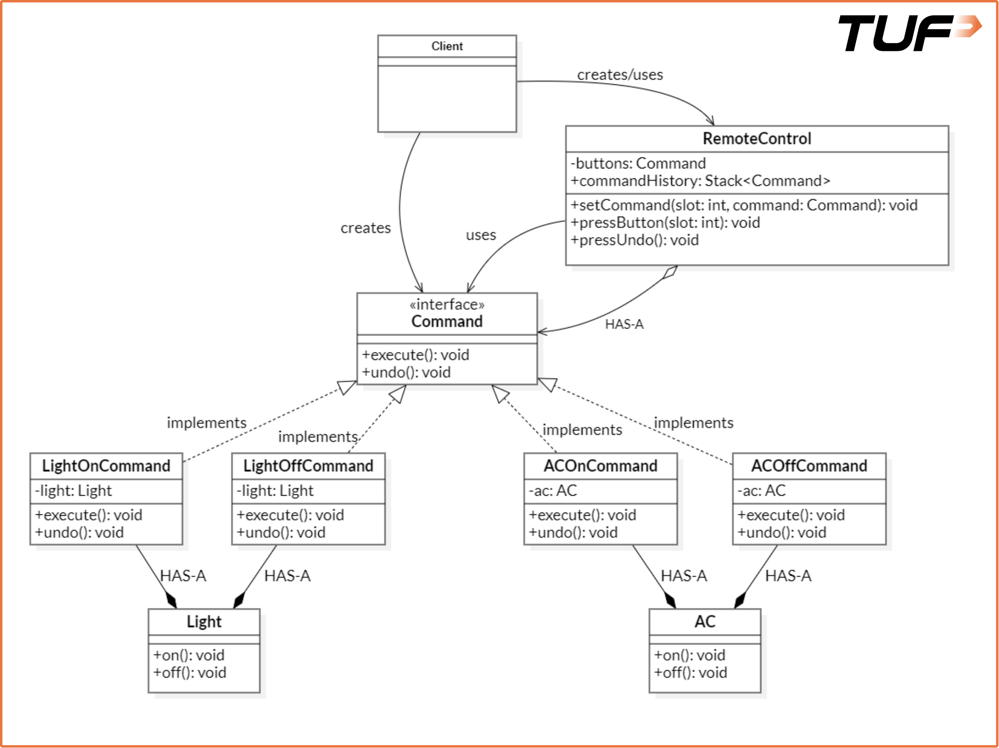
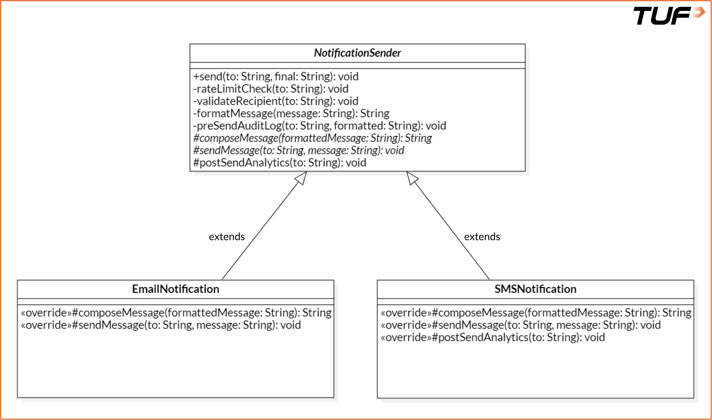
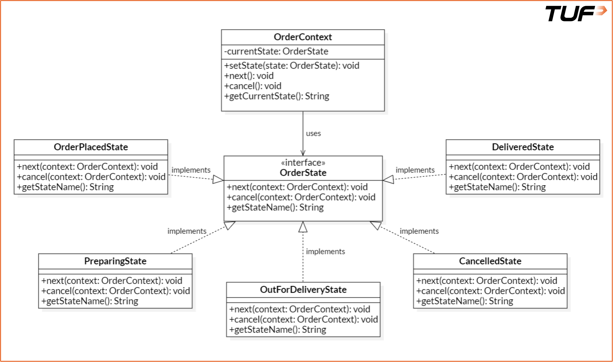
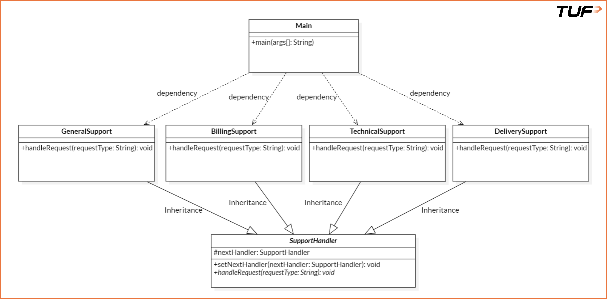
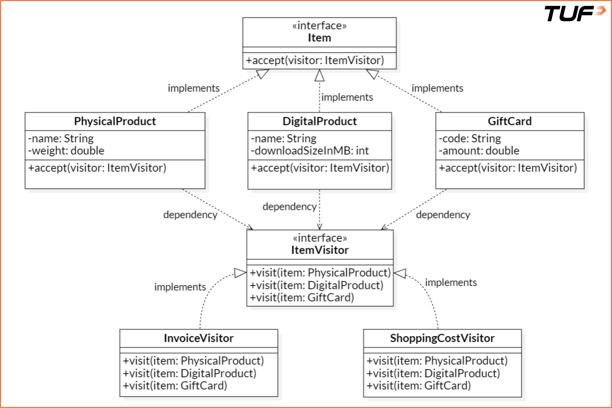
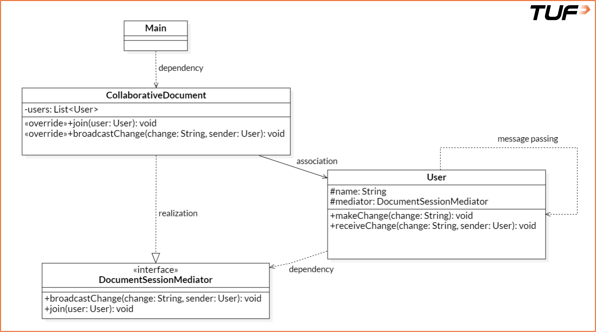
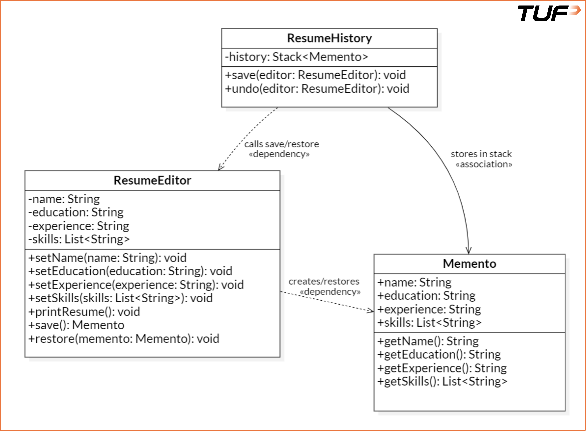

# Low-Level Design (LLD) Notes

---

## * Introduction
**What is LLD?**
* **LLD = Low-Level Design**
* Focuses on how the code will be implemented.
* Converts High-Level Design (HLD) into actual classes, methods, and logic.
* Acts as a bridge between design and coding.

---

## * Easy Real-Life Example

🏠 **Building a House**
* **HLD:** House blueprint (Rooms, Size, Connections)
* **LLD:** Construction details (Switch locations, Plumbing, Materials, Wiring)

👉 **HLD** = *What to build*  
👉 **LLD** = *How to build it*

---

## * Definition
LLD is the detailed design of individual components of a system.

It defines:
* Classes
* Methods
* Data Structures
* Algorithms
* Internal Logic

...before writing the actual code.

---

## * Example
**Website Login System**

LLD decides:
* `login()`
* `signup()`
* `forgotPassword()`
* Validation
* Error handling
* Database calls
* Password encryption

---

## * Key Characteristics

### 1. Granular (Code-Level)
LLD goes into implementation details. It includes:
* Classes
* Objects
* Methods
* Variables
* Data Structures

*Example:* Instead of saying *"Need User Authentication"*, LLD specifies:
* `User` class
* `LoginService`
* `validatePassword()`
* Error handling flow

### 2. Implementation Focused
LLD is the coding blueprint. It defines:
* Logic
* Workflow
* Function interactions
* Module implementation

May include: Pseudocode, Flowcharts, Sequence Diagrams.

### 3. Uses OOP Principles
LLD heavily uses OOP concepts:
* Encapsulation
* Abstraction
* Inheritance
* Polymorphism

*Benefits:* Reusable code, Modular design, Easy maintenance.

*Example:*
```text
      Notification
           |
  -------------------
  |                 |
Email              SMS
```

---

## * Stakeholders
People involved in implementation:
* Senior Developers
* Software Engineers
* Technical Leads
* Engineering Managers

---

## * HLD vs LLD

| HLD | LLD |
| :--- | :--- |
| System overview | Detailed implementation |
| Architecture | Classes & Methods |
| Modules | Functions & Logic |
| Abstract | Detailed |
| System diagrams | Class diagrams |

---

## * Importance of LLD
* **Avoids Rework:** Finds design issues early, saves development time.
* **Improves Collaboration:** Common reference for developers, easier integration.
* **Better Scalability:** Modular components, easy to extend with new features.
* **Encourages Best Practices:** Clean Code, OOP Principles, Design Patterns, maintainable code.

---
---
---
---

**TOPIC COMPLETED MOVING TO NEXT**

---
---
---
---

## * Software Design Principles
Software design principles are guidelines that help software developers create systems that are easy to understand, maintain, and extend. These principles can be applied at both the high-level and low-level design stages. Here are three cornerstone key software design principles:

### 1. DRY (Don't Repeat Yourself)
### 2. KISS (Keep It Simple, Stupid)
### 3. YAGNI (You Aren't Gonna Need It)

Let's understand each of these design principles in detail.

### 1. DRY: Don't Repeat Yourself
This principle states that every piece of knowledge must have a single, unambiguous, authoritative representation within a system. In simple terms, **avoid duplication of logic or code**. Repeating code makes the system hard to maintain and error-prone. If a change is required, you might forget to update all occurrences.

**Importance:**
* Reduces redundancy
* Easier maintenance
* Single point of change

#### Example: Area Calculation

**Bad Code (Violates DRY):**
The logic for calculating the area is repeated. If we need to change the logic, we have to do it in multiple places.
```java
import java.util.*;
class Main {
    public static void main(String[] args) {
        int length1 = 10, width1 = 5;
        int area1 = length1 * width1;
        System.out.println("Area1: " + area1);

        int length2 = 8, width2 = 4;
        int area2 = length2 * width2;
        System.out.println("Area2: " + area2);
    }
}
```

**Good Code (Follows DRY):**
We have created a single method `calculateArea`. If we need to change the logic, we only need to do it in one place.
```java
import java.util.*;
class AreaCalculator {
    public static int calculateArea(int length, int width) {
        return length * width;
    }
}

class Main {
    public static void main(String[] args) {
        int area1 = AreaCalculator.calculateArea(10, 5);
        int area2 = AreaCalculator.calculateArea(8, 4);

        System.out.println("Area1: " + area1);
        System.out.println("Area2: " + area2);
    }
}
```

**Applying DRY in Practice:**
* Identify repetitive code and replace it with a single, reusable code segment.
* Extract common functionality into methods or utility classes.
* Leverage libraries and frameworks when available.
* Refactor duplicate logic regularly across classes or layers.

**When Not to Use the DRY Principle:**
| Scenario | Reason |
| :--- | :--- |
| **Premature Abstraction** | Don't extract common code too early. It can create unnecessary coupling between unrelated parts. |
| **Performance-Critical Code** | Repeating optimized low-level logic is sometimes faster than calling a generalized, reusable method. |
| **Sacrificing Readability** | If extracting repeated code makes the code less readable, prefer clarity over DRYness. |
| **Legacy Codebases** | Introducing DRY by extracting shared logic can accidentally change behavior if not well-tested. |

### 2. KISS: Keep It Simple, Stupid
This principle states that simplicity should be a key goal in design and unnecessary complexity should be avoided. In simple terms, **use the simplest possible solution that works**. Avoid clever, convoluted code.

**Importance:**
* Easier debugging
* Improved readability
* Better maintainability
* Faster development

#### Example: Checking for Even Numbers

**Bad Code (Too Complex / Overengineered):**
Uses extra variables and unnecessary `if-else` logic. Makes the code longer and harder to follow.
```java
import java.util.*;
public class NumberUtils {
    public static boolean isEven(int number) {
        // Using unnecessary logic to determine evenness
        boolean isEven = false;
        
        if (number % 2 == 0) {
            isEven = true;
        } else {
            isEven = false;
        }
        
        return isEven;
    }
}
```

**Good Code (Simple and Clear):**
Simple, one-liner solution that is easy to read and understand.
```java
import java.util.*;
public class NumberUtils {
    public static boolean isEven(int number) {
        return number % 2 == 0;
    }
}
```

### 3. YAGNI: You Aren't Gonna Need It
This principle states: *"Always implement things when you actually need them, never when you just foresee that you need them."* In simple terms, **don't add functionality until it's necessary**. Avoid building features that you think you might need in the future to keep the codebase clean and reduce unnecessary complexity.

**Example:**
Assume you've been asked to build a note-taking app that allows users to create and view notes. 
* **Violating YAGNI:** Thinking ahead to add categories, tagging, or Google Drive syncing immediately. This creates a lot of unnecessary complexity and wastage of time.

**Importance:**
* Reduced waste
* Simplified codebase
* Faster development

**When NOT to use YAGNI:**
| Scenario | Reason |
| :--- | :--- |
| **Requirements are well-known** | If a feature is guaranteed soon (e.g., adding image support in 2 sprints), preparing the data model now might save significant refactoring later. |
| **Performance-Critical Areas** | Preemptively building and testing real-world usage patterns can catch bottlenecks early. |

---
---
---
---

**TOPIC COMPLETED MOVING TO NEXT**

---
---
---
---

## * SOLID Principles: Single Responsibility Principle (SRP)

### Introduction
There is a set of five principles for writing clean, scalable, maintainable object-oriented code. These principles are known as **SOLID** principles. The **S** in SOLID stands for **Single Responsibility Principle**.

**Definition:**
> A class should have only one reason to change. In other words, a class should only have one job, one responsibility, and one purpose.

If a class takes on more than one responsibility, it becomes coupled. This means that if one responsibility changes, the other responsibilities may also be affected, leading to a ripple effect of changes throughout the codebase.

### Real-life Analogy
Imagine a chef who is responsible for cooking, cleaning, serving food, and ordering groceries. If the chef is busy cleaning, they can't focus on cooking, and the quality of the food may suffer.

Instead, different people should handle each task:
* **Chef:** Cooks the food.
* **Cleaner:** Cleans.
* **Waiter:** Serves the food.
* **Manager:** Orders groceries.

This way, each person can focus on their specific responsibility, leading to better results overall.

### Significance of SRP

Let us understand this with the example of a **TUF+ compiler**. 

**Violating SRP:**
Currently, a single `TUFplusCompiler` class does all of the following things:
1. Adds driver code
2. Performs syntax check
3. Runs code with already fed test cases
4. Stores the output in Database
5. Returns the necessary output to the user

Implementing all these functionalities in a single class violates the Single Responsibility Principle.

**Following SRP:**
Instead, we can break it down into smaller classes, each with a single responsibility. We can also add a `Coordinator` class to manage them.

| Class | Responsibility |
| :--- | :--- |
| `DriverCodeGenerator` | Responsible for adding driver code. |
| `SyntaxChecker` | Responsible for performing syntax checks. |
| `TestRunner` | Responsible for running code with test cases. |
| `DatabaseManager` | Responsible for storing output in the database. |
| `UserOutputHandler` | Responsible for returning output to the user. |
| `Coordinator` | Coordinates between all these classes/modules. |

By following SRP, we make the code more modular, easier to maintain, and less prone to bugs. Each class can be modified or replaced independently.

### Advantages of SRP
* **Improved Maintainability:** Changes in one part won't affect other parts.
* **Enhanced Readability:** Smaller, focused classes are easier to read and understand.
* **Better Reusability:** Single-responsibility classes can be reused in different contexts without unnecessary dependencies.
* **Facilitates Testing:** Smaller classes have fewer dependencies and are easier to test.
* **Lower Risk in Changes:** Changes are less likely to cause unintended side effects.

### Common Mistakes When Violating SRP

| Mistake | Consequence |
| :--- | :--- |
| **Mixing Database Logic with Business Logic** | Putting data access (e.g., SQL) and core business rules in the same class makes it hard to change the database layer without affecting business logic. |
| **Coupling UI Code with Business Logic** | Embedding application logic directly in the UI layer makes it tedious to change the UI without affecting the underlying logic. |

> [!NOTE]
> **Is SRP just for classes?**
> No. SRP can be applied to methods, modules, microservices, and even entire systems. The key is to ensure that each component has a single responsibility. It's a mindset you can apply from the smallest method to the largest system design.

---

## * SOLID Principles: Open/Closed Principle (OCP)

### Introduction
There is a set of five principles for writing clean, scalable, maintainable object-oriented code. These principles are known as **SOLID** principles. The **O** in SOLID stands for **Open/Closed Principle**.

**Definition:**
> As per OCP, Software entities (classes, modules, functions, etc.) should be open for extension, but closed for modification.

This means that the behavior of a module can be extended without modifying its source code. The goal is to reduce the risk of breaking existing functionality when requirements change.

### Real-life Analogy
Let's understand the application of OCP in real-life with the help of power adapters. Imagine you travel from India to the UK. Your Indian charger doesn't fit into UK power sockets. Instead of buying a new charger, you use a travel adapter.
* The adapter extends your existing charger's usability (now works in UK).
* You did not modify the charger itself.

Similarly, in code, OCP encourages adding new functionality via extension, rather than altering existing, stable code.

### Real-World Example
Let's now use region-based tax calculation (e.g., India, US, UK) in an Invoicing System to explain the Open/Closed Principle. As an invoicing system grows, it must handle tax rules for different regions (the values might not be accurate):
* India: GST 18%
* US: Sales Tax 8%
* UK: VAT 12%

New regions maybe added over time.

#### Bad Design (Violating OCP)
```java
class InvoiceProcessor {
    public double calculateTotal(String region, double amount) {
        if (region.equalsIgnoreCase("India")) {
            return amount + amount * 0.18;
        } else if (region.equalsIgnoreCase("US")) {
            return amount + amount * 0.08;
        } else if (region.equalsIgnoreCase("UK")) {
            return amount + amount * 0.12;
        } else {
            return amount; // No tax for unknown region
        }
    }
}
```
The above code is considered a bad practice because:
* Adding a new region (e.g., Germany) requires modifying this method.
* You risk breaking existing logic while adding new functionality.
* Hard to test, maintain, or scale.
* Violates the Open/Closed Principle.

#### Good Design (Follows OCP)
```java
// Tax strategy Interface
interface TaxCalculator {
    double calculateTax(double amount);
}

// Implementing Region-Specific Tax Calculators
class IndiaTaxCalculator implements TaxCalculator {
    public double calculateTax(double amount) {
        return amount * 0.18; // GST
    }
}
class USTaxCalculator implements TaxCalculator {
    public double calculateTax(double amount) {
        return amount * 0.08; // Sales Tax
    }
}
class UKTaxCalculator implements TaxCalculator {
    public double calculateTax(double amount) {
        return amount * 0.12; // VAT
    }
}

// Using Dependency Injection
class Invoice {
    private double amount;
    private TaxCalculator taxCalculator;

    public Invoice(double amount, TaxCalculator taxCalculator) {
        this.amount = amount;
        this.taxCalculator = taxCalculator;
    }

    public double getTotalAmount() {
        return amount + taxCalculator.calculateTax(amount);
    }
}

// Main class
class Main {
    public static void main(String[] args) {
        double amount = 1000.0;

        Invoice indiaInvoice = new Invoice(amount, new IndiaTaxCalculator());
        System.out.println("Total (India): ₹" + indiaInvoice.getTotalAmount());

        Invoice usInvoice = new Invoice(amount, new USTaxCalculator());
        System.out.println("Total (US): $" + usInvoice.getTotalAmount());

        Invoice ukInvoice = new Invoice(amount, new UKTaxCalculator());
        System.out.println("Total (UK): £" + ukInvoice.getTotalAmount());
    }
}
```
**Explanation:**
* **Define a Tax Strategy Interface:** The `TaxCalculator` interface defines a contract for all region-specific tax classes to follow, enabling polymorphism and extension.
* **Implement Region-Specific Tax Calculators:** The `IndiaTaxCalculator`, `USTaxCalculator`, and `UKTaxCalculator` classes provide concrete implementations of the `TaxCalculator` interface for each region, encapsulating tax logic.
* **Using Dependency Injection:** The `Invoice` class is decoupled from specific tax types by receiving a `TaxCalculator` from the outside (this is called Dependency Injection).
* **Main Running Code:** In the main function, we create the appropriate tax calculator and inject it into the `Invoice` class, making the system easily extensible for new regions.

Assume that now, we want to support Germany with 15% tax. In such a case, a simple code snippet can be introduced in the file:
```java
class GermanyTaxCalculator implements TaxCalculator {
    public double calculateTax(double amount) {
        return amount * 0.15;
    }
}
```
...and just pass `new GermanyTaxCalculator()` to `Invoice`. No modification to `Invoice` or main logic is needed.

### When to Apply OCP?
The Open/Closed Principle is especially useful in the following scenarios:
* When a module is expected to change or evolve due to shifting business or technical requirements.
* When there is a need to extend functionality without modifying existing, tested code.
* When developing frameworks, plugins, or extensible systems such as billing engines, tax calculators, or UI components.
* When aiming to safeguard stable, production-ready modules from regression caused by direct changes.
* When a class is becoming a God Class - handling too many responsibilities or branching logic - which signals a need to extract behaviors into separate, extendable components.

That said, applying the principle preemptively without clear extension needs can introduce unnecessary abstraction and complexity. It is generally most effective when applied in response to observed patterns of change or a well-understood need for scalability.

### Common Misconceptions about OCP
There are a few misconceptions that revolve around OCP:

| Misconception | Reality |
| :--- | :--- |
| **“Open/Closed means code should never be changed again.”** | This interpretation overlooks the intent of OCP. The principle emphasizes avoiding changes to core logic while allowing behavior to be extended safely. |
| **“OCP leads to too many classes, so it's overkill.”** | It's true that applying OCP often results in more classes or interfaces. However, this trade-off typically improves modularity, testability, and maintainability. |
| **“OCP makes the code harder to read.”** | In systems with complex behavior or frequent changes, well-structured extensibility actually improves clarity by separating concerns and reducing conditional logic. |
| **“OCP should always be applied upfront.”** | Applying OCP preemptively can result in unnecessary abstraction. It is often more effective when used in response to emerging patterns of change. |
| **“Refactoring contradicts OCP.”** | Refactoring is frequently a step toward making code compliant with OCP by improving its structure and extensibility. |
| **“OCP makes retesting legacy code unnecessary.”** | New extensions still require thorough testing to ensure correctness and integration. |

---

## * SOLID Principles: Liskov Substitution Principle (LSP)

### Introduction
There is a set of five principles for writing clean, scalable, maintainable object-oriented code. These principles are known as **SOLID** principles. The **L** in SOLID stands for **Liskov Substitution Principle**.

**Definition:**
> If `S` is a subtype of `T`, then objects of type `T` may be replaced with objects of type `S` without altering the correctness of the program.

This means that any subclass should be substitutable for its parent class without breaking the functionality.

Think of it like this:
If you write code using a parent class (say `Shape`), and later swap in a child class (like `Circle`), the code should still work without errors or unexpected behavior. If the subclass changes behavior in a way that breaks expectations, it violates LSP.

### Real-life Analogy
Imagine you run a pet hotel, and you have a general policy: *"Any pet staying here must be able to be fed, walked, and groomed."*
You design your hotel to handle pets, and you've had dogs, cats, and rabbits as guests, and things work fine.

**Problem:**
Assume someone brings in a pet snake. Here are the issues:
* You try to walk it. Can't.
* You try to groom it. Doesn't make sense.
* You offer pet food. Snake needs live mice.

Suddenly, your normal pet hotel process breaks. Your system expected all pets to behave like dogs or cats, but this snake breaks the assumptions. This creates an LSP Violation.

**A Valid Substitution:**
If instead someone brings in a pet hamster - it still eats food, needs care, and maybe doesn't walk outside, but it still fits within the expected “pet” behavior. You just make a minor adjustment (like putting it in a wheel instead of walking it). Still fine - no big surprises.

**Understanding:**
The pet hotel needs to trust that any "pet" will behave in expected ways. If a new pet completely changes the rules, the whole system becomes fragile.
That's exactly what the Liskov Substitution Principle protects us from in software - making sure substituting one thing for another doesn't break the expected behavior.

### Example: LSP Violation
Let's illustrate this with the classic Rectangle-Square example, which is a famous LSP violation case.

```java
// Rectangle class
class Rectangle {
    int width, height;

    void setWidth(int w) { width = w; }
    void setHeight(int h) { height = h; }
    int getArea() { return width * height; }
}

// Square class extending the Rectangle class
class Square extends Rectangle {
    @Override 
    void setWidth(int w) {
        width = w;
        height = w; // makes it a square
    }

    @Override
    void setHeight(int h) {
        height = h;
        width = h; // makes it a square
    }
}

// Main class
class Main {
    public static void main(String args[]) {
        // Replacing object of Rectangle class with Square class
        Rectangle r = new Square();
        
        // Method call to print the area of the rectangle
        printArea(r);
    }
    
    private static void printArea(Rectangle r) {
        r.setWidth(5);
        r.setHeight(10);
        System.out.println(r.getArea()); // Expected: 50 but Actual: 100
    }
}
```

In the above code:
* `Square` class is a subclass of `Rectangle` class.
* The `printArea()` function takes a `Rectangle` object as an argument and prints its area.
* To demonstrate the violation of LSP, the object of `Rectangle` class is replaced with the object of `Square` class.

**Violation:**
* **Expected Output:** 50
* **Actual Output:** 100 (since both the width and height became 10)

So, the `Square` violates LSP because it changes the behavior of `setWidth` and `setHeight`, breaking the assumptions of the parent class.

### Need of LSP
Consider the example of a Notification system:
```java
// Notification class
class Notification {
    public void sendNotification() {
        System.out.println("Notification sent");
    }
}

// Main class
class Main {
    public static void main(String args[]) {
        Notification notification = new Notification();
        notification.sendNotification();
    }
}
```
Assume we wish to introduce some new type of notifications, say Email Notification or Text Notification. We can easily extend the system without breaking existing code using LSP.

```java
// Notification class
class Notification {
    public void sendNotification() {
        System.out.println("Notification sent");
    }
}

// Subclass for Email Notification
class EmailNotification extends Notification {
    @Override
    public void sendNotification() {
        System.out.println("Email Notification sent");
    }
}

// Subclass for Text Notification
class TextNotification extends Notification {
    @Override
    public void sendNotification() {
        System.out.println("Text Notification sent");
    }
}

// Main class
class Main {
    public static void main(String args[]) {
        /* Replaced the Notification class object
        with one of its subclass' objects */
        Notification notification = new EmailNotification();
        notification.sendNotification();
    }
}
```
Here, the only change needed for introducing two different types of the notification system is to create two subclasses with an overridden `sendNotification()` method. The main class can remain unchanged. This is the power of LSP.

### Why Does LSP Matter?
When LSP is violated, the code becomes:
* **Unpredictable:** Code relying on base class assumptions will break with certain subclasses.
* **Hard to Maintain:** Adding new subclasses requires rechecking all usages.
* **Bug-Prone:** Runtime errors, wrong outputs, or inconsistent behavior.
* **Less Reusable:** Substituting child objects becomes dangerous.
* **Tight Coupling:** Client code ends up getting tightly coupled to specific types, making it less maintainable.

### How to Spot LSP Violations?
To spot LSP violations, ask yourself these questions:
1. Does the subclass override methods in a way that changes meaning or assumptions?
2. Can I replace the base class with the subclass everywhere without changing expected behavior or breaking correctness?
3. Does the subclass throw unexpected exceptions or return wrong values?
4. Does the subclass weaken any preconditions or strengthen postconditions?

If the answer to any of these questions is "yes", there might be an LSP violation.

### Key Principles to Follow
* Subclasses should honor the contract (expectations) of the parent class.
* Avoid overriding methods in a way that changes behavior drastically.
* Prefer composition over inheritance when possible.
* Think in terms of interfaces and behavioral compatibility.
* Subclass should only extend, not restrict behavior.

---

## * SOLID Principles: Interface Segregation Principle (ISP)

### Introduction
There is a set of five principles for writing clean, scalable, maintainable object-oriented code. These principles are known as **SOLID** principles. The **I** in SOLID stands for **Interface Segregation Principle**.

**Definition:**
> It says: "Don't force a class to depend on methods it does not use."

### Understanding
Suppose you order an Uber. You're just a rider - you only care about booking rides, tracking the driver, and paying. You don't care about picking up passengers, verifying driver's licenses, or managing earnings - that's for drivers!

But what if the app gave you one massive interface with everything - rider features and driver features? It would be confusing, right?

That's exactly what ISP helps prevent in software.

### Uber Example: Applying ISP
Let's say you're designing Uber's app interfaces.

#### Bad Interface Design (Violates ISP):
```java
interface UberUser {
    void bookRide();
    void acceptRide();
    void trackEarnings();
    void ratePassenger();
    void rateDriver();
}
```
Using such an interface would force riders to implement methods they don't need, like `acceptRide()` and `trackEarnings()`. For instance:
```java
class Rider implements UberUser {
    public void bookRide() { /* yes */ }
    public void acceptRide() { /* not needed */ }
    public void trackEarnings() { /* not needed */ }
    public void ratePassenger() { /* not needed */ }
    public void rateDriver() { /* yes */ }
}
```
This is extremely messy. `Rider` is forced to implement stuff it never uses!

#### Good Interface Design (Follows ISP):
A better interface design would separate the concerns:
```java
interface RiderInterface {
    void bookRide();
    void rateDriver();
}

interface DriverInterface {
    void acceptRide();
    void trackEarnings();
    void ratePassenger();
}
```
Now, each class only implements what it actually needs:
```java
class Rider implements RiderInterface {
    public void bookRide() { /* yes */ }
    public void rateDriver() { /* yes */ }
}

class Driver implements DriverInterface {
    public void acceptRide() { /* yes */ }
    public void trackEarnings() { /* yes */ }
    public void ratePassenger() { /* yes */ }
}
```
Now, each class has exactly what it needs - no more, no less. Thus, following the ISP keeps the code clean and easy to maintain.

### Benefits of using ISP
There are several benefits to using the Interface Segregation Principle (ISP) in software design. Here are some of the key advantages:
* **Cleaner Codebase:** Classes are not bloated with irrelevant methods.
* **Better Flexibility:** Easier to change one part without affecting others.
* **High Maintainability:** Smaller interfaces are easier to understand and test.
* **Fewer Bugs:** Less chance of someone accidentally using or overriding a method they don't need.
* **Scalability:** As your app grows, adding new roles (like delivery partners in Uber Eats) becomes easier.

### When to apply ISP
The Interface Segregation Principle (ISP) is a valuable guideline in software design, but it should be applied judiciously. Here are some scenarios where you should consider applying ISP:
* You see a class implementing methods it doesn't use.
* An interface starts to grow too big and is being used by multiple types of classes.
* Adding a new feature requires modifying several unrelated classes.
* You're working with APIs or plugins where exposing only relevant methods improves usability.

### Conclusion
The Interface Segregation Principle is all about designing interfaces that are tailored to the needs of each client - just like Uber doesn't show driver options to passengers. This leads to modular, understandable, and future-proof code.

> [!TIP]
> **Remember:** Fat interfaces are bad. Slim, purpose-specific interfaces are good.

---

## * Pre-requisites
To better understand the DIP, it is recommended to have a basic understanding of the following terms:
* **High-Level Modules:** The parts of your code that contain the core logic - the brains of your application. They make big decisions and coordinate how different features work together.
  * *Example:* CEO (makes decisions, plans strategies).
* **Low-Level Modules:** The ones that handle the details - like talking to a database, making API calls, reading files, or providing data. They support the high-level logic by doing the grunt work.
  * *Example:* Employees (do the actual implementation, logistics, and execution).
* **Abstraction**

---

## * SOLID Principles: Dependency Inversion Principle (DIP)

### Introduction
There is a set of five principles for writing clean, scalable, maintainable object-oriented code. These principles are known as **SOLID** principles. The **D** in SOLID stands for **Dependency Inversion Principle**.

**Definition:**
> "High-level modules should not depend on low-level modules. Both should depend on abstractions. Abstractions should not depend on details. Details should depend on abstractions."

In simpler words, Rather than high-level classes controlling and depending on the details of lower-level ones, both should rely on interfaces or abstract classes. This makes your code flexible, testable, and easier to maintain.

### Real-life Analogy
Let's say you're hungry and you want pizza. You use a food delivery app, and not contact the chef directly.
* You (user) → Use → Food App (Abstraction)
* Food App → Deals with → Restaurant/Chef (Implementation)

**Understanding**
You don't care which chef will make the pizza or how the pizza is made or who is your delivery partner - you just want it delivered from your selected restaurant on time. Here:
* You = High-level module
* Food App Interface = Abstraction
* Restaurant = Low-level module

You're not directly dependent on any specific details, but only on the food delivery system (abstraction).

This is what exactly DIP suggests while writing code with industry standards - high-level modules should not depend on low-level modules. Instead, both should depend on abstractions.

### Example: Netflix Recommendation Engine
Let's illustrate the Dependency Inversion Principle with a simple example of a Netflix recommendation engine.

Netflix uses various recommendation strategies:
* **Recently Added:** Shows/movies recently added to the catalog
* **Trending Now:** Based on what's currently popular
* **Genre-Based:** What you've watched and liked before

Now let's see how Netflix might (badly) and should (correctly) implements this using the Dependency Inversion Principle.

#### Without DIP - Tightly Coupled Code
```java
// Class implementing the recommendations based on recently added
class RecentlyAdded {
    // Method to get the recommendations
    public void getRecommendations() {
        System.out.println("Showing recently added content...");
    }
}

// Class implementing the overall Recommendation Engine
class RecommendationEngine {
    private RecentlyAdded recommender = new RecentlyAdded();

    public void recommend() {
        recommender.getRecommendations();
    }
}
```
**Issues in the above code:**
* `RecommendationEngine` is tightly coupled to `RecentlyAdded`.
* If we want to switch to `TrendingNow` or `GenreBased` strategies, we have to modify the engine.

#### With DIP - Using Abstraction
```java
// Interface provided for classes to implement different recommendation strategies
interface RecommendationStrategy {
    void getRecommendations();
}

// Class implementing recommendations based on recently added
class RecentlyAdded implements RecommendationStrategy {
    public void getRecommendations() {
        System.out.println("Showing recently added content...");
    }
}

// Class implementing recommendations based on trending now
class TrendingNow implements RecommendationStrategy {
    public void getRecommendations() {
        System.out.println("Showing trending content...");
    }
}

// Class implementing recommendations based on Genre
class GenreBased implements RecommendationStrategy {
    public void getRecommendations() {
        System.out.println("Showing content based on your favorite genres...");
    }
}

// Class implementing the Recommendation Engine (High - level module)
class RecommendationEngine {
    private RecommendationStrategy strategy;

    public RecommendationEngine(RecommendationStrategy strategy) {
        this.strategy = strategy;
    }

    public void recommend() {
        strategy.getRecommendations();
    }
}

// Main driver code
class Main {
    public static void main(String[] args) {
        RecommendationStrategy strategy = new TrendingNow(); // could also be RecentlyAdded or GenreBased
        RecommendationEngine engine = new RecommendationEngine(strategy);
        engine.recommend();
    }
}
```
Here:
* `RecommendationEngine` doesn't care how recommendations are made - it just needs a recommendation.
* The strategies (`TrendingNow`, `RecentlyAdded`, `GenreBased`) can be switched or upgraded anytime, without changing the engine.

#### Easier Switching between Strategies at Runtime
Let's say a user switches from "Recently Added" to "Genre-Based" dynamically:
```java
// Interface provided for classes to implement different recommendation strategies
interface RecommendationStrategy {
    void getRecommendations();
}

// Class implementing recommendations based on recently added
class RecentlyAdded implements RecommendationStrategy {
    public void getRecommendations() {
        System.out.println("Showing recently added content...");
    }
}

// Class implementing recommendations based on trending now
class TrendingNow implements RecommendationStrategy {
    public void getRecommendations() {
        System.out.println("Showing trending content...");
    }
}

// Class implementing recommendations based on Genre
class GenreBased implements RecommendationStrategy {
    public void getRecommendations() {
        System.out.println("Showing content based on your favorite genres...");
    }
}

// Class implementing the Recommendation Engine (High - level module)
class RecommendationEngine {
    private RecommendationStrategy strategy;

    public RecommendationEngine(RecommendationStrategy strategy) {
        this.strategy = strategy;
    }

    public void recommend() {
        strategy.getRecommendations();
    }
}

// Main driver code
class Main {
    public static void main(String[] args) {
        RecommendationEngine engine = new RecommendationEngine(new GenreBased());
        engine.recommend();
    }
}
```
No changes required in `RecommendationEngine` class - just pass a new strategy. That's the power of Dependency Inversion Principle used in designing the Recommendation Strategy.

### Benefits of using DIP
There are various benefits to using the Dependency Inversion Principle (DIP) in software design. Here are some of the key advantages:
* **Flexibility:** Easily swap out implementations without modifying high-level code.
* **Testability:** You can mock or stub the abstractions during testing.
* **Reusability:** Code becomes reusable since it's not tightly bound to one specific implementation.
* **Maintainability:** Makes it easier to change one part of the system without affecting others.
* **Scalability:** You can scale or upgrade parts of your codebase without a massive rewrite.

---
---
---
---

**TOPIC COMPLETED MOVING TO NEXT**

---
---
---
---

## * Unified Modeling Language (UML)

### Introduction
**Formal Definition:**
> UML (Unified Modeling Language) is a standardized modeling language used to visualize, specify, construct, and document the structure and behavior of software systems.

It provides a set of graphic notation techniques to create abstract models of systems, covering both static and dynamic aspects.

### Understanding
Think of UML as a toolkit of diagrams that helps software developers and designers map out how a system works, before or alongside writing the actual code. It's like planning a journey with a map — you get a clear picture of where everything is and how it all connects.

### Real-life Analogy
Imagine you're building a house. Before laying bricks, you'd need blueprints — diagrams that show where each room goes, how pipes connect, and how electricity flows. Without these, things can get messy, expensive, and confusing.

In the same way, UML diagrams are the blueprints of software systems. They help teams design systems clearly, avoid confusion, and catch problems early — before any code is written.

### Types of UML Diagrams
UML diagrams are divided into two main categories, each serving a different purpose in modeling software systems:

#### 1. Structural Diagrams
These describe the static structure of a system — what it contains, how different parts relate to each other, and how data is organized.

They are like the architectural blueprints of the system, showing the foundation, components, and their connections. Structural diagrams focus on the elements that exist in the system (like classes, objects, and hardware), rather than what happens during execution.

#### 2. Behavioral Diagrams
These describe the dynamic behavior of a system — how it behaves over time, how users interact with it, and how parts communicate during execution.

They are like the scripts and animations in a movie — showing what happens, when it happens, and who is involved. Behavioral diagrams focus on actions, interactions, processes, and state changes.

### Different Structural Diagrams
There are seven main types of structural diagrams in UML, each serving a specific purpose in modeling the static aspects of a system:
* **Class Diagram:** Shows classes, their properties, methods, and relationships — a map of the code structure.
* **Object Diagram:** Shows a snapshot of instances of classes and their relationships at a specific point in time.
* **Component Diagram:** Depicts how software components (modules) are organized and connected.
* **Composite Structure Diagram:** Shows the internal parts of a class and how they interact to carry out behavior.
* **Deployment Diagram:** Illustrates how software is physically deployed onto hardware devices or servers.
* **Package Diagram:** Groups related elements (like classes) into packages for better organization.
* **Profile Diagram:** Used to customize UML for specific platforms or domains by extending its elements.

### Different Behavioral Diagrams
There are seven main types of behavioral diagrams in UML, each serving a specific purpose in modeling the dynamic aspects of a system:
* **Use Case Diagram:** Captures what users (actors) can do with the system — its high-level functionalities.
* **Activity Diagram:** Models workflows and business processes — similar to flowcharts.
* **Sequence Diagram:** Shows the order of messages exchanged between objects over time.
* **Communication Diagram:** Emphasizes interactions between objects and how they're connected.
* **State Machine Diagram:** Depicts how an object transitions between states based on events.
* **Interaction Overview Diagram:** Combines features of sequence and activity diagrams to model interaction flow.
* **Timing Diagram:** Focuses on object behavior with respect to time, particularly useful for real-time systems.

> [!NOTE]
> **Focusing on Low-Level Design (LLD):**
> When diving into Low-Level Design, the focus is on the internal structure and detailed interaction of software components. While all UML diagrams have their place, the **Class Diagram** is considered the most important for mastering LLD. It provides a clear view of the classes, their attributes, methods, and relationships, making it essential for understanding how to design and implement software systems effectively.

### UML Class Diagrams: Introduction
A UML Class Diagram provides a high-level overview of the system architecture. It captures the system's classes, interfaces, enumerations, their attributes and operations (methods), and the relationships among them. It is instrumental in both forward and reverse engineering processes and is widely used in modeling object-oriented systems.

Class diagrams support various design activities including domain modeling, data modeling, and the architectural representation of systems. These diagrams are often created during the early stages of the software development lifecycle and refined as the project progresses.

Looking at a class diagram, you must quickly be able to understand the system's structure and how different components interact with each other. This is particularly useful for new team members or stakeholders who need to get up to speed with the system's design regardless of understanding the underlying code.

In this section, we will explore the various components of UML Class Diagrams, including classes, attributes, methods, and relationships. We will also discuss the notations used to represent these elements and how they can be effectively utilized in software design.

### UML Class Notations

#### 1. Class representation
A class in UML is depicted as a rectangle divided into three compartments:
* **Top compartment:** Contains the class name (bold and centered).
* **Middle compartment:** Lists the attributes.
* **Bottom compartment:** Lists the operations (methods).


Each attribute or method is listed with its visibility marker, name, and type (for attributes) or return type (for methods). Parameters for methods are also specified in the parentheses.

#### 2. Visibility Markers
Visibility markers define access levels for attributes and operations:
* **Public (+):** Accessible from any other class.
* **Private (-):** Accessible only within the class itself.
* **Protected (#):** Accessible within the class and its subclasses.
* **Package (~):** Accessible within the same package.

These markers help enforce encapsulation, a core principle in object-oriented design.

#### 3. Attributes and Method System
Attributes and methods follow this syntax in class diagrams:

**3.1 Attributes**
`visibility name: Type [multiplicity] = DefaultValue`

Let's break this down:
* `visibility`: The visibility marker (e.g., +, -, #, ~).
* `name`: The name of the attribute.
* `Type`: The data type of the attribute (e.g., int, String).
* `multiplicity`: An optional field indicating how many instances of the attribute can exist (e.g., 0..1, 1..*, etc.).
* `DefaultValue`: An optional default value for the attribute.

For example, if you wish to represent the following statement: 
`public int age = 21;`

using a class diagram, then the conversion will look like this: 
`+ age: int = 21`


**3.2 Methods (Operations):**
`visibility name(parameterName1: Type1,...): ReturnType`

Let's break this down:
* `visibility`: The visibility marker (e.g., +, -, #, ~).
* `name`: The name of the method.
* `parameterName`: The name of the parameter.
* `Type`: The data type of the parameter.
* `ReturnType`: The return type of the method.

For example, if you wish to represent the method inside the class:
```java
class Person {
    private boolean isAdult(int age) { 
        return age >= 18; 
    }
}
```

using a class diagram, then the conversion will look like this:
`- isAdult(age:int): boolean`


Optional elements like multiplicity, default values, and stereotypes (e.g., `<<constructor>>`, `<<static>>`) can also be included to enrich the diagram.

#### 4. Interface
An interface defines a contract that other classes must follow. It contains only abstract methods (no implementation). UML class diagram for interfaces contains the following compartments:
* **Name compartment:** Contains the stereotype `<<interface>>` and the name of the interface.
* **Operation compartment:** Contains method signatures (i.e., abstract operations to be implemented).

For example, consider the following interface that can be represented as the diagram given below:
```java
// Interface for classes that can calculate pay
public interface Payable {
    
    // Method to calculate pay
    double calculatePay();
}
```


> [!NOTE]
> Note that by default, interfaces don't have a compartment for attributes like regular classes. However, there is an exception, i.e., If the interface declares constants, you may include an attribute compartment to show them.

#### 5. Abstract Class
An abstract class is a class that cannot be instantiated and may contain both implemented and unimplemented (abstract) methods. It is represented in UML class diagrams with the `<<abstract>>` stereotype above the class name and the class name being italic.
```java
// Abstract class representing an Animal
public abstract class Animal {

    // Abstract method to make sound
    public abstract void makeSound();
}
```
The diagram representation of the above code will look like this:


#### 6. Enumeration (Enum)
An enumeration is a data type consisting of a fixed set of named values, often called literals. It is represented in UML class diagrams with the `<<enumeration>>` stereotype above the name in one compartment and list of literals in another compartment.


### Perspectives of Class Diagrams

#### 1. Conceptual Perspective
Its purpose is to provide a high-level view of the system, focusing on the main concepts and their relationships. It is often used in the early stages of system design to establish a common understanding among stakeholders (Business Analysts, Domain Experts).
* **Diagram Style:**
  * Classes represent real-world concepts, like Customer, Order, Invoice.
  * No attributes or operations are shown unless absolutely necessary.
  * Relationships depict business-level associations, not implementation details.

#### 2. Specification Perspective
Its purpose is to define the structure and behavior of the system's classes, focusing on responsibilities, roles, and collaborations without specifying code-level details. This view highlights what operations a class should support, enabling interface and design-level planning. It is meant for System Architects and Software Designers.
* **Diagram Style:**
  * Includes abstract classes, interfaces, and key public methods.
  * Shows associations and inheritance relationships between classes and interfaces.
  * Focuses on contract-based design (e.g., what a class promises to do).

#### 3. Implementation Perspective
Its purpose is to present a concrete, code-level view of the system. This perspective includes complete class definitions, access modifiers, attributes with types and default values, and full method signatures. It is mainly used by developers and software engineers during the implementation phase.
* **Diagram Style:**
  * Shows all attributes (public, private, etc.) and methods.
  * Includes visibility markers (`+` public, `-` private, `#` protected).
  * May show data types, default values, and even constructors.
  * All relationships — including association, aggregation, composition, inheritance, and dependency — are explicitly visualized.

### Relationship Between Classes

#### 1. Association (USE-A)
Association represents a general relationship between two classes where one class uses or interacts with another. It can be: one-to-one, one-to-many or many-to-many.
* **Example:** A teacher can teach multiple students, and a student can be taught by multiple teachers (many-to-many association).
* **UML Notation:** A solid line between the two classes.

#### 2. Aggregation (HAS-A)
Aggregation is a "whole-part" relationship where a class is made up of one or more classes, but those parts can exist independently.
* **Example:** A Department has multiple Professors. If the department is removed, the professors still exist.
* **UML Notation:** A hollow diamond at the container (whole) class.

#### 3. Composition (Strong HAS-A)
Composition is a stronger form of aggregation where the part cannot exist without the whole. It is a "whole-part" relationship where the part is dependent on the whole.
* **Example:** A House has Rooms. If the House is destroyed, so are the Rooms.
* **UML Notation:** A filled diamond at the whole side.

#### 4. Inheritance
Inheritance defines an IS-A relationship where a subclass inherits properties and behavior from a superclass. The subclass can extend or override the superclass's attributes and methods.
* **Example:** A Dog is an Animal.
* **UML Notation:** A solid line with a hollow triangle pointing to the parent class.

#### 5. Realization (Implementation)
Realization is the relationship between a class and an interface. The class agrees to implement the behavior declared by the interface.
* **Example:** A Circle class implements the Shape interface.
* **UML Notation:** A dashed line with a hollow triangle pointing to the interface.

#### 6. Dependency
Dependency indicates that a class uses another class temporarily. Changes to the used class may affect the dependent class.
* **Example:** `OrderService` depends on `PaymentService` to process payments.
* **UML Notation:** A dashed line with an open arrow pointing to the class being used.

### Summary Table
| Relationship | UML Notation | Example |
| :--- | :--- | :--- |
| Association | Solid line | `Student ——— Teacher` |
| Aggregation | Solid line with hollow diamond | `Department ◇——— Professor` |
| Composition | Solid line with filled diamond | `House ◆——— Room` |
| Inheritance | Solid line with hollow triangle | `Dog ———▷ Animal` |
| Realization | Dashed line with hollow triangle | `Circle - - - ▷ Shape Interface` |
| Dependency | Dashed line with open arrow | `Order - - - → Payment Services` |


---
---
---
---
---
---
---
---
---
---
---
---
---
---
---

**TOPIC COMPLETED MOVING TO NEXT**

---
---
---
---
---
---
---
---
---
---
---
---
---
---
---

## * Design Patterns

### Introduction
Design patterns are a foundational concept in software engineering, especially when building scalable and maintainable systems. In this article, we explore what design patterns are, why they matter, how they originated, and how they are categorized. This introduction sets the stage for deeper dives into individual patterns in upcoming discussions.

### What Are Design Patterns?
Design patterns are standard, time-tested solutions to common software design problems. They are not code templates but abstract descriptions or blueprints that help developers solve issues in code architecture and system design.

To put it simply: Design patterns help you avoid reinventing the wheel when facing recurring design challenges.

#### Real-World Analogy
Think of design patterns like recipes in cooking. If you want to bake a cake, you don't experiment from scratch each time - you follow a proven recipe. Similarly, design patterns are tried-and-tested “recipes” for solving common coding problems efficiently and consistently.

### The Origin of Design Patterns
The idea of design patterns was formalized by the Gang of Four (GoF) - Erich Gamma, Richard Helm, Ralph Johnson, and John Vlissides - in their seminal 1994 book "Design Patterns: Elements of Reusable Object-Oriented Software."

They cataloged 23 design patterns that were repeatedly seen in object-oriented software development and grouped them into three major categories.

### The Three Categories of Design Patterns

#### 1. Creational Patterns
These focus on object creation mechanisms, trying to create objects in a manner suitable to the situation. They abstract the instantiation process, making the system independent of how its objects are created.

**Real-World Analogy:**
Imagine ordering a drink at a vending machine. You press a button (say “Orange Juice”), and the machine internally figures out how to prepare it - whether to pour from a bottle, mix a concentrate, or use a fresh dispenser. You don't care how it's made - you just get your drink.

This is similar to the Factory Pattern, where the creation logic is hidden from the user and abstracted for flexibility.

**Examples include:**
* Singleton Pattern
* Factory Method
* Abstract Factory Pattern
* Builder Pattern
* Prototype Pattern

#### 2. Structural Patterns
These deal with object composition - how classes and objects can be combined to form larger structures while keeping the system flexible and efficient. It helps systems to work together that otherwise could not because of incompatible interfaces.

**Real-World Analogy:**
Suppose you have a modern smartphone (your system) that uses a USB-C charger, but your old power adapter only supports micro-USB. Instead of replacing either device, you use an adapter that connects the two.

That adapter is like a structural pattern (specifically, the Adapter Pattern) - it allows incompatible components to work together seamlessly without changing their internals.

**Examples include:**
* Adapter Pattern
* Bridge Pattern
* Composite Pattern
* Decorator Pattern
* Facade Pattern
* Flyweight Pattern
* Proxy Pattern

#### 3. Behavioral Patterns
These are concerned with object interaction and responsibility - how they communicate and assign responsibilities while ensuring loose coupling.

**Real-World Analogy:**
Think of a restaurant. The waiter takes your order and passes it to the kitchen. You don't talk directly to the chef - the waiter acts as a mediator between you and the kitchen.

This reflects the Mediator Pattern, which defines an object that controls communication between other objects, preventing tight interdependencies.

**Examples include:**
* Observer Pattern
* Strategy Pattern
* Interpreter Pattern
* Command Pattern
* Chain of Responsibility
* Mediator Pattern
* State Pattern
* Template Method
* Visitor Pattern
* Iterator Pattern
* Memento Pattern

> [!NOTE]
> This is just a brief overview of design patterns. Each pattern has its own unique characteristics, advantages, and use cases. In the following topics, we will delve deeper into each category and explore specific patterns in detail.

### Creational Design Patterns

#### 1. Singleton Pattern
The Singleton Pattern ensures that a class has only one instance and provides a global point of access to that instance.

**In simpler terms:**
Imagine you're building an application where you only want one shared object throughout the lifecycle of the program. This is where Singleton comes into play - it restricts object creation and guarantees that all parts of your application use the same object.

**The Problem It Solves**
In a typical application, creating multiple objects of a class might not be problematic. However, in certain scenarios - like logging, configuration handling, or managing a database connection - you want just one instance to avoid redundancy, excessive memory use, or inconsistent behavior.

**Real-World Analogy: The Operating System's Print Spooler**
Imagine you're in an office with multiple employees, and everyone sends documents to a single shared printer. Now, if each computer tried to talk directly to the printer on its own terms, the printer would get overwhelmed - prints might get jumbled, overlap, or crash the device.

Instead, there's a Print Spooler - a background service that manages all print jobs. No matter who initiates the print, they all go through one centralized spooler instance that queues and handles the tasks in order.

**Why Is It a Creational Pattern?**
The Singleton Pattern falls under the creational design patterns. This is because it deals with how objects are created. Unlike simple instantiation (`new`), Singleton controls the object creation process by returning an existing instance rather than creating a new one.

**Identifying the Need for a Singleton**
Imagine you're developing a logging service. You need a class that writes logs to a file. If every part of your application creates a new logger instance, the result might be:
* Overwritten logs
* Multiple file handles
* Synchronization issues

Instead, if there's only one logger instance (a Singleton), all parts of the program write to the same log file in a controlled manner.

#### Working of Singleton Pattern
The Singleton Pattern typically involves the following steps:
1. **Private constructor:** Prevents instantiation from outside the class.
2. **Static variable:** Holds the single instance of the class.
3. **Public static method:** Provides a global access point to get the instance.

This ensures that no matter how many times you call the method to get an instance, it will always return the same object.

#### Approaches to Implement Singleton Pattern:
In the real world, while designing the product, there are two primary ways to implement the Singleton pattern:
1. Eager Loading
2. Lazy Loading

Each with its own trade-offs in terms of performance, memory usage, and thread safety.

##### 1. Eager Loading (Early Initialization)
In Eager Loading, the Singleton instance is created as soon as the class is loaded, regardless of whether it's ever used. Let's understand this with a real-life analogy.

**Real-World Analogy: Fire Extinguisher in a Building**
A fire extinguisher is always present, even if a fire never occurs. Similarly, eager loading creates the Singleton instance upfront, just in case it's needed.

**Example Code:**
```java
// Class implementing Eager Loading
class EagerSingleton {
    private static final EagerSingleton instance = new EagerSingleton();

    // private constructor
    private EagerSingleton() {
        // Declaring it private prevents creation of its object using the new keyword
    }

    // Method to get the instance of class
    public static EagerSingleton getInstance() {
        return instance; // Always returns the same instance 
    }
}
```

**Understanding**
* The object is created immediately when the class is loaded.
* It's always available and inherently thread-safe.

**Pros**
* Very simple to implement.
* Thread-safe without any extra handling.

**Cons**
* Wastes memory if the instance is never used.
* Not suitable for heavy objects.

##### 2. Lazy Loading (On-Demand Initialization)
In Lazy Loading, the Singleton instance is created only when it's needed - the first time the `getInstance()` method is called.

**Real-World Analogy: Coffee Machine**
Imagine a coffee machine that only brews coffee when you press the button. It doesn't waste energy or resources until you actually want a cup. Similarly, lazy loading creates the Singleton instance only when it's requested.

**Example Code:**
```java
// Class implementing Lazy Loading
class LazySingleton {
    // Object declaration
    private static LazySingleton instance;

    // private constructor
    private LazySingleton() {
        // Declaring it private prevents creation of its object using the new keyword
    }

    // Method to get the instance of class
    public static LazySingleton getInstance() {
        // If the object is not created 
        if (instance == null) {
            // A new object is created
            instance = new LazySingleton();
        }

        // Otherwise the already created object is returned
        return instance;
    }
}
```

**Understanding**
* The instance starts as null.
* It is only created when `getInstance()` is first called.
* Future calls return the already created instance.

**Pros**
* Saves memory if the instance is never used.
* Object creation is deferred until required.

**Cons**
* Lazy Loading is **Not** thread-safe by default. Thus, it requires synchronization in multi-threaded environments.

#### Thread Safety: A Critical Concern in Singleton Pattern
In a single-threaded environment, implementing a Singleton is straightforward. However, things get complicated in multi-threaded applications, which are very common in modern software (especially web servers, mobile apps, etc.).

**The Problem**
Let's say two threads simultaneously call `getInstance()` for the first time in a lazy-loaded Singleton. If the instance hasn't been created yet, both threads might pass the `null` check and end up creating two different instances - completely breaking the Singleton guarantee.

This kind of bug is:
* **Hard to detect**, as it may not occur every time.
* **Severe**, because it defeats the whole purpose of the pattern.
* **Costly**, especially if the Singleton manages critical resources like logging, configuration, or DB connections.

#### Different Ways to Achieve Thread Safety
There are several ways to make the Singleton pattern thread-safe. Here are a few common approaches:

##### 1. Synchronized Method
This is the simplest way to ensure thread safety. By synchronizing the method that creates the instance, we can prevent multiple threads from creating separate instances at the same time. However, this approach can lead to performance issues due to the overhead of synchronization.

Consider the following code snippet for better understanding:
```java
public class Singleton {
    // Object declaration
    private static Singleton instance;

    // Private constructor
    private Singleton() {}

    // Synchronized keyword used
    public static synchronized Singleton getInstance() {
        if (instance == null) {
            instance = new Singleton();
        }
        return instance;
    }
}
```

**What synchronized keyword does?**
The `synchronized` keyword ensures that only one thread at a time can execute the `getInstance()` method. This prevents multiple threads from entering the method simultaneously and creating multiple instances.

**Pros**
* Simple and easy to implement.
* Thread-safe without needing complex logic.

**Cons**
* Performance overhead: Every call to `getInstance()` is synchronized, even after the instance is created.
* May slow down the application in high-concurrency scenarios.

##### 2. Double-Checked Locking
This is a more efficient way to achieve thread safety. The idea is to check if the instance is `null` before acquiring the lock. If it is, then we synchronize the block and check again. This reduces the overhead of synchronization after the instance has been created.

Consider the following code snippet for better understanding:
```java
public class Singleton {
    // Volatile object declaration
    private static volatile Singleton instance;

    // Private constructor
    private Singleton() {}

    // Thread-safe method using double-checked locking
    public static Singleton getInstance() {
        if (instance == null) {
            synchronized (Singleton.class) {
                if (instance == null) {
                    instance = new Singleton();
                }
            }
        }
        return instance;
    }
}
```

**Understanding**
* The outer `if` check avoids synchronization once the instance is created.
* The inner `if` inside `synchronized` ensures that only one thread creates the instance.
* `volatile` keyword ensures changes made by one thread are visible to others. Without `volatile`, one thread might create the Singleton instance, but other threads may not see the updated value due to caching. `volatile` ensures that the instance is always read from the main memory, so all threads see the most up-to-date version.

**Pros**
* Efficient: Synchronization only happens once, when the instance is created.
* Safe and fast in concurrent environments.

**Cons**
* Slightly more complex than the synchronized method.
* Requires Java 1.5 or above due to reliance on `volatile`.

##### 3. Bill Pugh Singleton (Best Practice for Lazy Loading)
This is a highly efficient way to implement the Singleton pattern. It uses a static inner helper class to hold the Singleton instance. The instance is created only when the inner class is loaded, which happens only when `getInstance()` is called for the first time.

Consider the following code snippet for better understanding:
```java
public class Singleton {
    // Private constructor
    private Singleton() {}

    // Static inner class to hold the Singleton instance
    private static class Holder {
        private static final Singleton INSTANCE = new Singleton();
    }

    // Public method to return the Singleton instance
    public static Singleton getInstance() {
        return Holder.INSTANCE;
    }
}
```

**Explanation**
* The Singleton instance is not created until `getInstance()` is called.
* The static inner class (`Holder`) is not loaded until referenced, thanks to Java's class loading mechanism.
* It ensures thread safety, lazy loading, and high performance without synchronization overhead.

**Pros**
* Best of both worlds: Lazy + Thread-safe.
* No need for `synchronized` or `volatile`.
* Clean and efficient.

**Cons**
* It is slightly less intuitive for beginners due to the use of a nested static class.

##### 4. Eager Loading
As discussed earlier, eager loading does not face thread safety issues. This approach avoids thread issues altogether by creating the instance upfront - at the cost of potential memory waste. Thus, it is not a preferred method in most cases but is still a valid option.

#### Pros of Singleton Pattern
* **Cleaner Implementation:** Singleton offers a straightforward and tidy way to manage a single instance of a class, especially when designed with thread safety and simplicity in mind.
* **Guarantees One Instance:** This pattern enforces that only one instance of the class can exist, making it ideal for shared resources.
* **Provides a Way to Maintain a Global Resource:** It allows centralized access to a global resource or service, which can be useful in managing application-wide configurations or state.
* **Supports Lazy Loading:** Many Singleton implementations allow the instance to be created only when it is first accessed, optimizing memory usage and startup performance.

#### Cons of Singleton Pattern
* **Used with Parameters and Confused with Factory:** When a Singleton class requires parameters for instantiation, it may blur lines with the Factory pattern, leading to design confusion.
* **Hard to Write Unit Tests:** Since the Singleton holds a global state, it becomes difficult to isolate and mock for unit testing, thus potentially hindering testability.
* **Classes Using It Are Highly Coupled to It:** Components that depend on the Singleton become tightly coupled to its implementation, which reduces flexibility and makes code harder to maintain or refactor.
* **Special Cases to Avoid Race Conditions:** In multi-threaded environments, care must be taken to avoid race conditions during the instance creation phase, complicating implementation.
* **Violates the Single Responsibility Principle (SRP):** A Singleton often handles both instance control and its core functionality, thereby violating the SRP, a key principle of clean software design.

#### Conclusion
#### Conclusion
The Singleton pattern can be a powerful tool when used appropriately, particularly for managing global states and shared resources. However, developers should be mindful of its drawbacks, especially regarding testing and maintainability. Consider alternatives or enhanced implementations (like dependency injection) where appropriate to maintain clean and scalable codebases.

---
---
---
---
---

#### 2. Factory Pattern
The Factory Pattern is a creational design pattern that provides an interface for creating objects but allows subclasses to alter the type of objects that will be created.

**In simpler terms:**
Rather than calling a constructor directly to create an object, we use a factory method to create that object based on some input or condition.

**When Should You Use It?**
We can use the Factory Pattern when:
* The client code needs to work with multiple types of objects.
* The decision of which class to instantiate must be made at runtime.
* The instantiation process is complex or needs to be controlled.

**Real-World Analogy: Ordering Pizza**
Imagine you walk into a pizza shop and say, “I'd like a pizza.” The shop doesn't ask you to go into the kitchen and make it yourself. Instead, it asks, “Which type? Margherita? Pepperoni? Veggie?” Based on your choice, the kitchen (factory) creates the specific pizza for you and hands it over.

You (the client), don't care how it's made or what specific class of ingredients is used. You just want your pizza. The factory (kitchen) handles the creation logic behind the scenes.

This is exactly what the Factory Pattern does in code: it creates an object based on some input without exposing the instantiation logic to the client.

#### Basic Structure of Factory Pattern
The Factory Pattern typically consists of the following components:
* **Product:** It is an interface or abstract class that defines the methods the product must implement.
* **Concrete Products:** The concrete classes that implement the Product interface.
* **Factory:** A class with a method that returns different concrete products based on input.

Consider the following example code snippet:
```java
// Interface 
interface Shape {
    void draw();
}

// Class implementing the Shape Interface
class Circle implements Shape {
    @Override
    public void draw() {
        System.out.println("Drawing Circle");
    }
}

// Class implementing the Shape Interface
class Square implements Shape {
    @Override
    public void draw() {
        System.out.println("Drawing Square");
    }
}

// Factory Class
class ShapeFactory {
    /* Method that takes the type of shape as input 
    and returns the corresponding object */
    public Shape getShape(String shapeType) {
        if (shapeType.equalsIgnoreCase("CIRCLE")) {
            return new Circle();
        } else if (shapeType.equalsIgnoreCase("SQUARE")) {
            return new Square();
        }
        return null;
    }
}

// Driver code
class Main {
    public static void main(String[] args) {
        // Object of ShapeFactory is initialized
        ShapeFactory shapeFactory = new ShapeFactory();

        // Get a Circle object and call its draw method
        Shape shape1 = shapeFactory.getShape("CIRCLE");
        shape1.draw();

        // Get a Square object and call its draw method
        Shape shape2 = shapeFactory.getShape("SQUARE");
        shape2.draw();
    }
}
```

Here, `ShapeFactory` is the factory that returns different objects (`Circle`, `Square`) based on input.

#### Real-life Product Example - Logistics Services
Let's say you are building a logistics application that needs to handle different types of transport services: By Road, By Air, etc.

##### Bad Practice: Not Following Factory Pattern
Consider the following code snippet where object creation logic is tightly coupled with business logic:
```java
// Logistics Interface
interface Logistics {
    void send();
}

// Class implementing the Logistics Interface
class Road implements Logistics {
    @Override
    public void send() {
        System.out.println("Sending by road logic");
    }
}

// Class implementing the Logistics Interface
class Air implements Logistics {
    @Override
    public void send() {
        System.out.println("Sending by air logic");
    }
}

// Class implementing Logistics Service
class LogisticsService {
    public void send(String mode) {
        if (mode.equals("Air")) {
            Logistics logistics = new Air();
            logistics.send();
        } else if (mode.equals("Road")) {
            Logistics logistics = new Road();
            logistics.send();
        }
    }
}

// Driver code
class Main {
    public static void main(String[] args) {
        LogisticsService service = new LogisticsService();
        service.send("Air");
        service.send("Road");
    }
}
```

**Understanding the Issue:**
In the `LogisticsService` class:
* The object of `Air` or `Road` is directly instantiated based on string comparison.
* The object creation logic is embedded inside the business logic (`send` method).
* This violates the Open/Closed Principle — if you want to add a new mode (e.g., Ship), you have to modify the `send` method.

**Problems:**
* **Tight Coupling:** `LogisticsService` depends directly on `Air` and `Road` classes.
* **Hard to Extend:** Adding a new mode (e.g., Drone, Ship) requires modifying existing code.
* **No Separation of Concerns:** Object creation and business logic are mixed.
* **Code Duplication:** Repeated instantiation and `send()` logic.
* **Testing & Maintenance Nightmare:** Hard to test independently or mock logistics.

##### Good Practice: Following Factory Pattern
Let's now apply the Factory Pattern to clean this up and make it scalable.
```java
// Logistic Interface
interface Logistics {
    void send();
}

// Class implementing the Logistics Interface
class Road implements Logistics {
    @Override
    public void send() {
        System.out.println("Sending by road logic");
    }
}

// Class implementing the Logistics Interface
class Air implements Logistics {
    @Override
    public void send() {
        System.out.println("Sending by air logic");
    }
}

// Factory Class taking care of Logistics
class LogisticsFactory {
    public static Logistics getLogistics(String mode) {
        if (mode.equalsIgnoreCase("Air")) {
            return new Air();
        } else if (mode.equalsIgnoreCase("Road")) {
            return new Road();
        }
        throw new IllegalArgumentException("Unknown logistics mode: " + mode);
    }
}

// Class implementing the Logistics Services
class LogisticsService {
    public void send(String mode) {
        /* Using the Logistics Factory to get the 
        desired object based on the mode */
        Logistics logistics = LogisticsFactory.getLogistics(mode);
        logistics.send();
    }
}

// Driver Code
class Main {
    public static void main(String[] args) {
        LogisticsService service = new LogisticsService();
        service.send("Air");
        service.send("Road");
    }
}
```

**Understanding the Improvement:**
In this refactored code:
* The object creation logic is moved to the `LogisticsFactory`.
* The `LogisticsService` class now only focuses on business logic.
* Adding a new mode (e.g., Ship) only requires modifying the factory, not the service.

**Benefits:**
* **Loose Coupling:** The service is decoupled from specific logistics classes.
* **Open/Closed Principle:** New modes can be added without modifying existing code.
* **Separation of Concerns:** Object creation and business logic are separated.
* **No Code Duplication:** Instantiation logic is centralized in the factory.
* **Easier Testing & Maintenance:** Each component can be tested independently.

#### Pros of Factory Pattern
* **Promotes Loose Coupling:**
  * The client code is decoupled from the actual instantiation of classes.
  * You work with interfaces rather than concrete classes.
* **Enhances Extensibility (OCP - Open/Closed Principle):**
  * You can introduce new classes (e.g., new types of logistics like Ship) without modifying existing client code.
  * The system becomes easier to scale and extend.
* **Centralizes Object Creation (SRP - Single Responsibility Principle):**
  * The responsibility of object creation is moved to a dedicated factory class.
  * Business logic stays clean and focused only on "what to do" with the object.
* **Increases Flexibility:**
  * The decision of "which object to create" can be deferred to runtime based on input, config, or logic.
  * Makes your system adaptable to dynamic requirements.
* **Improves Code Reusability:**
  * Common instantiation logic can be reused from a single factory.
  * Avoids code duplication when creating similar objects in different parts of the system.

#### Cons of Factory Pattern
* **Increased Complexity:** Introduces additional layers (factory classes/interfaces) which might be overkill for very small programs.
* **More Code Overhead:** Requires writing extra code like factory classes and interfaces, which might look unnecessary in simpler use-cases.

#### Class Diagram


---
---
---
---
---

#### 3. Builder Pattern
The Builder Pattern is a creational design pattern that separates the construction of a complex object from its representation. This allows you to create different types and representations of an object using the same construction process.

**Formal Definition:**
"Builder pattern builds a complex object step by step. It separates the construction of a complex object from its representation, so that the same construction process can create different representations."

**In simpler terms:**
Imagine you're ordering a custom burger. You choose the bun, patty, toppings, sauces, and whether you want it grilled or toasted. The chef follows your instructions step by step to build your custom burger. This is what the Builder Pattern does - it lets you construct complex objects by specifying their parts one at a time, giving you flexibility and control over the object creation process.

**Real-life Analogy (Custom Pizza Order)**
Think of ordering a pizza online. You select the crust type, size, toppings, cheese, and sauce - all step by step. The pizza shop then builds your pizza according to your selections. Different customers can use the same process to get entirely different pizzas. This is the essence of the Builder Pattern: a structured, step-wise approach to creating customized complex objects.

#### Understanding the Problem
Imagine you're building a `BurgerMeal` in your application. A burger must have some mandatory components like: Bun and Patty. And it can also include optional components like: Sides, Toppings, and Cheese.

Now let’s try to implement this using a traditional constructor approach:
```java
import java.util.*;

// Represents a customizable Burger Meal
class BurgerMeal {
    // Mandatory components
    private String bun;
    private String patty;

    // Optional components
    private String sides;
    private List<String> toppings;
    private boolean cheese;

    // Constructor trying to handle all combinations
    public BurgerMeal(String bun, String patty, String sides, List<String> toppings, boolean cheese) {
        this.bun = bun;
        this.patty = patty;
        this.sides = sides;
        this.toppings = toppings;
        this.cheese = cheese;
    }
}

class Main {
    public static void main(String[] args) {
        // Constructing the object with only required details
        BurgerMeal burgerMeal = new BurgerMeal("wheat", "veg", null, null, false);
    }
}
```

**Issues in Code:**
This constructor approach works, but it creates multiple problems:
* **Hard to Read and Maintain:** The user has to remember the order of parameters and their types. It becomes difficult to read when more optional parameters are added.
* **Unnecessary null values:** Even if the user doesn’t want toppings or sides, they still have to pass `null` explicitly. This clutters the object creation code.
* **Risk of NullPointerException:** If we forget to null-check before accessing optional values inside the class, it may lead to runtime exceptions.
* **Too Many Constructor Overloads:** To handle various combinations (e.g., with cheese, without sides, only toppings, etc.), you’d need to create multiple overloaded constructors - which is not scalable.
* **Tight Coupling Between Parameters and Construction:** There is no flexibility to set values step by step. The entire object must be built in one go, which doesn't match the natural way of ordering or customizing a burger.

##### Telescoping Constructor Anti-Pattern
To manage optional parameters, many developers try to solve this by writing multiple overloaded constructors - each with one more optional parameter than the last. For example:
```java
class BurgerMeal {
    public BurgerMeal(String bun, String patty) { ... }
    public BurgerMeal(String bun, String patty, boolean cheese) { ... }
    public BurgerMeal(String bun, String patty, boolean cheese, String side) { ... }
    public BurgerMeal(String bun, String patty, boolean cheese, String side, String drink) { ... }
}
```

This is called the **Telescoping Constructor Anti-Pattern**.

But this creates a cascade of constructors that become:
* Hard to read and write
* Error-prone due to confusing parameter order
* Difficult to maintain when more fields are added
* Inflexible, as users must use parameters in a specific order

It occurs most commonly in Java, which lacks support for optional or default parameters (unlike C++ or Python). Because of this limitation, developers are forced to create multiple constructor overloads to handle different combinations of parameters.

Clearly, this approach doesn't scale well. And this is exactly the kind of problem that the Builder Pattern is designed to solve. It gives the user full control over which parts to build while keeping the construction code clean, readable, and safe.

#### The Solution
To solve the problems we saw earlier with constructors, we use the Builder Pattern. It separates object construction from its representation, allowing us to build step-by-step while keeping the object immutable and readable.

**Code**
```java
import java.util.*;

// Represents a customizable Burger Meal
class BurgerMeal {
    // Required components
    private final String bunType;
    private final String patty;

    // Optional components
    private final boolean hasCheese;
    private final List<String> toppings;
    private final String side;
    private final String drink;

    // Private constructor to force use of Builder
    private BurgerMeal(BurgerBuilder builder) {
        this.bunType = builder.bunType;
        this.patty = builder.patty;
        this.hasCheese = builder.hasCheese;
        this.toppings = builder.toppings;
        this.side = builder.side;
        this.drink = builder.drink;
    }

    // Static nested Builder class
    public static class BurgerBuilder {
        // Required
        private final String bunType;
        private final String patty;

        // Optional
        private boolean hasCheese;
        private List<String> toppings;
        private String side;
        private String drink;

        // Builder constructor with required fields
        public BurgerBuilder(String bunType, String patty) {
            this.bunType = bunType;
            this.patty = patty;
        }

        // Method to set cheese
        public BurgerBuilder withCheese(boolean hasCheese) {
            this.hasCheese = hasCheese;
            return this;
        }

        // Method to set toppings
        public BurgerBuilder withToppings(List<String> toppings) {
            this.toppings = toppings;
            return this;
        }

        // Method to set side
        public BurgerBuilder withSide(String side) {
            this.side = side;
            return this;
        }

        // Method to set drink
        public BurgerBuilder withDrink(String drink) {
            this.drink = drink;
            return this;
        }

        // Final build method
        public BurgerMeal build() {
            return new BurgerMeal(this);
        }
    }
}

class Main {
    public static void main(String[] args) {
        // Creating burger with only required fields
        BurgerMeal plainBurger = new BurgerMeal.BurgerBuilder("wheat", "veg")
                                    .build();

        // Burger with cheese only
        BurgerMeal burgerWithCheese = new BurgerMeal.BurgerBuilder("wheat", "veg")
                                        .withCheese(true)
                                        .build();

        // Fully loaded burger
        List<String> toppings = Arrays.asList("lettuce", "onion", "jalapeno");
        BurgerMeal loadedBurger = new BurgerMeal.BurgerBuilder("multigrain", "chicken")
                                        .withCheese(true)
                                        .withToppings(toppings)
                                        .withSide("fries")
                                        .withDrink("coke")
                                        .build();
    }
}
```

**Understanding the Code**
* **Private Constructor:** The constructor of `BurgerMeal` is made private so that object creation is restricted to the Builder only.
* **Nested Static BurgerBuilder Class:** This builder class holds the same fields as `BurgerMeal`. It ensures immutability and keeps construction controlled.
* **Fluent API Style:** Each method (like `withCheese`, `withSide`) returns the builder itself, enabling method chaining in a fluent and readable manner.
* **Selective Configuration:** Only required fields (`bunType`, `patty`) are passed to the builder's constructor. Everything else is optional and set via `withXYZ()` methods.
* **Final Step: build():** Once all desired fields are set, calling `.build()` finalizes the object construction and returns the `BurgerMeal` instance.

##### Why This is Better
| Aspect | Constructor Approach | Builder Pattern |
| :--- | :--- | :--- |
| **Object readability** | Poor (nulls, long argument list) | Excellent (fluent and expressive) |
| **Flexibility** | Low (all-or-nothing setup) | High (configure only what’s needed) |
| **Maintainability** | Hard to scale with more fields | Easy to extend with more options |
| **Safety** | High chance of errors with nulls | Controlled and safe instantiation |

#### When to Use and When to Avoid the Builder Pattern

**When to Use?**
You should consider using the Builder Pattern in the following scenarios:
* An object has multiple fields, especially when many of them are optional. Managing such objects using constructors becomes messy and error-prone.
* Immutability is preferred - Builder lets you construct an object step by step and then make it immutable once built.
* You want readable, maintainable object creation, especially when dealing with domain models or configuration objects. The fluent interface style improves clarity and flexibility.

**When to Avoid?**
The Builder Pattern can be overkill in simpler use cases. Avoid it when:
* Your class has only 1-2 fields: Using a constructor or setter methods is simpler and more concise.
* You don’t need object customization or immutability: If the object is small, mutable, or built only in one place, a builder adds unnecessary complexity.

#### Pros and Cons of Builder Pattern
Understanding both the advantages and limitations of the Builder Pattern helps in deciding when to use it effectively.

**Pros**
* **Avoids constructor telescoping:** You no longer need to write multiple overloaded constructors for different configurations.
* **Ensures immutability:** The final object can be made immutable once built, which improves safety and thread-safety.
* **Clean, readable object creation:** The fluent API makes object construction expressive and easy to follow.
* **Great for complex configurations:** If your object has many optional parameters or conditional setup, the builder pattern keeps it organized.

**Cons**
* **Slightly tough to set up:** Initial setup requires writing a separate builder class, which adds to boilerplate.
* **Overkill for small classes:** If a class only has one or two fields, using a builder adds unnecessary complexity.
* **Separate builder class needed:** You need to maintain a second class or static inner class just to construct the main object, increasing maintenance.

#### Real World Products Using Builder Pattern
Understanding where the Builder Pattern is used in real products helps solidify its relevance. Let's look at two real-world examples:

##### 1. Lombok's @Builder Annotation (Java)
Lombok is a Java library that reduces boilerplate code using annotations. One of its popular features is the `@Builder` annotation, which automatically generates a builder class behind the scenes.

Instead of writing the builder logic manually, you just annotate your class:
```java
@Builder
public class User {
    private String name;
    private int age;
    private String address;
}
```

Now, you can build objects using a fluent API:
```java
User user = User.builder()
            .name("John")
            .age(30)
            .address("NYC")
            .build();
```

##### 2. Amazon Cart Configuration
Think about Amazon's shopping cart system. When you add an item to your cart, you're not just storing an item ID. You're building a complex object with fields like:
* Quantity
* Size or color (for apparel)
* Delivery option
* Gift wrap
* Save for later status
* Discounted price or offer tag

Each user may customize these options differently. Internally, such cart items are likely created using a Builder Pattern to allow step-by-step configuration while ensuring data consistency and immutability.

---
---
---
---
---

#### 4. Abstract Factory Pattern
The Abstract Factory Pattern is a creational design pattern that provides an interface for creating families of related or dependent objects without specifying their concrete classes.

**In simpler terms:**
You use it when you have multiple factories, each responsible for producing objects that are meant to work together.

**When Should You Use It?**
Use of the Abstract Factory Pattern is appropriate in the following scenarios:
* When multiple related objects must be created as part of a cohesive set (e.g., a payment gateway and its corresponding invoice generator).
* When the type of objects to be instantiated depends on a specific context, such as country, theme, or platform.
* When client code should remain independent of concrete product classes.
* When consistency across a family of related products must be maintained (e.g., a US payment gateway paired with a US-style invoice).

#### Real-life Example
Imagine we're building a Checkout Service for our platform TUF Plus:

##### Bad Design: Hardcoded Object Creation in CheckoutService
This version of the CheckoutService tightly couples business logic with object creation. It works for a simple scenario but quickly becomes problematic as the application scales or needs to support multiple payment gateways and invoice formats.

```java
// Interface representing any payment gateway
interface PaymentGateway {
    void processPayment(double amount);
}

// Concrete implementation: Razorpay
class RazorpayGateway implements PaymentGateway {
    public void processPayment(double amount) {
        System.out.println("Processing INR payment via Razorpay: " + amount);
    }
}

// Concrete implementation: PayU
class PayUGateway implements PaymentGateway {
    public void processPayment(double amount) {
        System.out.println("Processing INR payment via PayU: " + amount);
    }
}

// Interface representing invoice generation
interface Invoice {
    void generateInvoice();
}

// Concrete invoice implementation for India
class GSTInvoice implements Invoice {
    public void generateInvoice() {
        System.out.println("Generating GST Invoice for India.");
    }
}

// CheckoutService that directly handles object creation (bad practice)
class CheckoutService {
    private String gatewayType;

    // Constructor accepts a string to determine which gateway to use
    public CheckoutService(String gatewayType) {
        this.gatewayType = gatewayType;
    }

    // Checkout process hardcodes logic for gateway and invoice creation
    public void checkOut(double amount) {
        PaymentGateway paymentGateway;

        // Hardcoded decision logic
        if (gatewayType.equals("razorpay")) {
            paymentGateway = new RazorpayGateway();
        } else {
            paymentGateway = new PayUGateway();
        }

        // Process payment using selected gateway
        paymentGateway.processPayment(amount);

        // Always uses GSTInvoice, even though more types may exist later
        Invoice invoice = new GSTInvoice();
        invoice.generateInvoice();
    }
}

// Main method
class Main {
    public static void main(String[] args) {
        // Example: Using Razorpay
        CheckoutService razorpayService = new CheckoutService("razorpay");
        razorpayService.checkOut(1500.00);
    }
}
```

**Issues with this design:**
* **Tight Coupling:** The `CheckoutService` directly creates instances of `RazorpayGateway`, `PayUGateway`, and `GSTInvoice`, making it dependent on specific implementations.
* **Violation of the Open/Closed Principle:** Any addition of new payment gateways or invoice types will require modifying the `CheckoutService` class.
* **Lack of Extensibility:** Hardcoding limits the ability to support other countries or multiple combinations of payment methods and invoice formats.

Now, let's refactor this code using the Abstract Factory Pattern to improve its design and flexibility.

##### Improved Design: Abstract Factory Pattern for CheckoutService
This version follows the Abstract Factory Pattern to cleanly separate the creation of `PaymentGateway` and `Invoice` objects from the business logic of `CheckoutService`.

```java
// ========== Interfaces ==========
interface PaymentGateway {
    void processPayment(double amount);
}

interface Invoice {
    void generateInvoice();
}

// ========== India Implementations ==========
class RazorpayGateway implements PaymentGateway {
    public void processPayment(double amount) {
        System.out.println("Processing INR payment via Razorpay: " + amount);
    }
}

class PayUGateway implements PaymentGateway {
    public void processPayment(double amount) {
        System.out.println("Processing INR payment via PayU: " + amount);
    }
}

class GSTInvoice implements Invoice {
    public void generateInvoice() {
        System.out.println("Generating GST Invoice for India.");
    }
}

// ========== US Implementations ==========
class PayPalGateway implements PaymentGateway {
    public void processPayment(double amount) {
        System.out.println("Processing USD payment via PayPal: " + amount);
    }
}

class StripeGateway implements PaymentGateway {
    public void processPayment(double amount) {
        System.out.println("Processing USD payment via Stripe: " + amount);
    }
}

class USInvoice implements Invoice {
    public void generateInvoice() {
        System.out.println("Generating Invoice as per US norms.");
    }
}

// ========== Abstract Factory ==========
interface RegionFactory {
    PaymentGateway createPaymentGateway(String gatewayType);
    Invoice createInvoice();
}

// ========== Concrete Factories ==========
class IndiaFactory implements RegionFactory {
    public PaymentGateway createPaymentGateway(String gatewayType) {
        if (gatewayType.equalsIgnoreCase("razorpay")) {
            return new RazorpayGateway();
        } else if (gatewayType.equalsIgnoreCase("payu")) {
            return new PayUGateway();
        }
        throw new IllegalArgumentException("Unsupported gateway for India: " + gatewayType);
    }

    public Invoice createInvoice() {
        return new GSTInvoice();
    }
}

class USFactory implements RegionFactory {
    public PaymentGateway createPaymentGateway(String gatewayType) {
        if (gatewayType.equalsIgnoreCase("paypal")) {
            return new PayPalGateway();
        } else if (gatewayType.equalsIgnoreCase("stripe")) {
            return new StripeGateway();
        }
        throw new IllegalArgumentException("Unsupported gateway for US: " + gatewayType);
    }

    public Invoice createInvoice() {
        return new USInvoice();
    }
}

// ========== Checkout Service ==========
class CheckoutService {
    private PaymentGateway paymentGateway;
    private Invoice invoice;
    private String gatewayType;

    public CheckoutService(RegionFactory factory, String gatewayType) {
        this.gatewayType = gatewayType;
        this.paymentGateway = factory.createPaymentGateway(gatewayType);
        this.invoice = factory.createInvoice();
    }

    public void completeOrder(double amount) {
        paymentGateway.processPayment(amount);
        invoice.generateInvoice();
    }
}

// ========== Main Method ==========
class Main {
    public static void main(String[] args) {
        // Using Razorpay in India
        CheckoutService indiaCheckout = new CheckoutService(new IndiaFactory(), "razorpay");
        indiaCheckout.completeOrder(1999.0);

        System.out.println("---");

        // Using PayPal in US
        CheckoutService usCheckout = new CheckoutService(new USFactory(), "paypal");
        usCheckout.completeOrder(49.99);
    }
}
```

**How This Code Fixes the Original Issues**
* **Object creation logic was mixed with business logic:** Now moved to separate factory classes like `IndiaFactory` and `USFactory`.
* **Concrete classes like Razorpay and PayU were hardcoded in the service:** Replaced with abstractions (`PaymentGateway`, `Invoice`) and created via interfaces.
* **Adding a new gateway or invoice type required modifying CheckoutService:** Now, new gateways or invoices can be added by updating/adding a new factory - no changes required in the service class.
* **The code was difficult to maintain and scale across regions:** Now easy to maintain and scale by plugging in region-specific factories (e.g., `USFactory`, `IndiaFactory`, etc.).

**Key Benefits of this design**
* **Scalable:** Add new countries or payment systems by simply creating new factories.
* **Clean and Maintainable:** `CheckoutService` doesn’t care what kind of gateway or invoice it's using.
* **Easy to Test:** Each factory can be tested independently with its own unit tests.
* **Follows SOLID Principles:** Especially the Open/Closed Principle and Dependency Inversion Principle.

#### Pros and Cons

**Pros of the Abstract Factory Pattern**
* **Encapsulates Object Creation:** Centralizes and abstracts the instantiation logic for related objects, making client code cleaner and more focused on behavior.
* **Promotes Consistency Across Products:** Ensures that related objects (e.g., UI components or payment modules) are used together correctly and consistently.
* **Enhances Scalability:** Adding new product families or regions can be done by introducing new factory classes, without modifying existing logic.
* **Supports Open/Closed Principle:** Code is open for extension (new factories/products) but closed for modification, improving long-term maintainability.
* **Improves Code Maintainability:** Reduces tight coupling between components and specific implementations, making it easier to modify, test, and debug individual parts.
* **Provides a Layer of Abstraction:** Abstracts away platform-specific or environment-specific details from the client, enhancing code portability.

**Cons of the Abstract Factory Pattern**
* **Increased Complexity:** Adds additional layers (interfaces, factories, families of products) which might be overkill for small or simple projects.
* **Difficult to Extend Product Families:** Adding a new product to an existing family requires updating all factory implementations.
* **More Boilerplate Code:** Requires writing multiple classes and interfaces even for basic use cases.
* **Reduced Flexibility in Runtime Decisions:** Factories are often chosen at compile-time, making dynamic switching at runtime more complex.

#### Class Diagram
The class diagram below illustrates the structure of the Abstract Factory Pattern, showing how the various components interact with each other.


---
---
---
---
---

#### 5. Prototype Pattern
The Prototype Pattern is a creational design pattern used to clone existing objects instead of constructing them from scratch. It enables efficient object creation, especially when the initialization process is complex or costly.

**Formal Definition:**
"Prototype pattern creates duplicate objects while keeping performance in mind. It provides a mechanism to copy the original object to a new one without making the code dependent on their classes."

**In simpler terms:**
Imagine you already have a perfectly set-up object - like a well-written email template or a configured game character. Instead of building a new one every time (which can be repetitive and expensive), you just copy the existing one and make small adjustments. This is what the Prototype Pattern does. It allows you to create new objects by copying existing ones, saving time and resources.

**Real-life Analogy (Photocopy Machine)**
Think of preparing ten offer letters. Instead of typing the same letter ten times, you write it once, photocopy it, and change just the name on each copy. This is how the Prototype Pattern works: start with a base object and produce modified copies with minimal changes.

#### Understanding
Let's understand better through a common challenge in software systems.

Consider an email notification system where each email instance requires extensive setup - loading templates, configurations, user settings, and formatting. Creating every email from scratch introduces redundancy and inefficiency.

Now imagine having a pre-configured prototype email, and simply cloning it for each user while modifying a few fields (like the name or content). That would save time, reduce errors, and simplify the logic.

#### Suitable Use Cases
Apply the Prototype Pattern in these situations:
* Object creation is resource-intensive or complex.
* You require many similar objects with slight variations.
* You want to avoid writing repetitive initialization logic.
* You need runtime object creation without tight class coupling.

#### Real-life Example
Imagine we're building an Email Template System at TUF:

##### Bad Code: Incomplete Use of Design Principles
```java
import java.util.*;

interface EmailTemplate {
    void setContent(String content);
    void send(String to);
}

// A concrete email class, hardcoded
class WelcomeEmail implements EmailTemplate {
    private String subject;
    private String content;

    public WelcomeEmail() {
        this.subject = "Welcome to TUF+";
        this.content = "Hi there! Thanks for joining us.";
    }

    @Override
    public void setContent(String content) {
        this.content = content;
    }

    @Override
    public void send(String to) {
        System.out.println("Sending to " + to + ": [" + subject + "] " + content);
    }
}

class Main {
    public static void main(String[] args) {
        // Create a welcome email
        WelcomeEmail email1 = new WelcomeEmail();
        email1.send("user1@example.com");

        // Suppose we want a similar email with slightly different content
        WelcomeEmail email2 = new WelcomeEmail();
        email2.setContent("Hi there! Welcome to TUF Premium.");
        email2.send("user2@example.com");

        // Yet another variation
        WelcomeEmail email3 = new WelcomeEmail();
        email3.setContent("Thanks for signing up. Let's get started!");
        email3.send("user3@example.com");
    }
}
```

**Issues in the Bad design**
* **Tight Coupling to Concrete Class:** The code uses the `WelcomeEmail` class directly.
* **No abstraction for cloning:** Client code is tightly bound to object creation logic (`new WelcomeEmail()` everywhere).
* **Repetitive Instantiation:** For every variation, a new instance is created using the constructor - even though most data remains the same. This leads to unnecessary duplication of code and logic.
* **Violates DRY Principle:** Repeated calls to `new WelcomeEmail()` and then `setContent()` for slight modifications break the Don't Repeat Yourself principle.
* **No Cloning or Copy Mechanism:** There is no concept of cloning or reusing a pre-defined template and just modifying small parts.

##### Good Code (Prototype Pattern Applied)
```java
import java.util.*;

// Defining the Prototype Interface
interface EmailTemplate extends Cloneable {
    EmailTemplate clone(); // Recommended to perform deep copy
    void setContent(String content);
    void send(String to);
}

// Concrete Class implementing clone logic
class WelcomeEmail implements EmailTemplate {
    private String subject;
    private String content;

    public WelcomeEmail() {
        this.subject = "Welcome to TUF+";
        this.content = "Hi there! Thanks for joining us.";
    }

    @Override
    public WelcomeEmail clone() {
        try {
            return (WelcomeEmail) super.clone();
        } catch (CloneNotSupportedException e) {
            throw new RuntimeException("Clone failed", e);
        }
    }

    @Override
    public void setContent(String content) {
        this.content = content;
    }

    @Override
    public void send(String to) {
        System.out.println("Sending to " + to + ": [" + subject + "] " + content);
    }
}

// Template Registry to store and provide clones
class EmailTemplateRegistry {
    private static final Map<String, EmailTemplate> templates = new HashMap<>();

    static {
        templates.put("welcome", new WelcomeEmail());
        // templates.put("discount", new DiscountEmail());
        // templates.put("feature-update", new FeatureUpdateEmail());
    }

    public static EmailTemplate getTemplate(String type) {
        return templates.get(type).clone(); // clone to avoid modifying original
    }
}

// Driver code
class Main {
    public static void main(String[] args) {
        EmailTemplate welcomeEmail1 = EmailTemplateRegistry.getTemplate("welcome");
        welcomeEmail1.setContent("Hi Alice, welcome to TUF Premium!");
        welcomeEmail1.send("alice@example.com");

        EmailTemplate welcomeEmail2 = EmailTemplateRegistry.getTemplate("welcome");
        welcomeEmail2.setContent("Hi Bob, thanks for joining!");
        welcomeEmail2.send("bob@example.com");

        // Reuse the base WelcomeEmail structure, just changing dynamic content
    }
}
```

**Benefits of Good Design**
* **Implements clone():** Allows object copying instead of recreation.
* **Introduces Registry:** Central location (`EmailTemplateRegistry`) holds template prototypes.
* **Decouples creation from usage:** Client code doesn't depend on how `WelcomeEmail` is constructed.
* **Improves performance:** Avoids complex re-initialization logic by cloning pre-configured templates.

#### Deep Cloning VS Shallow Cloning
There are two types of cloning in Java: **Shallow Cloning** and **Deep Cloning**.

In the context of the Prototype Pattern, **Deep Cloning is often preferred**. This means that when you clone an object, not only the object itself is copied, but also all the objects it references. This ensures that changes to the cloned object do not affect the original object or any of its referenced objects.

Deep cloning is considered safer as well than shallow cloning because it avoids unintended side effects and ensures each clone is truly independent - especially important when templates contain complex internal structures (like nested configuration objects, lists, etc.).

#### Pros of Prototype Pattern
* **Faster object creation:** No need to reinitialize objects from scratch.
* **Reduces subclassing:** No need to create multiple subclasses for variations.
* **Runtime object configuration:** Easy to modify a clone on the fly.
* **Ideal for UI/UX cloning:** Useful when duplicating component trees or screen states.

#### Cons of Prototype Pattern
* **Deep cloning can be hard:** Implementing a true deep copy takes extra effort.
* **Trouble with circular references:** Cloning objects that refer to each other can lead to complex issues.
* **Potential for bugs:** If cloning isn't handled carefully, it may introduce unexpected behavior.

#### Class Diagram
The class diagram below illustrates the structure of the Prototype Pattern, showing how the various components interact with each other. Only the specification perspective is shown here, as the implementation perspective is not relevant for this pattern.


---
---
---
---
---

### Structural Design Patterns

#### Introduction
Structural design patterns are concerned with the composition of classes and objects. They focus on how to assemble classes and objects into larger structures while keeping these structures flexible and efficient. Adapter Pattern is one of the most important structural design patterns. Let's understand in depth.

#### 1. Adapter Pattern
The Adapter Pattern allows incompatible interfaces to work together by acting as a translator or wrapper around an existing class. It converts the interface of a class into another interface that a client expects.

It acts as a bridge between the Target interface (expected by the client) and the Adaptee (an existing class with a different interface). This structural wrapping enables integration and compatibility across diverse systems.

**Real-Life Analogy**
Imagine traveling from India to Europe. Your mobile charger doesn't fit into European sockets. Instead of buying a new charger, you use a plug adapter. The adapter allows your charger (with its Indian plug) to fit the European socket, enabling charging without modifying either the socket or the charger.

**Problem It Solves**
* Interface incompatibility between classes.
* Reusability of existing classes without modifying their source code.
* Enables systems to communicate that otherwise couldn't due to differing method signatures.

Similarly, the Adapter Pattern allows objects with incompatible interfaces to collaborate by introducing an adapter.

#### Real-Life Coding Example
Let's consider a scenario where we are implementing the Payment Gateway System. And we have two different payment methods: PayU and Razorpay. While the PayU gateway already conforms to this interface, Razorpay follows a different structure as shown in the code below.

##### Using Incompatible Interface (Without Adapter)
```java
import java.util.*;

// Target Interface: 
// Standard interface expected by the CheckoutService
interface PaymentGateway {
    void pay(String orderId, double amount);
}

// Concrete implementation of PaymentGateway for PayU
class PayUGateway implements PaymentGateway {
    @Override
    public void pay(String orderId, double amount) {
        System.out.println("Paid Rs. " + amount + " using PayU for order: " + orderId);
    }
}

// Adaptee: 
// An existing class with an incompatible interface
class RazorpayAPI {
    public void makePayment(String invoiceId, double amountInRupees) {
        System.out.println("Paid Rs. " + amountInRupees + " using Razorpay for invoice: " + invoiceId);
    }
}

// Client Class:
// Uses PaymentGateway interface to process payments
class CheckoutService {
    private PaymentGateway paymentGateway;

    // Constructor injection for dependency inversion
    public CheckoutService(PaymentGateway paymentGateway) {
        this.paymentGateway = paymentGateway;
    }

    // Business logic to perform checkout
    public void checkout(String orderId, double amount) {
        paymentGateway.pay(orderId, amount);
    }
}

class Main {
    public static void main(String[] args) {
        // Using PayU payment gateway to process payment
        CheckoutService checkoutService = 
            new CheckoutService(new PayUGateway());
            
        checkoutService.checkout("12", 1780);
    }
}
```

**Understanding the Issues**
* `CheckoutService` expects any payment provider to implement the `PaymentGateway` interface.
* `PayUGateway` fits this requirement and works correctly.
* `RazorpayAPI`, however, uses a different method (`makePayment`) and does not implement `PaymentGateway`.
* Due to this mismatch, `RazorpayAPI` cannot be used directly with `CheckoutService`.

This is a case of interface incompatibility, where similar functionalities can't work together because of structural differences. To solve this without modifying existing code, we use the Adapter Pattern to make `RazorpayAPI` compatible with the expected interface.

##### Using Adapter Pattern
```java
import java.util.*;

// Target Interface: 
// Standard interface expected by the CheckoutService
interface PaymentGateway {
    void pay(String orderId, double amount);
}

// Concrete implementation of PaymentGateway for PayU
class PayUGateway implements PaymentGateway {
    @Override
    public void pay(String orderId, double amount) {
        System.out.println("Paid Rs." + amount + " using PayU for order: " + orderId);
    }
}

// Adaptee: 
// An existing class with an incompatible interface
class RazorpayAPI {
    public void makePayment(String invoiceId, double amountInRupees) {
        System.out.println("Paid Rs." + amountInRupees + " using Razorpay for invoice: " + invoiceId);
    }
}

// Adapter Class:
// Allows RazorpayAPI to be used where PaymentGateway is expected
class RazorpayAdapter implements PaymentGateway {
    private RazorpayAPI razorpayAPI;
    
    public RazorpayAdapter() {
        this.razorpayAPI = new RazorpayAPI();
    }
    
    // Translates the pay() call to RazorpayAPI's makePayment() method
    @Override
    public void pay(String orderId, double amount) {
        razorpayAPI.makePayment(orderId, amount); 
    }
}

// Client Class:
// Uses PaymentGateway interface to process payments
class CheckoutService {
    private PaymentGateway paymentGateway;

    // Constructor injection for dependency inversion
    public CheckoutService(PaymentGateway paymentGateway) {
        this.paymentGateway = paymentGateway;
    }

    // Business logic to perform checkout
    public void checkout(String orderId, double amount) {
        paymentGateway.pay(orderId, amount);
    }
}

class Main {
    public static void main(String[] args) {
        // Using razorpay payment gateway adapter to process payment
        CheckoutService checkoutService = 
            new CheckoutService(new RazorpayAdapter());
            
        checkoutService.checkout("12", 1780);
    }
}
```

Here, we created an adapter class `RazorpayAdapter` that implements the `PaymentGateway` interface. The adapter internally uses the `RazorpayAPI` class and translates the method calls from the expected interface to the actual implementation.

This allows us to use `RazorpayAPI` seamlessly with the `CheckoutService` without modifying either class.

#### When to Use Adapter Pattern
The Adapter Pattern is ideal in scenarios where you're trying to integrate components that were not originally designed to work together. It proves especially useful when:
* You need to use an existing class, but its interface does not match the one your system expects.
* You want to reuse legacy code without modifying its internal structure.
* You're integrating third-party APIs or external services into your application.

In such cases, the Adapter Pattern serves as a bridge, allowing seamless compatibility without altering existing codebases.

#### Advantages and Disadvantages
Like any design pattern, the Adapter Pattern comes with its own set of pros and cons:

**Pros:**
* **Code Reusability:** Encourages the reuse of existing classes without changing their implementation.
* **Code Extensibility:** Makes systems more flexible and adaptable to change.
* **Minimal Changes to Client Code:** Enables integration without requiring modifications to existing client logic.
* **Simplifies Third-party Integration:** Makes it easier to incorporate external services and APIs.

**Cons:**
* **Adds an Extra Layer of Abstraction:** Can introduce unnecessary complexity if not used judiciously.
* **Overuse Can Obscure System Design:** Excessive use of adapters might make the architecture harder to understand and maintain.

#### Real Product Use Cases
The Adapter Pattern is not just a theoretical concept - it plays a crucial role in real-world software products and systems. Many enterprise-level applications rely on this pattern to integrate with third-party tools, legacy systems, and platform-specific APIs. Below are some common and impactful use cases:

##### 1. Payment Gateways
**Scenario:** Different payment providers (e.g., PayPal, Stripe, Razorpay, PayU) expose their own APIs with varying method names, parameters, and response formats.

**Adapter Use:** By implementing a common `PaymentGateway` interface and creating adapters for each provider, businesses can switch or support multiple gateways without rewriting business logic. This decouples the checkout flow from provider-specific implementations.

##### 2. Logging Frameworks
**Scenario:** Enterprise applications often need to support different logging libraries like Log4j, SLF4J, or custom logging solutions.

**Adapter Use:** An adapter can unify the logging interface so developers can write `log.debug(...)`, regardless of whether the underlying implementation is Log4j or `java.util.logging`. This makes it easier to switch or support multiple logging backends with minimal changes.

##### 3. Cloud Providers and SDKs
**Scenario:** Cloud platforms like AWS, Azure, and Google Cloud offer similar functionalities (storage, compute, database) but expose them through different SDKs and APIs.

**Adapter Use:** Using an adapter layer, developers can abstract cloud operations behind a common interface, enabling them to change providers (e.g., from AWS S3 to Google Cloud Storage) without impacting the rest of the application. This is particularly useful for hybrid-cloud or multi-cloud strategies.

#### Class Diagram
The class diagram below illustrates the Adapter Pattern. The `PaymentGateway` interface is the target interface, while `RazorpayAPI` is the adaptee. The `RazorpayAdapter` acts as a bridge, allowing the client to interact with the adaptee through the target interface.


---
---
---
---
---

#### 2. Decorator Pattern
The Decorator Pattern is a structural design pattern that allows behavior to be added to individual objects, dynamically at runtime, without affecting the behavior of other objects from the same class.

It wraps an object inside another object that adds new behaviors or responsibilities at runtime, keeping the original object's interface intact.

**Real-Life Analogy**
Think of a coffee shop:
* You order a simple coffee.
* Then, you can add milk, add sugar, add whipped cream, etc.
* You don't need a whole new drink class for every combination.

Each addition wraps the original and adds something more.

**Problem It Solves**
It solves the problem of class explosion that occurs when you try to use inheritance to add combinations of behavior. For Example, imagine you have:
* A Pizza
* A CheesePizza
* A CheeseAndOlivePizza
* A CheeseAndOliveStuffedPizza

Every combination would need a new subclass as shown in the code below.

```java
import java.util.*;

// Each combination of pizza requires a new class
class PlainPizza {}
class CheesePizza extends PlainPizza {}
class OlivePizza extends PlainPizza {}
class StuffedPizza extends PlainPizza {}
class CheeseStuffedPizza extends CheesePizza {}
class CheeseOlivePizza extends CheesePizza {}
class CheeseOliveStuffedPizza extends CheeseOlivePizza {}

public class Main {
    public static void main(String[] args) {
        // Base pizza
        PlainPizza plainPizza = new PlainPizza();

        // Pizzas with individual toppings
        CheesePizza cheesePizza = new CheesePizza();
        OlivePizza olivePizza = new OlivePizza();
        StuffedPizza stuffedPizza = new StuffedPizza();

        // Combinations of toppings require separate classes
        CheeseStuffedPizza cheeseStuffedPizza = new CheeseStuffedPizza();
        CheeseOlivePizza cheeseOlivePizza = new CheeseOlivePizza();

        // Further combinations increase complexity exponentially
        CheeseOliveStuffedPizza cheeseOliveStuffedPizza = new CheeseOliveStuffedPizza();

    }
}
```

This quickly becomes unmanageable. Here, the Decorator Pattern comes into play. It lets you compose behaviors using wrappers instead of subclassing.

#### Solution to Pizza Problem
The Decorator Pattern solves the above discussed Pizza problem. It allows us to add responsibilities (like toppings) to objects dynamically without modifying their structure.

Instead of relying on a rigid class hierarchy, we compose objects using wrappers. This promotes flexibility, scalability, and cleaner code architecture.

##### Using Decorator Pattern
```java
import java.util.*;

// =========== Component Interface ============
interface Pizza {
    String getDescription();
    double getCost();
}

// ============= Concrete Components: Base pizza ==============
class PlainPizza implements Pizza {
    @Override
    public String getDescription() {
        return "Plain Pizza";
    }

    @Override
    public double getCost() {
        return 150.00;
    }
}

class MargheritaPizza implements Pizza {
    @Override
    public String getDescription() {
        return "Margherita Pizza";
    }

    @Override
    public double getCost() {
        return 200.00;
    }
}

// ======================== Abstract Decorator ===========================
// ====== Implements Pizza and holds a reference to a Pizza object =======
abstract class PizzaDecorator implements Pizza {
    protected Pizza pizza;

    public PizzaDecorator(Pizza pizza) {
        this.pizza = pizza;
    }
}

// ============ Concrete Decorator: Adds Extra Cheese ================
class ExtraCheese extends PizzaDecorator {
    public ExtraCheese(Pizza pizza) {
        super(pizza);
    }

    @Override
    public String getDescription() {
        return pizza.getDescription() + ", Extra Cheese";
    }

    @Override
    public double getCost() {
        return pizza.getCost() + 40.0;
    }
}

// ============ Concrete Decorator: Adds Olives ================
class Olives extends PizzaDecorator {
    public Olives(Pizza pizza) {
        super(pizza);
    }

    @Override
    public String getDescription() {
        return pizza.getDescription() + ", Olives";
    }

    @Override
    public double getCost() {
        return pizza.getCost() + 30.0;
    }
}

// =========== Concrete Decorator: Adds Stuffed Crust Cheese ==============
class StuffedCrust extends PizzaDecorator {
    public StuffedCrust(Pizza pizza) {
        super(pizza);
    }

    @Override
    public String getDescription() {
        return pizza.getDescription() + ", Stuffed Crust";
    }

    @Override
    public double getCost() {
        return pizza.getCost() + 50.0;
    }
}

// Driver code
public class Main {
    public static void main(String[] args) {
        // Start with a basic Margherita Pizza
        Pizza myPizza = new MargheritaPizza();

        // Add Extra Cheese
        myPizza = new ExtraCheese(myPizza);

        // Add Olives
        myPizza = new Olives(myPizza);

        // Add Stuffed Crust
        myPizza = new StuffedCrust(myPizza);

        // Final Description and Cost
        System.out.println("Pizza Description: " + myPizza.getDescription());
        System.out.println("Total Cost: ₹" + myPizza.getCost());
    }
}
```

**Understanding the Code**
The above code:
* Defines a `Pizza` interface that all pizzas (base and decorated) must implement.
* Implements two concrete `PlainPizza` and `MargheritaPizza` as the base pizzas.
* Defines an abstract `PizzaDecorator` which wraps a `Pizza` object and forwards method calls to it.
* Implements concrete decorators like `ExtraCheese`, `Olives`, and `StuffedCrust` which extend the functionality of the pizza object.

In the main method:
* A plain Margherita pizza is created.
* It is then wrapped successively with different decorators: `ExtraCheese`, `Olives`, and `StuffedCrust`.
* Each decorator adds to the pizza's description and cost.
* Finally, the composed pizza's description and total cost are printed.

**How Decorator Pattern Solves the Issue**
* **Avoids Class Explosion:** You no longer need a separate class for each combination of toppings. Just create new decorators as needed.
* **Flexible & Scalable:** Toppings can be added, removed, or reordered at runtime, offering high customization.
* **Follows Open/Closed Principle:** The base `Pizza` classes are open for extension (via decorators) but closed for modification.
* **Cleaner Code Architecture:** Composition is used instead of inheritance, resulting in loosely coupled components.
* **Promotes Reusability:** Each topping is a self-contained decorator and can be reused across different pizza compositions.

#### Key Takeaways
* **Abstract Classes and Constructors:** Abstract classes can have constructors, and these constructors are executed when a subclass is instantiated. This is important for initializing common properties or behavior shared across all subclasses.
* **Decorator as Layers:** Each decorator acts like a layer, similar to wrapping a gift box. Every decorator adds behavior on top of the previous one, allowing for flexible and dynamic composition of functionality.
* **Call Stack Analogy:** The Decorator Pattern functions like a call stack, where behavior is accumulated step by step as each decorator wraps the component. This stacked behavior is then unwrapped during method calls, preserving the order and layering.
* **Loose Coupling Between Classes:** The use of interfaces and composition in the Decorator Pattern ensures loose coupling between components. This makes the system more flexible, testable, and easier to extend without affecting existing code.

#### When Should You Use the Decorator Pattern?
The Decorator Pattern is particularly useful in scenarios where flexibility, modularity, and extensibility are key. Consider using it when:
* **You need to add responsibilities to objects dynamically:** Instead of hardcoding behaviors into a class, decorators allow you to attach additional functionality at runtime, offering great flexibility.
* **You want to avoid an explosion of subclasses:** For every possible combination of features, creating separate subclasses leads to unmanageable and bloated class hierarchies. Decorators eliminate this by composing behaviors.
* **You want to follow the Open/Closed Principle (OCP):** The pattern supports the OCP by allowing classes to be open for extension but closed for modification. You enhance behavior without altering existing code.
* **You want reusable and composable behaviors:** Decorators can be reused across different components and can be composed in various combinations to achieve desired functionality.
* **You need layered, step-by-step enhancements:** Decorators can be applied one after another, layering features gradually in a controlled and traceable way—much like wrapping layers around an object.

#### Advantages
A few advantages of using the Decorator Pattern are:
* **Adheres to the Open/Closed Principle (OCP):** Enhancements can be made without modifying existing code, supporting scalability and maintainability.
* **Runtime Flexibility to Compose Features:** Behaviors can be added or removed dynamically, allowing for highly customizable solutions.
* **Avoids Subclass Explosion:** Instead of creating multiple subclasses for every feature combination, decorators provide a cleaner, more modular approach.
* **Promotes Single Responsibility for Each Add-on:** Each decorator focuses on a specific functionality, leading to better code organization and readability.

#### Disadvantages
A few trade-offs while using the Decorator Pattern are:
* **Can Result in Many Small Classes:** Each feature typically requires its own decorator class, which can clutter the codebase.
* **Stack Trace Debugging is Difficult:** Debugging layered decorators can be challenging, as stack traces may become complex and harder to trace.
* **Overhead of Multiple Wrapping Classes:** Composing many decorators can introduce runtime overhead and make the class structure harder to follow.
* **Developers Must Understand Decorator Flow:** Proper implementation requires developers to grasp the decorator chaining logic, which may introduce a learning curve.

#### Real-World Use Cases
The Decorator Pattern is widely used in real-life software products to enable dynamic behavior composition without bloating the class hierarchy. Below are practical examples where it plays a critical role:

##### 1. Food Delivery Applications (e.g., Swiggy, Zomato)
**Context:** Customers can customize food items with add-ons like extra cheese, sauces, toppings, or side dishes.

**Role of Decorator Pattern:**
* Each add-on modifies the base food item's description and price dynamically.
* Instead of creating subclasses for every combination (e.g., `PizzaWithCheeseAndOlives`), decorators like `CheeseDecorator`, `OliveDecorator`, etc., can be stacked over a base `Pizza`.
* This allows the system to stay open for extension (new add-ons) but closed for modification.

##### 2. Google Docs or Word Processors
**Context:** Users can apply text formatting like bold, italic, or underline independently or in combination.

**Role of Decorator Pattern:**
* Each text style is implemented as a decorator that wraps the plain text object.
* Allows flexible layering of styles, e.g., `UnderlineDecorator(BoldDecorator(ItalicDecorator(Text)))`.
* Avoids subclassing for all combinations like `BoldItalicUnderlineText`, keeping the design clean and extensible.

#### Class Diagram
The class diagram for the Decorator Pattern illustrates the relationship between the component interface, concrete components, and decorators. It shows how decorators extend the functionality of components without modifying their structure.


---
---
---
---
---

#### 3. Facade Pattern
The Facade Pattern is a structural design pattern that provides a simplified, unified interface to a complex subsystem or group of classes.

It acts as a single entry point for clients to interact with the system, hiding the underlying complexity and making the system easier to use.

**Real-Life Analogy**
Think of Manual vs. Automatic Car:
* **Complex Subsystem (Manual Car):** Driving a manual car requires intricate knowledge of multiple components (clutch, gear shifter, accelerator) and their precise coordination to shift gears and drive. It's complex and requires the driver to manage many interactions.
* **Facade (Automatic Car):** An automatic car acts as a facade. It provides a simplified interface (e.g., "Drive," "Reverse," "Park") to the complex underlying mechanics of gear shifting. The driver (client) no longer needs to manually coordinate the clutch and gears; the automatic transmission handles these complexities internally, making driving much easier.

In short, the manual car exposes the complexity, while the automatic car (the facade) simplifies it for the user.

**Problem It Solves**
It solves the problem of dealing with complex subsystems by hiding the complexities behind a single, unified interface. For example, imagine a movie ticket booking system with:
* PaymentService
* SeatReservationService
* NotificationService
* LoyaltyPointsService
* TicketService

Instead of making the client interact with all of these directly, the Facade Pattern provides a single class like `MovieBookingFacade`, which internally coordinates all the services.

#### Real-Life Coding Example
Imagine you're developing a movie ticket booking application, like BookMyShow. Let's first take a look at a poorly structured approach to implementing the booking functionality.

##### The Bad Way (Without Using Facade pattern)
```java
// Service class responsible for handling payments
class PaymentService {
    public void makePayment(String accountId, double amount) {
        System.out.println("Payment of ₹" + amount + " successful for account " + accountId);
    }
}

// Service class responsible for reserving seats
class SeatReservationService {
    public void reserveSeat(String movieId, String seatNumber) {
        System.out.println("Seat " + seatNumber + " reserved for movie " + movieId);
    }
}

// Service class responsible for sending notifications
class NotificationService {
    public void sendBookingConfirmation(String userEmail) {
        System.out.println("Booking confirmation sent to " + userEmail);
    }
}

// Service class for managing loyalty/reward points
class LoyaltyPointsService {
    public void addPoints(String accountId, int points) {
        System.out.println(points + " loyalty points added to account " + accountId);
    }
}

// Service class for generating movie tickets
class TicketService {
    public void generateTicket(String movieId, String seatNumber) {
        System.out.println("Ticket generated for movie " + movieId + ", Seat: " + seatNumber);
    }
}

// Client Code
class Main {
    public static void main(String[] args) {
        // Booking a movie ticket manually (without a facade)

        // Step 1: Make payment
        PaymentService paymentService = new PaymentService();
        paymentService.makePayment("user123", 500);

        // Step 2: Reserve seat
        SeatReservationService seatReservationService = new SeatReservationService();
        seatReservationService.reserveSeat("movie456", "A10");

        // Step 3: Send booking confirmation via email
        NotificationService notificationService = new NotificationService();
        notificationService.sendBookingConfirmation("user@example.com");

        // Step 4: Add loyalty points to user's account
        LoyaltyPointsService loyaltyPointsService = new LoyaltyPointsService();
        loyaltyPointsService.addPoints("user123", 50);

        // Step 5: Generate the ticket
        TicketService ticketService = new TicketService();
        ticketService.generateTicket("movie456", "A10");
    }
}
```

While this code works, it's tightly coupled. The `Main` class (or client code) is manually calling each subsystem service in the correct order and with the correct parameters.

This leads to:
* High complexity for the client
* Duplicate code if you have to do this in multiple places
* Violation of the Single Responsibility Principle (the Main class knows too much)

This sets the stage for the Facade Pattern, which will encapsulate all these steps in one high-level method like `bookTicket()` and make the client code clean and readable.

##### Using Facade Pattern
```java
// Service class responsible for handling payments
class PaymentService {
    public void makePayment(String accountId, double amount) {
        System.out.println("Payment of ₹" + amount + " successful for account " + accountId);
    }
}

// Service class responsible for reserving seats
class SeatReservationService {
    public void reserveSeat(String movieId, String seatNumber) {
        System.out.println("Seat " + seatNumber + " reserved for movie " + movieId);
    }
}

// Service class responsible for sending notifications
class NotificationService {
    public void sendBookingConfirmation(String userEmail) {
        System.out.println("Booking confirmation sent to " + userEmail);
    }
}

// Service class for managing loyalty/reward points
class LoyaltyPointsService {
    public void addPoints(String accountId, int points) {
        System.out.println(points + " loyalty points added to account " + accountId);
    }
}

// Service class for generating movie tickets
class TicketService {
    public void generateTicket(String movieId, String seatNumber) {
        System.out.println("Ticket generated for movie " + movieId + ", Seat: " + seatNumber);
    }
}


// ========== The MovieBookingFacade class  ==============
class MovieBookingFacade {
    private PaymentService paymentService;
    private SeatReservationService seatReservationService;
    private NotificationService notificationService;
    private LoyaltyPointsService loyaltyPointsService;
    private TicketService ticketService;

    // Constructor to initialize all the subsystem services.
    public MovieBookingFacade() {
        this.paymentService = new PaymentService();
        this.seatReservationService = new SeatReservationService();
        this.notificationService = new NotificationService();
        this.loyaltyPointsService = new LoyaltyPointsService();
        this.ticketService = new TicketService();
    }

    // Method providing a simplified interface for booking a movie ticket
    public void bookMovieTicket(String accountId, String movieId, String seatNumber, String userEmail, double amount) {
        paymentService.makePayment(accountId, amount);
        seatReservationService.reserveSeat(movieId, seatNumber);
        ticketService.generateTicket(movieId, seatNumber);
        loyaltyPointsService.addPoints(accountId, 50);
        notificationService.sendBookingConfirmation(userEmail);

        // Indicate successful completion of the entire booking process.
        System.out.println("Movie ticket booking completed successfully!");
    }
}

// Client Code
class Main {
    public static void main(String[] args) {
        // Booking a movie ticket manually (using facade)
        MovieBookingFacade movieBookingFacade = new MovieBookingFacade();
        movieBookingFacade.bookMovieTicket("user123", "movie456", "A10", "user@example.com", 500);
    }
}
```

**How Facade Pattern Solves the Issue**
By introducing `MovieBookingFacade`, we:
* Provide a simple, unified interface (`bookMovieTicket()`).
* Hide the complexity of internal service calls from the client.
* Reduce coupling, so changes in internal services don't affect the client.
* Centralize the workflow logic, making it easier to update and reuse.

#### When to use Facade Pattern?
You should use use Facade pattern when:
* **Subsystems are complex:** This means there are too many classes and too many dependencies within the system you are trying to simplify.
* **You want to provide a simpler API for the outer world:** The Facade acts as a simplified entry point, hiding the complexity from clients.
* **You want to reduce coupling between subsystems and client code:** By interacting with the facade, the client code becomes less dependent on the individual components of the subsystem.
* **You want to layer your architecture cleanly:** The Facade helps in organizing the system into distinct layers, making it more modular and understandable.

#### Advantages
A few advantages of using the Facade Pattern are:
* **Lightweight coupling:** It reduces the dependencies between the client and the subsystem.
* **Flexibility:** It allows the subsystem to evolve without impacting the client code.
* **Simplifies client design:** Clients interact with a single, simplified interface instead of multiple complex objects.
* **Promotes layered architecture:** It helps organize the system into distinct layers, improving maintainability and scalability.
* **Better testability:** Individual subsystem components can be tested independently, and the facade itself can be tested for its orchestration logic.

#### Disadvantages
A few disadvantages of using the Facade Pattern are:
* **Fragile coupling:** If the facade itself changes frequently, it can still lead to ripple effects on client code.
* **Hidden complexity:** While it simplifies the client's view, the underlying complexity of the subsystem still exists, just hidden. This can make debugging or understanding the full flow more challenging for developers working on the subsystem.
* **Runtime errors:** Errors originating from the complex subsystem might be harder to diagnose when only interacting through the facade.
* **Difficult to trace:** Debugging can be more challenging as the facade adds another layer of indirection.
* **Violation of SRP (Single Responsibility Principle):** A facade might take on too many responsibilities if it orchestrates a very large and diverse set of operations, potentially becoming a "god object."

#### Class Diagram


---
---
---
---
---

#### 4. Composite Pattern
The Composite Pattern is a structural design pattern that allows you to compose objects into tree structures to represent part-whole hierarchies. It lets clients treat individual objects and compositions of objects uniformly.

**Problem It Solves**
The Composite Pattern solves the problem of treating individual objects and groups of objects in the same way. The main problem arises when:
* You want to work with a hierarchy of objects.
* You want the client code to be agnostic to whether it's dealing with a single object or a collection of them.

#### Understanding the Problem
Consider you are building the checkout service of an e-commerce application and you take the following approach as shown in the code below.

##### Code (Without Composite Pattern)
```java
import java.util.*;

// Represents a single product
class Product {
    private String name;
    private double price;
    
    public Product(String name, double price) {
        this.name = name;
        this.price = price;
    }

    public double getPrice() {
        return price;
    }

    public void display(String indent) {
        System.out.println(indent + "Product: " + name + " - ₹" + price);
    }
}

// Represents a bundle of products
class ProductBundle {
    private String bundleName;
    private List<Product> products = new ArrayList<>();
    
    public ProductBundle(String bundleName) {
        this.bundleName = bundleName;
    }

    public void addProduct(Product product) {
        products.add(product);
    }

    public double getPrice() {
        double total = 0;
        for (Product product : products) {
            total += product.getPrice();
        }
        return total;
    }

    public void display(String indent) {
        System.out.println(indent + "Bundle: " + bundleName);
        for (Product product : products) {
            product.display(indent + "  ");
        }
    }
}

// Main logic
class Main {
    public static void main(String[] args) {
        // Individual Items
        Product book = new Product("Book", 500);
        Product headphones = new Product("Headphones", 1500);
        Product charger = new Product("Charger", 800);
        Product pen = new Product("Pen", 20);
        Product notebook = new Product("Notebook", 60);
        
        // Bundle: Iphone Combo
        ProductBundle iphoneCombo = new ProductBundle("iPhone Combo Pack");
        iphoneCombo.addProduct(headphones);
        iphoneCombo.addProduct(charger);
    
        // Bundle: School Kit
        ProductBundle schoolKit = new ProductBundle("School Kit");
        schoolKit.addProduct(pen);
        schoolKit.addProduct(notebook);
        
        // Add to cart logic
        List<Object> cart = new ArrayList<>();
        cart.add(book);
        cart.add(iphoneCombo);
        cart.add(schoolKit);
        
        // Display Cart    
        double total = 0;
        System.out.println("Cart Details:\n");

        for (Object item : cart) {
            if (item instanceof Product) {
                ((Product) item).display("  ");
                total += ((Product) item).getPrice();
            } else if (item instanceof ProductBundle) {
                ((ProductBundle) item).display("  ");
                total += ((ProductBundle) item).getPrice();
            }
        }

        System.out.println("\nTotal Price: ₹" + total);
    }
}
```

**Working of Code**
* `Product` class represents a simple item with name and price.
* `ProductBundle` class represents a group of products bundled together.
* Both classes have methods to display and return their prices.
* In `main()`, individual products and bundles are created and added to the cart.
* The cart is a `List<Object>` that holds both products and bundles.
* During checkout, the code checks each item's type using `instanceof`.
* Based on the type, it casts the object and calls its respective methods.
* Finally, it displays all items and calculates the total price.

**Problem in above code**
In the above example, the code lacks the structure to treat individual and group items uniformly, i.e., In the current implementation, individual products (`Product`) and product bundles (`ProductBundle`) are completely separate types with no shared interface or superclass. This means we cannot write code that treats both uniformly and the logic always has to check which type we're working with.

Other than these, there are some other problems as well:
* `instanceof` is used repeatedly, breaking polymorphism.
* Cart uses `List<Object>`, which is unsafe and violates abstraction.
* `ProductBundle` cannot contain another `ProductBundle` (no recursive structure).
* Display and price logic are duplicated instead of unified.

#### Refactored Code Using Composite Pattern
Let's refactor the code using the Composite Pattern. The idea is to create a common interface `CartItem` for both `Product` and `ProductBundle`, allowing us to treat them uniformly.

```java
import java.util.*;

// Interface for items that can be added to the cart
interface CartItem {
    double getPrice();
    void display(String indent);
}

// Product class implementing CartItem
class Product implements CartItem {
    private String name;
    private double price;

    public Product(String name, double price) {
        this.name = name;
        this.price = price;
    }

    @Override
    public double getPrice() {
        return price;
    }

    @Override
    public void display(String indent) {
        System.out.println(indent + "Product: " + name + " - ₹" + price);
    }
}

// ProductBundle class implementing CartItem
class ProductBundle implements CartItem {
    private String bundleName;
    private List<CartItem> items = new ArrayList<>();

    public ProductBundle(String bundleName) {
        this.bundleName = bundleName;
    }

    public void addItem(CartItem item) {
        items.add(item);
    }

    @Override
    public double getPrice() {
        double total = 0;
        for (CartItem item : items) {
            total += item.getPrice();
        }
        return total;
    }

    @Override
    public void display(String indent) {
        System.out.println(indent + "Bundle: " + bundleName);
        for (CartItem item : items) {
            item.display(indent + "  ");
        }
    }
}

// Main class
class Main {
    public static void main(String[] args) {
        // Individual Products
        CartItem book = new Product("Atomic Habits", 499);
        CartItem phone = new Product("iPhone 15", 79999);
        CartItem earbuds = new Product("AirPods", 15999);
        CartItem charger = new Product("20W Charger", 1999);

        // Combo Deal
        ProductBundle iphoneCombo = new ProductBundle("iPhone Essentials Combo");
        iphoneCombo.addItem(phone);
        iphoneCombo.addItem(earbuds);
        iphoneCombo.addItem(charger);

        // Back to School Kit
        ProductBundle schoolKit = new ProductBundle("Back to School Kit");
        schoolKit.addItem(new Product("Notebook Pack", 249));
        schoolKit.addItem(new Product("Pen Set", 99));
        schoolKit.addItem(new Product("Highlighter", 149));

        // Add everything to cart
        List<CartItem> cart = new ArrayList<>();
        cart.add(book);
        cart.add(iphoneCombo);
        cart.add(schoolKit);

        // Display cart
        System.out.println("Your Amazon Cart:");
        double total = 0;
        for (CartItem item : cart) {
            item.display("  ");
            total += item.getPrice();
        }

        System.out.println("\nTotal: ₹" + total);
    }
}
```

**Working of Refactored Code**
* `CartItem` interface defines the common methods for both products and bundles.
* `Product` and `ProductBundle` classes implement the `CartItem` interface.
* The cart now holds a list of `CartItem`, allowing us to treat both products and bundles uniformly.
* The display and price calculation logic is simplified, as we no longer need to check types.

#### Understanding Leaf and Composite in the Composite Pattern
In the Composite Design Pattern, we categorize components into two main roles:

* **Leaf (Individual Object):** A Leaf is a simple, atomic object in the structure. It does not contain any child components. In our example:
  * `Product` is a Leaf.
  * It represents individual purchasable items like books, phones, pens, etc.
  * Implements `CartItem` and provides its own `getPrice()` and `display()` logic.
* **Composite (Container of Components):** A Composite is a complex object that can hold multiple `CartItem` objects, including both Leaf and other Composite objects. In our example:
  * `ProductBundle` is a Composite.
  * It can contain Products (leaves) and even other ProductBundles (nested composites).
  * Implements `CartItem` and delegates actions (`getPrice()` and `display()`) to its children.

**How it Solves the Issues**
* **Uniform Treatment via Shared Interface (`CartItem`):** Now, both `Product` and `ProductBundle` implement `CartItem`, so the cart can contain any of them without special handling. This eliminates the need for type checking (`instanceof`).
* **Enables Polymorphism:** All operations like `getPrice()` and `display()` are defined in the `CartItem` interface, so they can be called uniformly on both products and bundles. This simplifies logic and improves code extensibility.
* **Recursive Composition Made Easy:** Bundles can now include other bundles or products seamlessly. This supports deeply nested combos or kits which is a common real-world scenario.
* **No Code Duplication:** The cart-handling logic like computing total and displaying items is written once and works for any `CartItem`. This promotes cleaner, DRY (Don't Repeat Yourself) code.

#### When to Use Composite Pattern
The Composite Pattern is particularly useful when:
* **You have a hierarchical structure:** Use the composite pattern when your objects form a tree-like structure (e.g., folders inside folders, or products inside bundles).
* **You want to treat individual and groups in the same way:** When operations on single items and collections of items should be uniform (e.g., calculating total price, displaying structure).
* **You want to avoid client-side logic to differentiate leaf and composite:** Let polymorphism handle the differences between simple and composite objects, keeping client code clean and maintainable.

#### Advantages and Disadvantages
**Pros:**
* **Uniformity:** Treats individual and composite objects in the same way.
* **Extensible:** Easy to add new item types or structures.
* **Cleaner client code:** Reduces complexity for the user of the structure.
* **Supports OCP (Open/Closed Principle):** Add new components without modifying existing code.

**Cons:**
* **Violates SRP on scale:** Components manage both hierarchy and business logic.
* **Overkill for flat and simple structures:** Adds unnecessary complexity.
* **Can hide important distinctions:** In regulated or sensitive systems, uniform treatment might blur critical differences between types.

#### Class Diagram
The class diagram below illustrates the structure of the Composite Pattern.


---
---
---
---
---

#### 5. Proxy Pattern
The Proxy Pattern is a structural design pattern that provides a surrogate or placeholder for another object to control access to it.

A proxy acts as an intermediary that implements the same interface as the original object, allowing it to intercept and manage requests to the real object.

**Real-Life Analogy**
Think of a personal assistant:
* A busy CEO may not respond to everyone directly.
* Instead, their assistant takes calls, filters emails, manages the calendar, and only involves the CEO when necessary.
* The assistant controls access to the CEO while still providing essential services to others.

Here, the assistant is the proxy that controls and optimizes access to the real resource (the CEO).

**Problem It Solves**
It solves the problem of uncontrolled or expensive access to an object. For example, consider a scenario where:
* You have a heavy object like a video player that consumes a lot of resources on initialization.
* You want to delay its creation until it's actually needed (lazy loading).
* Or maybe the object resides on a remote server and you want to add a layer to manage the network communication.

The Proxy Pattern allows you to control access, defer initialization, add logging, caching, or security without modifying the original object.

#### Real-Life Coding Example
Imagine you're building a feature like a video streaming app (think YouTube or Netflix) where users can download videos. Now, consider this: multiple users might try to download the same video multiple times - or even the same user may repeat the request. In such scenarios, if we go ahead and download the video from the internet every single time, it leads to unnecessary network calls, longer wait times, and wasted bandwidth.

Let’s consider a scenario where we want to download a video multiple times, perhaps from different places in the code or by different users. A poor design would look like this:

##### Bad Design: Without Proxy
```java
// ========== RealVideoDownloader Class ==========
class RealVideoDownloader {
    public String downloadVideo(String videoUrl) {
        // caching logic missing
        // filtering logic missing
        // access logic missing
        System.out.println("Downloading video from URL: " + videoUrl);
        String content = "Video content from " + videoUrl;
        System.out.println("Downloaded Content: " + content);
        return content;
    }
}

// ================ Main Class ===================
class Main {
    public static void main(String[] args) {
        System.out.println("User 1 tries to download the video.");
        RealVideoDownloader downloader1 = new RealVideoDownloader();
        downloader1.downloadVideo("https://video.com/proxy-pattern");

        System.out.println();

        System.out.println("User 2 tries to download the same video again.");
        RealVideoDownloader downloader2 = new RealVideoDownloader();
        downloader2.downloadVideo("https://video.com/proxy-pattern");
    }
}
```

**Understanding the Issues**
* There's no caching, so the same video is downloaded again and again even if it’s already available.
* There's no access control or content filtering - any video URL is downloaded without restrictions.
* The client directly depends on the `RealVideoDownloader`, meaning there’s no way to intercept, log, or modify the download behavior without changing core logic.
* It results in multiple object creations and redundant resource usage.

The previous implementation made direct use of the `RealVideoDownloader` class for every download request, even if the same video was requested multiple times. This meant the system would re-download and reprocess the same video repeatedly, leading to unnecessary network usage and redundant computation.

To solve this, we use the Proxy Design Pattern - a structural pattern that provides a placeholder or surrogate for another object to control access to it.

##### Good Design: Using Proxy Pattern
```java
import java.util.*;

interface VideoDownloader {
    String downloadVideo(String videoURL);
}

// ========== RealVideoDownloader Class ==========
class RealVideoDownloader implements VideoDownloader {

    @Override
    public String downloadVideo(String videoUrl) {
        System.out.println("Downloading video from URL: " + videoUrl);
        return "Video content from " + videoUrl;
    }
}

// =============== Proxy With Cache ====================
class CachedVideoDownloader implements VideoDownloader {

    private RealVideoDownloader realDownloader;
    private Map<String, String> cache;

    public CachedVideoDownloader() {
        this.realDownloader = new RealVideoDownloader();
        this.cache = new HashMap<>();
    }

    @Override
    public String downloadVideo(String videoUrl) {
        if (cache.containsKey(videoUrl)) {
            System.out.println("Returning cached video for: " + videoUrl);
            return cache.get(videoUrl);
        }

        System.out.println("Cache miss. Downloading...");
        String video = realDownloader.downloadVideo(videoUrl);
        cache.put(videoUrl, video);
        return video;
    }
}


// ================ Main Class ===================
class Main {
    public static void main(String[] args) {
        VideoDownloader cacheVideoDownloader = new CachedVideoDownloader();
        System.out.println("User 1 tries to download the video.");
        cacheVideoDownloader.downloadVideo("https://video.com/proxy-pattern");

        System.out.println();

        System.out.println("User 2 tries to download the same video again.");
        cacheVideoDownloader.downloadVideo("https://video.com/proxy-pattern");
    }
}
```

**How Proxy Pattern Solves the Issue**
In this example, the proxy (`CachedVideoDownloader` Class) was used that implements a caching logic that checks if a video has already been downloaded. If so, it simply returns the cached result, saving time and resources.

This way, the real object is accessed only when absolutely necessary, while repeated requests are served efficiently through the proxy - resulting in faster response times and optimized performance.

#### When to Use Proxy Pattern?
The proxy pattern can be used when:
* When object creation is expensive, and you want to delay or control its instantiation.
* When you need to control access to sensitive operations or enforce permission checks.
* When interacting with remote objects that are costly or slow to fetch.
* When lazy loading is needed to optimize system performance and resource usage.

#### Types of Proxy
At a high level, proxies can be categorized into several types based on the specific purpose they serve:
* **Virtual Proxy**
  * **Purpose:** Controls access to a resource that is expensive to create.
  * **Use Case:** Commonly used for lazy initialization - where the real object is created only when absolutely necessary.
  * **Example:** A video downloader app that only fetches and loads the video data when the user hits “Play”.
* **Protection Proxy**
  * **Purpose:** Controls access to an object based on user permissions or roles.
  * **Use Case:** Useful in systems with multi-level access control, such as admin vs. regular users.
  * **Example:** In a document editor, only editors can modify content while viewers can only read.
* **Remote Proxy**
  * **Purpose:** Controls access to an object located on a remote server or in a different address space.
  * **Use Case:** Enables local code to access remote services as if they were local.
  * **Example:** A Java RMI object or API wrapper that abstracts out network communication.
* **Smart Proxy**
  * **Purpose:** Adds additional behavior when accessing the real object.
  * **Use Case:** Often used for logging, access counting, or reference counting.
  * **Example:** Automatically logging every time a file is accessed or updated.

#### Advantages
A few advantages of using the Proxy Pattern are:
* **Performance Optimization:** By introducing features like caching or lazy initialization, proxies can significantly reduce resource consumption and improve application performance.
* **Access Control:** Proxies act as a gatekeeper, controlling access to sensitive or expensive resources, and ensuring that only authorized users can access them.
* **Lazy Initialization:** Proxies delay the creation of costly resources until they are actually needed, optimizing resource usage and startup times.
* **Added Functionality:** Without modifying the original object, proxies can add additional behavior such as logging, security checks, or usage tracking.

#### Disadvantages
A few disadvantages of using the Proxy Pattern are:
* **Increased Complexity:** Introducing a proxy layer adds more components to the system, which can make the overall design harder to understand and maintain.
* **Potential Delays:** The proxy may introduce delays in accessing the actual object, especially when additional logic like permission checks or data fetching is involved.
* **Maintenance Overhead:** With extra layers and duplicated interfaces, maintaining proxies alongside real objects can increase the development and debugging effort.

#### Class Diagram


---
---
---
---
---

#### 6. Bridge Pattern
The Bridge Pattern is a structural design pattern that is used to decouple an abstraction from its implementation so that the two can vary independently.

**Problem It Solves**
When you have multiple dimensions of variability, such as different types of features (abstractions) and multiple implementations of those features, you might end up with a combinatorial explosion of subclasses if you try to use inheritance to handle all combinations. Thus bridge pattern:
* Avoids tight coupling between abstraction and implementation.
* Eliminates code duplication that would occur if every combination of abstraction and implementation had its own class.
* Promotes composition over inheritance, allowing more flexible code evolution.

**Real-Life Analogy**
Think of a TV remote and a TV:
* The remote is the abstraction (interface the user interacts with).
* The TV is the implementation (actual functionality).

You can have different types of remotes (basic, advanced) and different brands of TVs (Samsung, Sony). Bridge Pattern allows any remote to work with any TV without creating a separate class for each combination.

#### Real-Life Coding Example
Assume we are building a video player that aims to model different video players (like Web, Mobile, Smart TV) each with different quality types (HD, Ultra HD, 4K).

##### Using Tight Coupling Causing Class Explosion
```java
import java.util.*;

// ======= Interface for video quality =======
interface PlayQuality {
    void play(String title);
}

// Each class here represents a combination of platform and quality
class WebHDPlayer implements PlayQuality {
    public void play(String title) {
        // Web player plays in HD
        System.out.println("Web Player: Playing " + title + " in HD");
    }
}

class MobileHDPlayer implements PlayQuality {
    public void play(String title) {
        // Mobile player plays in HD
        System.out.println("Mobile Player: Playing " + title + " in HD");
    }
}

class SmartTVUltraHDPlayer implements PlayQuality {
    public void play(String title) {
        // Smart TV plays in Ultra HD
        System.out.println("Smart TV: Playing " + title + " in ultra HD");
    }
}

class Web4KPlayer implements PlayQuality {
    public void play(String title) {
        // Web player plays in 4K
        System.out.println("Web Player: Playing " + title + " in 4K");
    }
}

// ============ Main class ================
class Main {
    public static void main(String[] args) {
        PlayQuality player = new WebHDPlayer();
        player.play("Interstellar");
    }
}
```

**Understanding the Issue**
In the given design, platform types (like Web, Mobile, Smart TV) are tightly coupled with video quality types (like HD, Ultra HD, 4K). This results in a rigid system where every combination requires a separate class - for example, `WebHDPlayer`, `MobileHDPlayer`, `SmartTVUltraHDPlayer`, and so on.

As new platforms or quality types are introduced, the number of classes grows rapidly. Adding just one new platform or one new quality level leads to multiple new classes. If you have 5 platforms and 5 quality types, you end up with 25 distinct classes - most of which share very similar code.

Such tightly coupled designs are hard to test, extend, and manage over time. This is where the Bridge Pattern proves valuable - by decoupling the abstraction (platform) from its implementation (quality), it allows both to evolve independently, eliminating unnecessary class combinations.

##### Using Bridge Pattern
```java
import java.util.*;

// ======== Implementor Interface =========
interface VideoQuality {
    void load(String title);
}

// ============ Concrete Implementors ==============
class SDQuality implements VideoQuality {
    public void load(String title) {
        System.out.println("Streaming " + title + " in SD Quality");
    }
}

class HDQuality implements VideoQuality {
    public void load(String title) {
        System.out.println("Streaming " + title + " in HD Quality");
    }
}

class UltraHDQuality implements VideoQuality {
    public void load(String title) {
        System.out.println("Streaming " + title + " in 4K Ultra HD Quality");
    }
}

// ========== Abstraction ==========
abstract class VideoPlayer {
    protected VideoQuality quality;

    public VideoPlayer(VideoQuality quality) {
        this.quality = quality;
    }

    public abstract void play(String title);
}

// =========== Refined Abstractions ==============
class WebPlayer extends VideoPlayer {
    public WebPlayer(VideoQuality quality) {
        super(quality);
    }

    public void play(String title) {
        System.out.println("Web Platform:");
        quality.load(title);
    }
}

class MobilePlayer extends VideoPlayer {
    public MobilePlayer(VideoQuality quality) {
        super(quality);
    }

    public void play(String title) {
        System.out.println("Mobile Platform:");
        quality.load(title);
    }
}

// Client Code
class Main {
    public static void main(String[] args) {
        // Playing on Web with HD Quality
        VideoPlayer player1 = new WebPlayer(new HDQuality());
        player1.play("Interstellar");

        // Playing on Mobile with Ultra HD Quality
        VideoPlayer player2 = new MobilePlayer(new UltraHDQuality());
        player2.play("Inception");
    }
}
```

**How Bridge Pattern Solves the Issue:**
* **Separation of Concerns:** `VideoPlayer` (abstraction) focuses on the platform-specific behavior, while `VideoQuality` (implementor) handles quality-specific streaming logic.
* **Flexible Combinations:** You can mix and match any platform with any quality at runtime without creating new classes.
* **Easier to Extend:** Adding a new platform or a new quality only requires one new class, not multiple combinations:
  * Add `SmartTVPlayer` → works with all existing qualities.
  * Add `FullHDQuality` → works with all existing players.
* **Cleaner Code Structure:** Each class has a single responsibility. This promotes maintainability, scalability, and adheres to the Open/Closed Principle.

#### When to use Bridge Pattern?
Bridge Pattern is particularly useful when:
* You have multiple dimensions of variation
* You want to decouple abstraction from implementation
* You anticipate frequent changes or additions
* You want to follow SOLID principles
* You want runtime flexibility

#### Advantages
A few advantages of using the Bridge Pattern are:
* **Decouples abstraction and implementation:** Changes in one side (abstraction or implementation) do not affect the other.
* **Avoids class explosion:** You don't need to create a separate class for every combination of abstraction and implementation.
* **Supports the Open/Closed Principle (OCP):** You can extend functionalities without modifying existing code.
* **Ideal for cross-platform development:** Useful when developing for multiple platforms that share similar features.
* **Improves maintainability and testing:** Easier to manage and test each part independently.

#### Disadvantages
A few disadvantages of using the Bridge Pattern are:
* **Increased complexity:** Might be overkill if your application is simple or has limited variations.
* **Can be confused with other patterns:** Especially with patterns like Strategy or Adapter, due to structural similarities.
* **Coordination needed between teams:** If abstraction and implementation are developed separately, good communication is essential.

#### Class Diagram


---
---
---
---
---

#### 7. Flyweight Pattern
The Flyweight Pattern is a structural design pattern used to minimize memory usage by sharing as much data as possible with similar objects.

It separates the intrinsic (shared) state from the extrinsic (unique) state, so that shared parts of objects are stored only once and reused wherever needed.

**Real-Life Analogy**
Think of trees in a video game. In an open-world video game, you might see thousands of trees:
* All oak trees have the same texture, shape, and behavior (shared/intrinsic).
* But their location, size, or health status may differ (extrinsic).

Rather than loading the same tree model thousands of times, the game engine uses a single shared tree model and passes different parameters when rendering.

**Problem It Solves**
It solves the problem of high memory usage when a large number of similar objects are created. For example, imagine a system rendering:
* Thousands of tree objects in a forest
* Each with the same shape and texture but a different location

Instead of creating thousands of identical objects, the Flyweight Pattern lets you share the common parts (shape, texture) and store the unique parts (location) externally, dramatically reducing memory consumption.

**Core Concepts**
* **Intrinsic State:** The immutable, shared data stored inside the flyweight. It is independent of context.
* **Extrinsic State:** The context-specific data passed from the client and not stored in the flyweight.

#### Real-Life Coding Example
Imagine you're building a feature like Google Maps where you need to visually represent trees across the globe. Now, even though millions of trees are shown, most of them belong to only a few common types like “Oak”, “Pine”, or “Birch”. However, if we were to create a separate object for each individual tree — storing the same data repeatedly for tree type, color, and texture — it would lead to massive memory consumption.

Let’s consider a scenario where we want to create 1 million trees, all with the same name, color, and texture. A poor design would look like this:

##### Bad Design: Without Flyweight
```java
import java.util.*;

// ================ Tree Class =================
class Tree {
    // Attributes that keep on changing 
    private int x;
    private int y;
    
    // Attributes that remain constant
    private String name;
    private String color;
    private String texture;
    
    public Tree(int x, int y, String name, String color, String texture) {
        this.x = x;
        this.y = y;
        this.name = name;
        this.color = color;
        this.texture = texture;
    }
    
    public void draw() {
        System.out.println("Drawing tree at (" + x + ", " + y + ") with type " + name);
    }
}

// ================ Forest Class =================
class Forest {

    private List<Tree> trees = new ArrayList<>();

    public void plantTree(int x, int y, String name, String color, String texture) {
        Tree tree = new Tree(x, y, name, color, texture);
        trees.add(tree);
    }

    public void draw() {
        for (Tree tree : trees) {
            tree.draw();
        }
    }
}

// =============== Client Code ==================
class Main {
    public static void main(String[] args) {
        Forest forest = new Forest();
        
        // Planting 1 million trees
        for(int i = 0; i < 1000000; i++) {
            forest.plantTree(i, i, "Oak", "Green", "Rough");
        }
        
        System.out.println("Planted 1 million trees.");
    }
}
```

**Understanding the Issues**
Although the above codes works absolutely fine but there are a few problems associated with it:
* **Redundant memory usage:** Same tree data duplicated a million times.
* **Inefficient:** Slower rendering, higher GC overhead.

The previous implementation created a new `Tree` object for each of the 1 million trees, even when most of them had identical properties like name, color, and texture. This led to unnecessary duplication of memory for the shared attributes.

To solve this, we use the Flyweight Design Pattern — a structural pattern focused on minimizing memory usage by sharing as much data as possible between similar objects.

##### Good Design: Using Flyweight Pattern
```java
import java.util.*;

// ============= TreeType Class ================
class TreeType {
    // Properties that are common among all trees of this type
    private String name;
    private String color;
    private String texture;

    public TreeType(String name, String color, String texture) {
        this.name = name;
        this.color = color;
        this.texture = texture;
    }

    public void draw(int x, int y) {
        System.out.println("Drawing " + name + " tree at (" + x + ", " + y + ")");
    }
}


// ================ Tree Class =================
class Tree {
    // Attributes that keep on changing 
    private int x;
    private int y;
    
    // Attributes that remain constant
    private TreeType treeType;
    
    public Tree(int x, int y, TreeType treeType) {
        this.x = x;
        this.y = y;
        this.treeType = treeType;
    }
    
    public void draw() {
        treeType.draw(x, y);
    }
}


// ============ TreeFactory Class ==============
class TreeFactory {

    static Map<String, TreeType> treeTypeMap = new HashMap<>();

    public static TreeType getTreeType(String name, String color, String texture) {
        String key = name + " - " + color + " - " + texture;

        if (!treeTypeMap.containsKey(key)) {
            treeTypeMap.put(key, new TreeType(name, color, texture));
        }
        return treeTypeMap.get(key);
    }
}


// ================ Forest Class =================
class Forest {
    private List<Tree> trees = new ArrayList<>();

    public void plantTree(int x, int y, String name, String color, String texture) {
        Tree tree = new Tree(x, y, TreeFactory.getTreeType(name, color, texture));
        trees.add(tree);
    }

    public void draw() {
        for (Tree tree : trees) {
            tree.draw();
        }
    }
}


// =============== Client Code ==================
class Main {
    public static void main(String[] args) {
        Forest forest = new Forest();
        
        // Planting 1 million trees
        for(int i = 0; i < 1000000; i++) {
            forest.plantTree(i, i, "Oak", "Green", "Rough");
        }
        
        System.out.println("Planted 1 million trees.");
    }
}
```

**How Flyweight Pattern Solves the Issue**
Let’s break it down:
* **TreeType Class:** This acts as the flyweight object. It stores data common to all trees of a given type—like name, color, and texture. Instead of duplicating this data, we create only one instance per unique combination.
* **Tree Class:** This now only stores:
  * Intrinsic data: `x`, `y` (unique to each tree)
  * Reference to shared data: A `TreeType` instance
* **TreeFactory Class:** This is the central factory that ensures `TreeType` instances are reused:
  * **Memory Efficiency:** Even with 1 million trees, if they all share the same `TreeType` ("Oak", "Green", "Rough"), only one `TreeType` object is created and shared across all trees, reducing memory usage dramatically.

#### When to Use Flyweight Pattern?
The flyweight pattern can be used when:
* When you need to create a large number of similar objects.
* When memory and performance optimization is crucial.
* When the object's intrinsic properties could be shared independently of its extrinsic properties.

#### Advantages
A few advantages of using the Flyweight Pattern are:
* Greatly reduces memory usage when there are a lot of similar objects.
* Improves performance in resource-constrained environments.
* Enables faster object creation.

#### Disadvantages
A few disadvantages of using the Flyweight Pattern are:
* Adds complexity (especially around factory and object management).
* Harder to debug due to shared state.
* Can lead to tight coupling between flyweight and client code if not designed carefully.

#### Real-World Applications of Flyweight Pattern
The Flyweight pattern is widely used in large-scale applications where rendering or managing many similar objects efficiently is essential. Here are some real-world examples:

##### 1. Google Maps
When displaying millions of trees or similar visual landmarks, Google Maps avoids creating separate objects for each tree. Instead, it shares the same data (like tree type, color, texture) across all trees and only varies extrinsic properties like position — a classic use of the Flyweight pattern.

##### 2. Uber App
Uber renders many nearby cars on the map, but most of them are visually identical (same icon, color, etc.). Instead of creating a new object for each car from scratch, Uber reuses a common flyweight object and just changes the coordinates — reducing memory and improving performance.

##### 3. Web Browsers (Chrome, Firefox, etc.)
When rendering complex webpages with thousands of similar DOM elements (like repeated icons, buttons, text styles), modern browsers internally use the Flyweight pattern to optimize memory. For instance:
* A webpage might have hundreds of `<div>` or `<button>` elements styled identically.
* Instead of allocating separate memory for each element’s styling and behavior, browsers reuse the same shared style object (like CSS rules or rendering data) across all similar components.
* This allows browsers to load and display large webpages faster and with less RAM usage.

#### Class Diagram


---
---
---
---
---

### Behavioral Design Patterns

#### Introduction
Behavioral design patterns focus on how objects interact and communicate with each other, helping to define the flow of control in a system. These patterns simplify complex communication logic between objects while promoting loose coupling.

Imagine a TV remote that lets you switch through channels one by one, without needing to know how the channels are stored internally. This kind of controlled access is exactly what behavioral patterns help us achieve.

One such pattern is the Iterator Pattern. Let's understand the Iterator Pattern in depth in the upcoming sections.

#### 1. Iterator Pattern
The Iterator Pattern is a behavioral design pattern that provides a way to access the elements of a collection sequentially without exposing the underlying representation.

#### Formal Definition
The Iterator Pattern is a behavioral design pattern that entrusts the traversal behavior of a collection to a separate design object. It traverses the elements without exposing the underlying operations.

This means whether your collection is an array, a list, a tree, or something custom, you can use an iterator to traverse it in a consistent manner, one element at a time, without worrying about how the data is stored or managed internally.

#### Real-Life Analogy
Think of a vending machine. You don’t need to know how the snacks are arranged inside or where exactly your favorite drink is stored. You just press the "Next" button to scroll through options one by one. The vending machine controls the order and pace of traversal.

Similarly, an iterator acts like that "Next" button, giving you one item at a time, hiding the complexity of what’s going on behind the scenes.

#### Understanding the Problem
Let’s say we’re building a YouTube Playlist system. We want to store a list of videos and print their titles one by one. Let's look at the initial code setup:

```java
import java.util.*;

// A simple Video class with title
class Video {
    String title;

    public Video(String title) {
        this.title = title;
    }

    public String getTitle() {
        return title;
    }
}

// YouTubePlaylist class holds a list of Video objects
class YouTubePlaylist {
    private List<Video> videos = new ArrayList<>();

    // Add a video to the playlist
    public void addVideo(Video video) {
        videos.add(video);
    }

    // Expose the video list
    public List<Video> getVideos() {
        return videos;
    }
}

// Client Code
class Main {
    public static void main(String[] args) {
        YouTubePlaylist playlist = new YouTubePlaylist();
        playlist.addVideo(new Video("LLD Tutorial"));
        playlist.addVideo(new Video("System Design Basics"));

        // Loop through videos and print titles
        for (Video v : playlist.getVideos()) {
            System.out.println(v.getTitle());
        }
    }
}
```

**What are the Issues?**
While the code works, there are several design-level concerns:
* **Exposes internal structure:** The internal list or array is directly returned via `getVideos()` or similar methods. This breaks encapsulation, as clients can access or even modify the internal collection outside the owning class.
* **Tight coupling with underlying structure:** The external code is tightly bound to the specific type of collection used (like vector, list, etc.). Any change in the internal structure may require changes in client code.
* **No control over traversal:** Traversal logic is managed outside the class. You can't enforce custom traversal behaviors (e.g., reverse, skip elements, filter) without modifying external code.
* **Difficult to support multiple independent traversals:** If two parts of your program want to iterate over the same playlist independently, there's no built-in way to do that cleanly. You have to manage indexing and traversal state manually.

Let us now understand how we can solve this problem using the Iterator Pattern.

#### The Solution
To fix the issues like exposing internal data and lacking control over traversal, we can apply the Iterator Pattern. This pattern lets external code access playlist items sequentially without knowing or modifying the internal data structure.

Let’s implement this using custom interfaces and iterator classes.

```java
import java.util.*;

// ========== Video class representing a single video ==========
class Video {
    private String title;

    public Video(String title) {
        this.title = title;
    }

    public String getTitle() {
        return title;
    }
}

// ========== YouTubePlaylist class (Aggregate) ==========
class YouTubePlaylist {
    private List<Video> videos = new ArrayList<>();

    // Method to add video to playlist
    public void addVideo(Video video) {
        videos.add(video);
    }

    // Method to expose internal video list 
    public List<Video> getVideos() {
        return videos;
    }
}

// ========== Iterator interface ==========
interface PlaylistIterator {
    boolean hasNext();
    Video next();
}

// ========== Concrete Iterator class ==========
class YouTubePlaylistIterator implements PlaylistIterator {
    private List<Video> videos;
    private int position;

    // Constructor takes the list to iterate on
    public YouTubePlaylistIterator(List<Video> videos) {
        this.videos = videos;
        this.position = 0;
    }

    // Check if more videos are left to iterate
    @Override
    public boolean hasNext() {
        return position < videos.size();
    }

    // Return the next video in sequence
    @Override
    public Video next() {
        return hasNext() ? videos.get(position++) : null;
    }
}

// ========== Main method (Client code) ==========
public class Main {
    public static void main(String[] args) {
        // Create a playlist and add videos
        YouTubePlaylist playlist = new YouTubePlaylist();
        playlist.addVideo(new Video("LLD Tutorial"));
        playlist.addVideo(new Video("System Design Basics"));

        // Client directly creates the iterator using internal list (not ideal)
        PlaylistIterator iterator = new YouTubePlaylistIterator(playlist.getVideos());

        // Use the iterator to loop through the playlist
        while (iterator.hasNext()) {
            System.out.println(iterator.next().getTitle());
        }
    }
}
```

**How This Solves the Problem:**
With the iterator pattern in place, we’ve clearly separated the concern of how elements are traversed from the actual data structure that stores them. Here's how this improves our design:

| Problem | How Iterator Pattern Solves It |
| :--- | :--- |
| Direct access to internal data structure | The collection no longer exposes its internal data (like a list or array) directly for traversal. Instead, an iterator is used to access elements one-by-one, encapsulating the structure. |
| No standard way to iterate | All traversal is now handled through a consistent interface (`hasNext()` / `next()`), regardless of how the data is stored internally. This ensures uniformity in how iteration happens. |
| Traversal logic spread across client code | The logic for maintaining iteration state (e.g., index or position) is encapsulated within the iterator class itself, keeping the client code clean and focused only on usage. |
| Difficult to customize traversal | Custom iterator classes can easily be extended to provide different traversal strategies (e.g., reverse, filtering, skipping), without changing the underlying collection. |
| Tight coupling to collection type | Client code no longer depends on the exact type of data structure (like array, list, vector). It interacts only with the iterator, reducing dependencies and improving flexibility. |

**One Major Issue Still Remains...**
Even though we’ve abstracted the traversal logic into an iterator class, the client is still responsible for creating and using the iterator, which is not ideal. The goal of true encapsulation would be to hide even the creation of the iterator, something we’ll address now with a more refined approach in the next section.

#### More Refined Approach
This version fully aligns with the Iterator Design Pattern, where the collection itself provides the iterator, and the client is decoupled from the internal list structure.

```java
import java.util.*;

// ========== Video class representing a single video ==========
class Video {
    private String title;

    public Video(String title) {
        this.title = title;
    }

    public String getTitle() {
        return title;
    }
}

// ================ Playlist interface ================
// (acts as a contract for collections that are iterable) 
interface Playlist {
    // Method to return an iterator for the collection
    PlaylistIterator createIterator();
}

// ========== YouTubePlaylist class (Aggregate) ==========
// Implements Playlist to guarantee it provides an iterator
class YouTubePlaylist implements Playlist {
    private List<Video> videos = new ArrayList<>();

    // Method to add a video to the playlist
    public void addVideo(Video video) {
        videos.add(video);
    }

    // Instead of exposing the list, return an iterator
    @Override
    public PlaylistIterator createIterator() {
        return new YouTubePlaylistIterator(videos);
    }
}

// ========== Iterator interface (defines traversal contract) ==========
interface PlaylistIterator {
    boolean hasNext();   // Checks if more elements are left
    Video next();        // Returns the next element
}

// ========== Concrete Iterator class ==========
// Implements the actual logic for traversing the YouTubePlaylist
class YouTubePlaylistIterator implements PlaylistIterator {
    private List<Video> videos;
    private int position;

    // Constructor takes the collection to iterate over
    public YouTubePlaylistIterator(List<Video> videos) {
        this.videos = videos;
        this.position = 0;
    }

    // Check if more videos are left
    @Override
    public boolean hasNext() {
        return position < videos.size();
    }

    // Return the next video in the playlist
    @Override
    public Video next() {
        return hasNext() ? videos.get(position++) : null;
    }
}

// ========== Main method (Client code) ==========
public class Main {
    public static void main(String[] args) {
        // Create a playlist and add videos to it
        YouTubePlaylist playlist = new YouTubePlaylist();
        playlist.addVideo(new Video("LLD Tutorial"));
        playlist.addVideo(new Video("System Design Basics"));

        // Client simply asks for an iterator — no access to internal data structure
        PlaylistIterator iterator = playlist.createIterator();

        // Iterate through the playlist using the provided interface
        while (iterator.hasNext()) {
            System.out.println(iterator.next().getTitle());
        }
    }
}
```

**Key Improvements**
* The `YouTubePlaylist` class no longer exposes its internal implementation of `Video`s.
* The client does not manage or know about the internal structure.
* The `Playlist` interface allows us to make other types of playlists (e.g., `MusicPlaylist`) that can also be iterable.
* Fully aligns with the Iterator Design Pattern principles.

#### Ideal Scenarios for Using the Iterator Pattern
The Iterator Pattern isn’t meant for every situation, but it becomes incredibly useful in specific cases. Here are the key situations where this pattern shines:
* **You want to traverse a collection without exposing its internal structure:** Instead of revealing whether it's an `ArrayList`, `Vector`, or a custom tree, the pattern lets clients access elements one-by-one, safely and uniformly.
* **You need multiple ways to traverse a collection:** For example, forward traversal, reverse traversal, or skipping every second element. Each of these can be handled by a different iterator implementation without changing the collection itself.
* **You want a unified way to traverse different types of collections:** Whether it’s a list of videos, a set of songs, or a stack of documents, clients should be able to iterate over them using a common interface.
* **You want to decouple iteration logic from collection logic:** By separating how elements are stored from how they’re accessed, you reduce complexity and improve maintainability. Changes in iteration logic won’t affect how the collection is structured, and vice versa.

#### Real World Examples
The Iterator Pattern is deeply embedded in software systems where data needs to be traversed without exposing its internal structure. Here are two crisp, real-world examples:

##### 1. Java Collection Framework
In Java, every collection class, like `ArrayList`, `HashSet`, `TreeSet`, implements the `Iterable` interface, which returns an `Iterator` via the `iterator()` method:

```java
List<String> fruits = new ArrayList<>();
fruits.add("Apple");
fruits.add("Banana");

Iterator<String> iterator = fruits.iterator();
while (iterator.hasNext()) {
    System.out.println(iterator.next());
}
```
The client doesn’t need to know how the list is implemented internally, just how to get the next element.

##### 2. Java Streams and Spliterator
Java Streams internally rely on a traversal mechanism called `Spliterator` (Split + Iterator). It is designed to iterate elements efficiently and also supports splitting the data for parallel processing. This becomes extremely useful when dealing with large datasets, where Java can process data in multiple threads using parallel streams.

For example, when you call `stream()` or `parallelStream()` on a collection, Java obtains a `Spliterator` behind the scenes to traverse elements and optionally split the workload.

```java
List<Integer> nums = Arrays.asList(10, 20, 30, 40);

// Stream traversal (internally uses a Spliterator)
nums.stream().forEach(System.out::println);

// Parallel stream traversal (Spliterator can split work across threads)
nums.parallelStream().forEach(System.out::println);
```
So even though you do not explicitly create an iterator here, Java is still using the same underlying idea: traversing elements sequentially without exposing how the collection is structured, which is exactly what the Iterator Pattern is about.

#### Pros and Cons
**Pros of Iterator Pattern**
* **Hides internal structure:** You can traverse a collection without knowing how it's built internally.
* **Unified way to traverse:** You use the same methods (`hasNext`, `next`) regardless of the collection type.
* **Supports multiple traversal strategies:** You can easily create different iterators (e.g., forward, reverse, filtered).
* **Follows SRP and OCP principles:** Iteration logic is separated (Single Responsibility), and new iterators can be added without modifying existing code (Open/Closed).

**Cons of Iterator Pattern**
* **Adds extra classes/interfaces:** Requires more boilerplate code to set up custom iterators.
* **Can be overkill for simple data structures:** For small lists, a direct for loop might be more straightforward.
* **External iteration is manual:** Client has to manage the loop using `hasNext()` and `next()` unless abstracted further.

#### Class Diagram


---

#### 2. Observer Pattern

#### Introduction
Behavioral design patterns focus on how objects interact and communicate with each other, helping to define the flow of control in a system. These patterns simplify complex communication logic between objects while promoting loose coupling.

Imagine a notification system where multiple users get alerts when a new blog post is published. The publisher shouldn't have to worry about who all are subscribed or how they get notified. This kind of automatic, event-driven update mechanism is exactly what behavioral patterns help us achieve.

One such pattern is the Observer Pattern. Let’s explore the Observer Pattern in depth in the upcoming sections.

The Observer Pattern is a behavioral design pattern that defines a one-to-many dependency between objects so that when one object (the subject) changes its state, all its dependents (called observers) are notified and updated automatically.

#### Formal Definition
The Observer Pattern is a behavioral design pattern where an object, known as the subject, maintains a list of dependents (observers) and notifies them of any state changes, usually by calling one of their methods.

This means if multiple objects are watching another object for updates, they don’t need to keep checking repeatedly. Instead, they get notified as soon as something changes — making the system more efficient and loosely coupled.

#### Real-Life Analogy
Think of subscribing to a YouTube channel. Once you hit the Subscribe button and turn on notifications, you don’t have to keep visiting the channel to check for new videos. As soon as a new video is uploaded, you get notified instantly.
In this case:
* The channel is the subject.
* The subscribers are the observers.
* The notification is the automatic update mechanism triggered by the subject.

Similarly, in software, when an object (subject) undergoes a change, all registered observers get notified, just like YouTube alerts its subscribers.

#### Understanding the Problem
Let’s say we’re building a simple YouTube-like Notification System. Whenever a creator uploads a new video, all their subscribers should get notified.

Below is a naive implementation of this logic:

```java
import java.util.*;

class YouTubeChannel {
    public void uploadNewVideo(String videoTitle) {
        // Upload the video
        System.out.println("Uploading: " + videoTitle + "
");

        // Manually notify users
        System.out.println("Sending email to user1@example.com");
        System.out.println("Pushing in-app notification to user3@example.com");
    }
}

class Main {
    public static void main(String[] args) {
        // Create a channel and upload a new video
        YouTubeChannel channel = new YouTubeChannel();
        channel.uploadNewVideo("Design Patterns in Java");
    }
}
```

**What’s Wrong with This Approach?**
While the code works, there are several design-level concerns:
* **Tightly Coupled Code:** The `YouTubeChannel` class is directly responsible for how users are notified. If tomorrow we want to send an SMS or push notification, we’ll have to edit this class.
* **No Reusability:** The notification logic (email, app, etc.) is hardcoded. You can't reuse or extend this behavior in other places without copying code.
* **Scalability Issues:** Imagine having hundreds of users and multiple notification types. You’d end up cluttering this class with all the notification logic.
* **Violation of Single Responsibility Principle (SRP):** The class is doing two things: handling video uploads and managing user notifications. Ideally, each class should have one responsibility.

Let us now understand how we can solve this problem using the Observer Pattern.

#### The Solution
Let’s now refactor our system using the Observer Pattern. This version ensures a clean separation of concerns and solves all the issues we discussed earlier.

```java
import java.util.*;

// ==============================
// Observer Interface
// ==============================
interface Subscriber {
    void update(String videoTitle);
}

// ==============================
// Concrete Observer: Email
// ==============================
class EmailSubscriber implements Subscriber {
    private String email;

    public EmailSubscriber(String email) {
        this.email = email;
    }

    @Override
    public void update(String videoTitle) {
        System.out.println("Email sent to " + email + ": New video uploaded - " + videoTitle);
    }
}

// ==============================
// Concrete Observer: Mobile App
// ==============================
class MobileAppSubscriber implements Subscriber {
    private String username;

    public MobileAppSubscriber(String username) {
        this.username = username;
    }

    @Override
    public void update(String videoTitle) {
        System.out.println("In-app notification for " + username + ": New video - " + videoTitle);
    }
}

// ==============================
// Subject Interface
// ==============================
interface Channel {
    void subscribe(Subscriber subscriber);
    void unsubscribe(Subscriber subscriber);
    void notifySubscribers(String videoTitle);
}

// ==============================
// Concrete Subject: YouTubeChannel
// ==============================
class YouTubeChannel implements Channel {
    private List<Subscriber> subscribers = new ArrayList<>();
    private String channelName;

    public YouTubeChannel(String channelName) {
        this.channelName = channelName;
    }

    @Override
    public void subscribe(Subscriber subscriber) {
        subscribers.add(subscriber);
    }

    @Override
    public void unsubscribe(Subscriber subscriber) {
        subscribers.remove(subscriber);
    }

    @Override
    public void notifySubscribers(String videoTitle) {
        for (Subscriber subscriber : subscribers) {
            subscriber.update(videoTitle);
        }
    }

    // Simulates video upload and triggers notifications
    public void uploadVideo(String videoTitle) {
        System.out.println(channelName + " uploaded: " + videoTitle + "
");
        notifySubscribers(videoTitle);
    }
}

// ==============================
// Client Code
// ==============================
class Main {
    public static void main(String[] args) {
        YouTubeChannel tuf = new YouTubeChannel("takeUforward");

        // Add subscribers
        tuf.subscribe(new MobileAppSubscriber("raj"));
        tuf.subscribe(new EmailSubscriber("rahul@example.com"));

        // Upload video and notify all observers
        tuf.uploadVideo("observer-pattern");
    }
}
```

**How This Solves the Problem:**

| Problem in Old Approach | How Observer Pattern Solves It |
| :--- | :--- |
| Channel is tightly coupled with notification logic | Each subscriber handles its own notification via `update()` |
| Not extensible for new notification types | Add new subscriber classes without modifying existing code |
| No reusability of logic | Notification logic is encapsulated in reusable subscriber classes |
| SRP Violation (upload + notify in one class) | Upload logic stays in `YouTubeChannel`; notification logic is external |
| Difficult to manage large number of subscribers | `subscribe()` and `unsubscribe()` methods handle this cleanly |

#### Use Cases and Limitations

**Recommended Scenarios for Applying the Observer Pattern**
* **State Change Propagation:** When a change in one object must be immediately reflected across multiple dependent objects, the Observer Pattern provides a clean way to propagate this change without direct coupling.
* **Decoupling Between Core Components:** In systems where the subject (publisher) should remain agnostic of how many observers exist or what actions they perform, the Observer Pattern promotes separation of concerns. This makes the system easier to extend and maintain.
* **Dynamic Subscriptions at Runtime:** Situations that involve modules being added or removed dynamically (e.g., plugins, UI listeners, notification modules) benefit from the Observer Pattern, as it allows flexible attachment and detachment of observers without affecting the subject.

**Situations Where the Observer Pattern May Fall Short**
* **Excessive Observer Load:** In high-scale systems with millions of observers (e.g., when a celebrity with 10M followers goes live), a direct notification loop becomes inefficient. Such cases are better handled using event queues, pub-sub architectures, or broadcast systems optimized for massive concurrency.
* **Strict Control Over Notification Timing:** In environments where the timing of notifications must be tightly managed—such as financial systems or real-time analytics, deterministic control is critical. The Observer Pattern lacks fine-grained scheduling control. Systems like message brokers (e.g., Kafka, RabbitMQ) are more suitable in such scenarios, providing features like buffering, retries, and ordering.

In short, Observer Pattern works really well with a small number of observers, but to scale, it becomes essential to move toward an event-driven architecture.

#### Pros and Cons
**Pros**
* **Promotes Loose Coupling:** Observers and subjects are decoupled. They interact only through a common interface, which improves flexibility and modularity.
* **Open for Extension:** New types of observers can be added without modifying the subject class, adhering to the Open/Closed Principle.
* **Supports Dynamic Subscription:** Observers can be attached or detached at runtime, enabling highly configurable and adaptable systems.
* **Encourages Reusability:** Different observer implementations can be reused across subjects or contexts without duplication of logic.

**Cons**
* **Unpredictable Update Sequences:** If the order of observer notifications matters, it may be hard to manage as the pattern does not guarantee update order.
* **Performance Bottlenecks at Scale:** Notifying a large number of observers synchronously can degrade performance in high-scale systems.
* **Risk of Memory Leaks:** Failure to unsubscribe unused observers may result in lingering references and memory issues.
* **Difficult Debugging:** Since interactions happen indirectly through interfaces, tracing the source of bugs or unwanted updates can be challenging.
* **Tight Timing Coupling:** All observers are notified immediately. Delayed or controlled delivery of events is not supported natively.

#### Real-Life Use Cases
The Observer Pattern is widely used in real-world systems that require automatic propagation of changes across dependent components. Here are a few notable examples:
* **UI Event Handling:** In GUI frameworks, buttons, sliders, and input fields use observers (listeners) to respond to user actions like clicks or typing.
* **News or Blog Subscriptions:** Readers subscribe to news feeds or blog updates. When new content is published, all subscribers are notified instantly.
* **Stock Market Tickers:** Trading platforms subscribe to stock price changes. Whenever prices update, relevant modules (charts, alerts, watchlists) are notified in real-time.
* **File System Watchers:** IDEs or OS-level watchers use observers to track file changes. Once a file is modified, all registered tools or services (like compilers or sync tools) are triggered.
* **Social Media Notifications:** Platforms like YouTube or Instagram notify followers when someone they follow posts new content.

#### Class Diagram



---

#### 3. Strategy Pattern

#### Introduction
Behavioral design patterns focus on how objects interact and communicate with each other, helping to define the flow of control in a system. These patterns make systems more flexible by allowing behavior to be selected or changed at runtime without altering the core logic.

Imagine a navigation app that can switch between driving, walking, or cycling routes. The algorithm used to calculate the path depends on the selected mode of travel. Instead of hardcoding all possible strategies inside one class, wouldn’t it be better if each strategy was defined separately and chosen dynamically?

That’s exactly what the Strategy Pattern enables. It allows a class to choose its behavior at runtime by encapsulating related algorithms into interchangeable objects. Let's explore the Strategy Pattern in detail in the upcoming sections.

#### Formal Definition
The Strategy Pattern is a behavioral design pattern that enables selecting an algorithm's behavior at runtime by defining a set of strategies (algorithms), each encapsulated in its own class, and making them interchangeable via a common interface.

It is primarily focused on changing the behavior of an object dynamically, without modifying its class. This promotes better organization of related algorithms and enhances code flexibility and scalability.

#### Real-Life Analogy
Consider how Uber matches a rider with a driver. The underlying algorithm may change depending on the context, like matching with the nearest driver, giving priority to surge zones, or choosing from an airport queue.
In this case:
* The ride-matching service is the context.
* The different matching algorithms (nearest, surge-priority, airport-queue) are the strategies.
* The strategy interface allows the system to switch between these algorithms seamlessly, depending on real-time conditions.

Similarly, in software, the Strategy Pattern allows a class to use different algorithms or behaviors at runtime, without altering its code structure, just like Uber switches matching strategies based on need.

#### Understanding the Problem
Let’s say we are building a ride-matching service for a ride-hailing platform. The matching behavior changes depending on conditions such as proximity, surge areas, or airport queues.

Here’s a naive implementation of this logic:

```java
import java.util.*;

// Class implementing Ride Matching Service
class RideMatchingService {
    public void matchRider(String riderLocation, String matchingType) {
        // Match rider using different hardcoded strategies
        if (matchingType.equals("NEAREST")) {
            // Find nearest driver
            System.out.println("Matching rider at " + riderLocation + " with nearest driver.");
        } else if (matchingType.equals("SURGE_PRIORITY")) {
            // Match based on surge area logic
            System.out.println("Matching rider at " + riderLocation + " based on surge pricing priority.");
        } else if (matchingType.equals("AIRPORT_QUEUE")) {
            // Use FIFO-based airport queue logic
            System.out.println("Matching rider at " + riderLocation + " from airport queue.");
        } else {
            System.out.println("Invalid matching strategy provided.");
        }
    }
}

// Client Code
public class Main {
    public static void main(String[] args) {
        RideMatchingService service = new RideMatchingService();

        // Try different strategies
        service.matchRider("Downtown", "NEAREST");
        service.matchRider("City Center", "SURGE_PRIORITY");
        service.matchRider("Airport Terminal 1", "AIRPORT_QUEUE");
    }
}
```

**Problems with This Approach:**

| Issue | Explanation |
| :--- | :--- |
| Violation of Open/Closed Principle | Adding a new strategy (e.g., VIP rider matching) would require modifying the `RideMatchingService` class. This tightly couples strategy logic with the core class. |
| Code Becomes Messy | As more conditions are added, the number of if-else branches grows, making the code harder to maintain and read. |
| Difficult to Test or Reuse | Individual matching strategies are not reusable or testable in isolation. All logic is embedded inside a single method. |
| No Separation of Concerns | The class handles both coordination (service logic) and implementation (strategy logic), which reduces flexibility. |

#### The Solution
The Strategy Pattern helps eliminate complex conditional logic by encapsulating each matching algorithm into its own class. The ride-matching service then delegates the decision-making to the selected strategy at runtime. This makes the system flexible, extensible, and easier to maintain.

Let's look at the implementation in code:

```java
import java.util.*;

// ==============================
// Strategy Interface
// ==============================
interface MatchingStrategy {
    void match(String riderLocation);
}

// ==============================
// Concrete Strategy: Nearest Driver
// ==============================
class NearestDriverStrategy implements MatchingStrategy {
    @Override
    public void match(String riderLocation) {
        System.out.println("Matching with the nearest available driver to " + riderLocation);
        // Distance-based matching logic
    }
}

// ==============================
// Concrete Strategy: Airport Queue
// ==============================
class AirportQueueStrategy implements MatchingStrategy {
    @Override
    public void match(String riderLocation) {
        System.out.println("Matching using FIFO airport queue for " + riderLocation);
        // Match first-in-line driver for airport pickup
    }
}

// ==============================
// Concrete Strategy: Surge Priority
// ==============================
class SurgePriorityStrategy implements MatchingStrategy {
    @Override
    public void match(String riderLocation) {
        System.out.println("Matching rider using surge pricing priority near " + riderLocation);
        // Prioritize high-surge zones or premium drivers
    }
}

// ==============================
// Context Class: RideMatchingService
// ==============================
class RideMatchingService {
    private MatchingStrategy strategy;

    // Constructor injection of strategy
    public RideMatchingService(MatchingStrategy strategy) {
        this.strategy = strategy;
    }

    // Setter injection for changing strategy dynamically
    public void setStrategy(MatchingStrategy strategy) {
        this.strategy = strategy;
    }

    // Delegates the matching logic to the strategy
    public void matchRider(String location) {
        strategy.match(location);
    }
}

// ==============================
// Client Code
// ==============================
public class Main {
    public static void main(String[] args) {
        // Using airport queue strategy
        RideMatchingService rideMatchingService = new RideMatchingService(new AirportQueueStrategy());
        rideMatchingService.matchRider("Terminal 1");

        // Using nearest driver strategy and later switching to surge priority
        RideMatchingService rideMatchingService2 = new RideMatchingService(new NearestDriverStrategy());
        rideMatchingService2.matchRider("Downtown");
        rideMatchingService2.setStrategy(new SurgePriorityStrategy());
        rideMatchingService2.matchRider("Downtown");
    }
}
```

**How This Solves the Earlier Problems:**

| Problem in Old Approach | How Strategy Pattern Solves It |
| :--- | :--- |
| Violation of Open/Closed Principle | New strategies can be added without modifying existing service code, just create a new class implementing `MatchingStrategy`. |
| Code Becomes Messy | Eliminates complex if-else logic by delegating behavior to separate classes. |
| Difficult to Test or Reuse | Each strategy is independently testable and reusable across services or contexts. |
| No Separation of Concerns | `RideMatchingService` is only concerned with coordination, actual logic lies in strategy classes. |

#### Suitable Scenarios for Strategy Pattern
The Strategy Pattern is an ideal choice in the following scenarios:
* **Multiple Interchangeable Algorithms:** When a system supports different algorithms or behaviors that can be swapped in and out based on context or configuration.
* **Compliance with Open/Closed Principle (OCP):** When new strategies need to be introduced without modifying the existing business logic, keeping the core code closed for modification and open for extension.
* **Elimination of Conditionals:** When large blocks of if-else or switch statements are used to select behavior, Strategy Pattern helps to cleanly separate these into dedicated classes.
* **Behavior-Specific Unit Testing:** When there's a need to test behaviors independently and isolate them from the context, Strategy Pattern offers clear test boundaries.
* **Runtime Behavior Selection:** When the behavior of a class needs to be selected dynamically during execution based on user input, configuration, or environment.

#### Pros and Cons
**Pros**
* **Supports the Open/Closed Principle (OCP):** New strategies can be added without modifying existing code, keeping the system extensible.
* **Easy to Add New Behaviors:** Each behavior is encapsulated in its own class, making it simple to plug in new logic.
* **Enables Runtime Behavior Changes:** Behavior can be changed dynamically at runtime by swapping strategy objects.
* **Encourages Composition Over Inheritance:** Promotes flexible design by favoring object composition rather than rigid class hierarchies.

**Cons**
* **May Lead to Too Many Small Classes:** Each strategy is implemented in a separate class, which can increase code volume.
* **Requires Awareness of All Strategies:** The client needs to know which strategies exist and when to use each one.
* **Slight Overhead Due to Interfaces:** Involves extra structure around interfaces, which may be unnecessary for simple logic.
* **Slightly More Complex Than if-else:** For very simple cases, the Strategy Pattern may introduce more complexity than needed.

#### Class Diagram



---

#### 4. Command Pattern

#### Introduction
Behavioral design patterns focus on how objects interact and communicate with each other, defining the flow of control in a system. These patterns make it easier to manage the interactions between objects, promoting loose coupling and enhancing flexibility.

Imagine a remote control that sends commands to various devices, like turning on the lights or adjusting the volume. The user doesn’t need to understand the internal workings of the devices, just the commands they can give. This is a perfect example of what behavioral patterns like the Command Pattern help us achieve.

The Command Pattern encapsulates a request as an object, allowing for more flexible and dynamic command handling. In the upcoming sections, we’ll dive deeper into how the Command Pattern works and how it can be applied in real-world scenarios.

#### Formal Definition
The Command Pattern is a behavioral design pattern that turns a request into a separate object, allowing you to decouple the code that issues the request from the code that performs it.

It encapsulates a request as an object, allowing for parameterization of clients with different requests, queuing of requests, and logging of the requests. It lets you add features like undo, redo, logging, and dynamic command execution without changing the core business logic.

This allows you to execute commands at a later time, in a flexible manner, without having to interact directly with the request's execution details.

#### Real-Life Analogy
Think of a remote control used to turn on or off the lights or an air conditioner (AC). When you press a button to turn on the lights or adjust the temperature, you don’t need to understand how the internal circuits work or how the AC receives the signal. You just press the "On" or "Off" button, and the remote control takes care of sending the command.

Similarly, the Command Pattern decouples the sender of a request (the remote control) from the receiver (the light or AC), providing flexibility and simplicity in handling commands.

**Four Key Components**
* **Client**: Initiates the request and sets up the command object.
* **Invoker**: Asks the command to execute the request.
* **Command**: Defines a binding between a receiver object and an action.
* **Receiver**: Knows how to perform the actions to satisfy a request.

#### Understanding the Problem
Let's say we're building a simple remote control system where devices like lights and air conditioner can be turned on and off. Here's a naive implementation of the code:

```java
import java.util.*;

// Receiver classes - Light and AC with basic on/off methods
class Light {
    public void on() {
        System.out.println("Light turned ON");
    }

    public void off() {
        System.out.println("Light turned OFF");
    }
}

class AC {
    public void on() {
        System.out.println("AC turned ON");
    }

    public void off() {
        System.out.println("AC turned OFF");
    }
}

// Invoker - NaiveRemoteControl class to control devices
class NaiveRemoteControl {
    private Light light;
    private AC ac;
    private String lastAction = "";

    public NaiveRemoteControl(Light light, AC ac) {
        this.light = light;
        this.ac = ac;
    }

    // Command methods
    public void pressLightOn() {
        light.on();
        lastAction = "LIGHT_ON";
    }

    public void pressLightOff() {
        light.off();
        lastAction = "LIGHT_OFF";
    }

    public void pressACOn() {
        ac.on();
        lastAction = "AC_ON";
    }

    public void pressACOff() {
        ac.off();
        lastAction = "AC_OFF";
    }

    // Undo last action
    public void pressUndo() {
        switch (lastAction) {
            case "LIGHT_ON": light.off(); lastAction = "LIGHT_OFF"; break;
            case "LIGHT_OFF": light.on(); lastAction = "LIGHT_ON"; break;
            case "AC_ON": ac.off(); lastAction = "AC_OFF"; break;
            case "AC_OFF": ac.on(); lastAction = "AC_ON"; break;
            default: System.out.println("No action to undo."); break;
        }
    }
}

// Client Code
public class Main {
    public static void main(String[] args) {
        Light light = new Light();
        AC ac = new AC();
        NaiveRemoteControl remote = new NaiveRemoteControl(light, ac);

        remote.pressLightOn();
        remote.pressACOn();
        remote.pressLightOff();
        remote.pressUndo(); // Should undo LIGHT_OFF -> Light ON
        remote.pressUndo(); // Should undo AC_ON -> AC OFF
    }
}
```

While the implementation works, it suffers from some significant issues.

**Issues in the Code**
1. **Tight Coupling**: The `NaiveRemoteControl` class directly calls methods on the `Light` and `AC` classes. If additional devices need to be added in the future, changes will be required in the remote control class. This violates the open/closed principle, where classes should be open for extension but closed for modification.
2. **Lack of Flexibility**: The commands are hardcoded in the remote control class. If new actions or different command sequences are required, modifying the remote control code is necessary, leading to potential maintenance challenges.
3. **Undo Functionality**: The `pressUndo` method is tightly coupled with the commands. This makes it difficult to add more complex undo functionality, especially when dealing with multiple actions or a variety of devices.
4. **Hardcoded Commands**: The remote control class directly defines commands like `pressLightOn`, `pressACOn`, etc. This makes the system rigid and difficult to modify. Adding new actions or commands would require changing the remote control code, leading to challenges in maintaining or extending the system.
5. **Maintaining Command History**: The original approach doesn’t have a centralized mechanism to track previously executed commands. This leads to difficulties in implementing features like undo, where the last action needs to be reversed efficiently.

#### The Solution
The issues in the previous implementation can be addressed by using the Command Pattern. By applying this pattern, it becomes easier to encapsulate requests as objects, allowing for flexible and reusable command handling. The command pattern decouples the request sender (Invoker) from the receiver (Light/AC) and provides a unified way to handle multiple commands and actions.

Code Implementation:

```java
import java.util.*;

// ========= Receiver classes ===========
// Light and AC with basic on/off methods
class Light {
    public void on() {
        System.out.println("Light turned ON");
    }

    public void off() {
        System.out.println("Light turned OFF");
    }
}

class AC {
    public void on() {
        System.out.println("AC turned ON");
    }

    public void off() {
        System.out.println("AC turned OFF");
    }
}

// ========= Command interface ===========
//    defines the command structure
interface Command {
    void execute();
    void undo();
}

// Concrete commands for Light ON and OFF
class LightOnCommand implements Command {
    private Light light;

    public LightOnCommand(Light light) {
        this.light = light;
    }

    public void execute() {
        light.on();
    }

    public void undo() {
        light.off();
    }
}

class LightOffCommand implements Command {
    private Light light;

    public LightOffCommand(Light light) {
        this.light = light;
    }

    public void execute() {
        light.off();
    }

    public void undo() {
        light.on();
    }
}

// Concrete commands for AC ON and OFF
class AConCommand implements Command {
    private AC ac;

    public AConCommand(AC ac) {
        this.ac = ac;
    }

    public void execute() {
        ac.on();
    }

    public void undo() {
        ac.off();
    }
}

class ACOffCommand implements Command {
    private AC ac;

    public ACOffCommand(AC ac) {
        this.ac = ac;
    }

    public void execute() {
        ac.off();
    }

    public void undo() {
        ac.on();
    }
}

// ========== Remote control class (Invoker) ==========
class RemoteControl {
    private Command[] buttons = new Command[4];  // Assigning 4 slots for commands
    private Stack<Command> commandHistory = new Stack<>();

    // Assign command to slot
    public void setCommand(int slot, Command command) {
        buttons[slot] = command;
    }

    // Press the button to execute the command
    public void pressButton(int slot) {
        if (buttons[slot] != null) {
            buttons[slot].execute();
            commandHistory.push(buttons[slot]);
        } else {
            System.out.println("No command assigned to slot " + slot);
        }
    }

    // Undo the last action
    public void pressUndo() {
        if (!commandHistory.isEmpty()) {
            commandHistory.pop().undo();
        } else {
            System.out.println("No commands to undo.");
        }
    }
}

// ========= Client code ===========
public class Main {
    public static void main(String[] args) {
        Light light = new Light();
        AC ac = new AC();

        Command lightOn = new LightOnCommand(light);
        Command lightOff = new LightOffCommand(light);
        Command acOn = new AConCommand(ac);
        Command acOff = new ACOffCommand(ac);

        RemoteControl remote = new RemoteControl();
        remote.setCommand(0, lightOn);
        remote.setCommand(1, lightOff);
        remote.setCommand(2, acOn);
        remote.setCommand(3, acOff);

        remote.pressButton(0); // Light ON
        remote.pressButton(2); // AC ON
        remote.pressButton(1); // Light OFF
        remote.pressUndo();    // Undo Light OFF -> Light ON
        remote.pressUndo();    // Undo AC ON -> AC OFF
    }
}
```

Let's now understand how the Command Pattern resolves the above discussed issues:

| Issue | How Command Pattern Resolves the Issue |
| :--- | :--- |
| Tight Coupling | By using the Command Pattern, the `RemoteControl` class no longer directly interacts with the devices. It now interacts with command objects (e.g., `LightOnCommand`, `ACOffCommand`), which decouples the logic. |
| Lack of Flexibility | With the Command Pattern, new commands (e.g., for new devices or actions) can be created as new `Command` implementations without changing the `RemoteControl` class. This allows for easy extension. |
| Undo Functionality | The Command Pattern provides a consistent structure for undoing commands. Each concrete command (e.g., `LightOnCommand`, `ACOffCommand`) has its own `undo()` method, which allows easy reversal of actions. |
| Hardcoded Commands | The Command Pattern uses an interface for commands, which allows dynamic assignment of different commands to slots in the remote. This makes the command assignments flexible and customizable. |
| Maintaining Command History | The Command Pattern introduces a stack (`commandHistory`) in the `RemoteControl` class, which tracks previously executed commands. This makes the undo functionality centralized and easier to manage. |

**Impact Without the Command Pattern**
* **Tight Coupling Between Invoker and Receiver:** The invoker and receiver are directly linked, making future changes or additions to the system difficult without modifying both components.
* **Lack of Reusability:** No abstraction for actions limits the ability to reuse code for different functionalities or scenarios across various parts of the application.
* **Undo/Redo Operations Not Supported:** Implementing undo or redo functionality becomes complex and error-prone when operations are directly tied to specific actions.
* **Difficulty in Implementing Batch Actions:** Implementing batch operations, like night mode changes, becomes cumbersome as each action needs to be handled individually.
* **No Plug-and-Play Flexibility:** The system lacks the flexibility to add or modify commands dynamically without impacting other parts of the application.
* **Scalability Issues:** As the system grows, managing commands and handling new features becomes increasingly difficult without a structured approach like the Command Pattern.

#### When to Use the Command Pattern
* **Decoupling Sender from Receiver:** Use the Command Pattern when there is a need to decouple the sender (Invoker) from the receiver (the object performing the action).
* **Undo/Redo Support:** The Command Pattern is useful when you require built-in support for undoing or redoing actions.
* **Batch Operations:** When multiple actions need to be executed as part of a batch (e.g., applying night mode), the Command Pattern allows easy implementation.
* **Plug-in Architecture:** It facilitates the creation of flexible, extensible systems where new commands can be added without affecting the core system.
* **Creating Macros or Composite Commands:** Use the pattern to group multiple commands together, enabling complex actions to be executed in sequence as a single macro.

#### Pros and Cons of the Command Pattern

**Pros**
* **Decouples Sender and Receiver:** The sender (Invoker) and receiver (the device or action) are decoupled, allowing for flexibility and easier maintenance.
* **Supports Undo/Redo Functionality:** The Command Pattern inherently supports undo and redo actions, allowing for easier management of state reversals.
* **Easily Extensible and Reusable:** New commands can be added without modifying existing code, and commands can be reused across different parts of the application.

**Cons**
* **Increases the Number of Classes:** Implementing the Command Pattern can result in a large number of small classes for each command, potentially increasing the complexity.
* **Can Add Unnecessary Complexity for Simple Tasks:** For simple applications, the Command Pattern may introduce unnecessary complexity, making it harder to manage than simpler alternatives.
* **Requires Careful Design for Undo/Redo:** Implementing undo/redo functionality correctly requires careful design and additional effort, especially for complex command chains.

#### Class Diagram



---

#### 5. Template Pattern

#### Introduction
Behavioral design patterns focus on how objects communicate and collaborate with each other to define the flow of control in a system. These patterns aim to simplify complex logic and improve the structure of interactions while promoting loose coupling between objects.

Imagine you are baking a cake using a predefined recipe. The recipe lays out the general steps you need to follow, like mixing ingredients, preheating the oven, and baking the cake. While the basic steps are fixed, the specific details (such as the ingredients or the flavor) can be varied. The Template Pattern helps to manage this by defining the basic structure of an algorithm while allowing certain steps to be implemented by subclasses.

Let’s explore the Template Pattern in more detail in the upcoming sections.

#### Formal Definition
The Template Pattern is a behavioral design pattern that provides a blueprint for executing an algorithm. It allows subclasses to override specific steps of the algorithm, but the overall structure remains the same. This ensures that the invariant parts of the algorithm are not changed, while enabling customization in the variable parts.

#### Real Life Analogy
Imagine you are following a recipe to bake a cake. The overall process of baking a cake (preheat oven, mix ingredients, bake, and cool) is fixed, but the specific ingredients or flavors may vary (chocolate, vanilla, etc.).

The Template Pattern is like the recipe: it defines the basic structure of the process (steps), while allowing the specific ingredients (or steps) to be varied depending on the cake type.

#### Key Steps in Template Pattern
The Template Pattern generally consists of four key steps:
* **Template Method (Final Method in Base Class):** This method defines the skeleton of the algorithm. It calls the various steps and determines their sequence. This method is final to prevent overriding in subclasses, ensuring that the algorithm’s structure stays consistent.
* **Primitive Operations (Abstract Methods):** These are abstract methods that subclasses must implement. These methods represent the variable parts of the algorithm that may change based on the subclass’s specific requirements.
* **Concrete Operations (Final or Concrete Methods):** These are methods that contain behavior common to all subclasses. They are defined in the base class and are shared by all subclasses.
* **Hooks (Optional Methods with Default Behavior):** Hooks are optional methods in the base class that provide default behavior. Subclasses can override these methods to modify the behavior when needed, but they are not mandatory for all subclasses to implement.

By using the Template Pattern, one can ensure that the common steps of an algorithm remain unchanged while allowing subclasses to modify the specific details of the algorithm.

#### Understanding the Problem
Let’s assume we are building a Notification Service where we need to send notifications via multiple channels, such as Email and SMS. Below is a simple way of how it might be implemented:

```java
import java.util.*;

// EmailNotification handles sending emails
class EmailNotification {

    public void send(String to, String message) {
        System.out.println("Checking rate limits for: " + to);
        System.out.println("Validating email recipient: " + to);
        String formatted = message.trim();
        System.out.println("Logging before send: " + formatted + " to " + to);

        // Compose Email
        String composedMessage = "<html><body><p>" + formatted + "</p></body></html>";

        // Send Email
        System.out.println("Sending EMAIL to " + to + " with content:\n" + composedMessage);

        // Analytics
        System.out.println("Analytics updated for: " + to);
    }
}

// SMSNotification handles sending SMS messages
class SMSNotification {

    public void send(String to, String message) {
        System.out.println("Checking rate limits for: " + to);
        System.out.println("Validating phone number: " + to);
        String formatted = message.trim();
        System.out.println("Logging before send: " + formatted + " to " + to);

        // Compose SMS
        String composedMessage = "[SMS] " + formatted;

        // Send SMS
        System.out.println("Sending SMS to " + to + " with message: " + composedMessage);

        // Analytics (custom)
        System.out.println("Custom SMS analytics for: " + to);
    }
}

class Main {
    public static void main(String[] args) {
        // Create objects for both notification services
        EmailNotification emailNotification = new EmailNotification();
        SMSNotification smsNotification = new SMSNotification();

        // Sending email notification
        emailNotification.send("example@example.com", "Your order has been placed!");
        
        System.out.println(" ");
        
        // Sending SMS notification
        smsNotification.send("1234567890", "Your OTP is 1234.");
    }
}
```

**Issues In This Code**
1. **Code Duplication:** Both `EmailNotification` and `SMSNotification` contain nearly identical logic for rate limit checking, message formatting, logging, and analytics. This violates the DRY (Don't Repeat Yourself) principle, making the code harder to maintain.
2. **Hardcoded Behavior:** The behavior for sending emails and SMS is tightly coupled with the `send()` method. If we need to add a new notification type (e.g., Push Notification), we would need to duplicate the entire logic and modify each notification class.
3. **Lack of Extensibility:** If we need to change the logic for rate limit checks, logging, or analytics, we will have to modify it across all notification classes, leading to potential errors and inconsistencies.
4. **Maintenance Overhead:** With each new notification type, you are adding more classes with similar code, making the system increasingly difficult to manage as it grows.

#### The Solution
The Template Pattern can be used to improve the structure of the previous code. By using the Template Pattern, we can eliminate duplicated logic (e.g., rate limit checks, recipient validation, logging, etc.) and define a skeleton method in a base class, while allowing the subclasses to define the specific steps such as message composition and sending.

Here's is the revised code using the Template Pattern:

```java
import java.util.*;

// Abstract class defining the template method and common steps
abstract class NotificationSender {

    // Template method
    public final void send(String to, String rawMessage) {
        // Common Logic
        rateLimitCheck(to);
        validateRecipient(to);
        String formatted = formatMessage(rawMessage);
        preSendAuditLog(to, formatted);
        
        // Specific Logic: defined by subclassese
        String composedMessage = composeMessage(formatted);
        sendMessage(to, composedMessage);
        
        // Optional Hook
        postSendAnalytics(to);
    }

    // Common step 1: Check rate limits
    private void rateLimitCheck(String to) {
        System.out.println("Checking rate limits for: " + to);
    }

    // Common step 2: Validate recipient
    private void validateRecipient(String to) {
        System.out.println("Validating recipient: " + to);
    }

    // Common step 3: Format the message (can be customized)
    private String formatMessage(String message) {
        return message.trim(); // could include HTML escaping, emoji processing, etc.
    }

    // Common step 4: Pre-send audit log
    private void preSendAuditLog(String to, String formatted) {
        System.out.println("Logging before send: " + formatted + " to " + to);
    }

    // Hook for subclasses to implement custom message composition
    protected abstract String composeMessage(String formattedMessage);

    // Hook for subclasses to implement custom message sending
    protected abstract void sendMessage(String to, String message);

    // Optional hook for analytics (can be overridden)
    protected void postSendAnalytics(String to) {
        System.out.println("Analytics updated for: " + to);
    }
}

// Concrete class for email notifications
class EmailNotification extends NotificationSender {

    // Implement message composition for email
    @Override
    protected String composeMessage(String formattedMessage) {
        return "<html><body><p>" + formattedMessage + "</p></body></html>";
    }

    // Implement email sending logic
    @Override
    protected void sendMessage(String to, String message) {
        System.out.println("Sending EMAIL to " + to + " with content:\n" + message);
    }
}

// Concrete class for SMS notifications
class SMSNotification extends NotificationSender {

    // Implement message composition for SMS
    @Override
    protected String composeMessage(String formattedMessage) {
        return "[SMS] " + formattedMessage;
    }

    // Implement SMS sending logic
    @Override
    protected void sendMessage(String to, String message) {
        System.out.println("Sending SMS to " + to + " with message: " + message);
    }

    // Override optional hook for custom SMS analytics
    @Override
    protected void postSendAnalytics(String to) {
        System.out.println("Custom SMS analytics for: " + to);
    }
}

// Client code
class Main {
    public static void main(String[] args) {
        NotificationSender emailSender = new EmailNotification();
        emailSender.send("john@example.com", "Welcome to TUF+!");

        System.out.println(" ");

        NotificationSender smsSender = new SMSNotification();
        smsSender.send("9876543210", "Your OTP is 4567.");
    }
}
```

**Key Steps of Template Pattern Used in Above Code**
* **Template Method (Final Method in Base Class):** The `send()` method is the template method that defines the skeleton of the algorithm. It calls common steps such as `rateLimitCheck`, `validateRecipient`, `preSendAuditLog`, etc., and delegates customizable actions like `composeMessage` and `sendMessage` to subclasses.
* **Primitive Operations (Abstract Methods):** The methods `composeMessage()` and `sendMessage()` are abstract, meaning they must be implemented by subclasses (`EmailNotification` and `SMSNotification`) to define specific behaviors for each notification type.
* **Concrete Operations (Final or Concrete Methods):** Methods like `rateLimitCheck`, `validateRecipient`, `preSendAuditLog`, and `postSendAnalytics` are defined in the base class as concrete operations because they contain common logic shared by both email and SMS notifications.
* **Hooks (Optional Methods with Default Behavior):** The `postSendAnalytics` method is an optional hook that can be overridden by subclasses (e.g., `SMSNotification` overrides this method to provide custom analytics behavior). Subclasses can choose to use or skip this method based on specific requirements.

**How This Approach Solves the Issues**

| Issue | Solution with Template Pattern |
| :--- | :--- |
| Code Duplication | The common steps (rate limit checks, recipient validation, logging, etc.) are now centralized in the base class, reducing duplication. |
| Hardcoded Behavior | The specific behaviors (email vs SMS) are handled by subclasses, making the code more flexible and extensible. |
| Lack of Extensibility | New types of notifications (e.g., `PushNotification`) can be added by subclassing `NotificationSender` and implementing the abstract methods. |
| Maintenance Overhead | Common logic is handled in one place (the base class), so updating behaviors (like rate limit checks or logging) only requires changes in the base class. |

#### When to Use the Template Pattern
The Template Pattern is best suited in the following scenarios:
* When multiple classes follow the same algorithm but differ in a few steps. This pattern allows the core structure to remain the same while enabling flexibility in specific steps of the algorithm.
* When you want to avoid code duplication of common steps. The Template Pattern centralizes shared logic in the base class, promoting code reusability.
* When you need to enforce a fixed order of steps. This pattern ensures that the steps of an algorithm follow a specific sequence, which can be crucial in certain operations.
* When you want to provide optional customizations. Subclasses can override specific steps to customize the behavior while still maintaining the overall algorithm.
* When you need a structured flow. The Template Pattern ensures that subclasses follow a certain framework, with the flexibility to implement specific details.

#### Advantages and Disadvantages of Template Method
**Pros**
* **Promotes code reusability by sharing the same steps:** The Template Pattern helps in sharing common steps across different classes, ensuring that they follow the same algorithm without duplicating code.
* **Supports OCP (Open/Closed Principle):** New behaviors (custom steps) can be added by extending the base class without modifying its existing code, supporting the Open/Closed Principle.
* **Enforces a consistent flow:** The pattern ensures a fixed sequence of steps, making the flow predictable and consistent across all subclasses.
* **Allows optional customization via hook methods:** The use of hooks allows subclasses to modify or extend behavior when needed without changing the base structure.

**Cons**
* **Inheritance-based, limits flexibility:** The Template Pattern uses inheritance, which can reduce flexibility as the behavior is tightly coupled with the base class.
* **Subclasses are tightly coupled with the base class:** Any changes in the base class may affect all subclasses, making it harder to modify or extend certain features independently.
* **Not ideal if the algorithm varies, switch to Strategy Pattern:** If the algorithm changes significantly, the Template Pattern becomes less suitable, and using the Strategy Pattern may be a better choice.
* **May result in too many subclasses:** If the number of steps to be customized grows, you might end up creating too many subclasses, making the codebase harder to maintain.

#### Real World Products where Template Pattern is Used
The Template Pattern is commonly used in real-world applications where the overall structure of an operation is fixed, but specific steps need to be customizable. Here are some examples:
1. **TUF+ Payment Flow:** In TUF+, the payment flow for both Indian and International transactions follows a predefined sequence. This sequence includes steps like validating the payment method, processing the payment, and updating the account. While these steps remain the same, the specifics (such as validating a UPI ID for Indian payments or a credit card for international payments) can vary between subclasses, providing flexibility and customization.
2. **Game Engines:** Game engines like Unity or Unreal Engine use the Template Pattern in their game loop and rendering process. The framework for rendering a frame is common (input handling, physics update, rendering), but specific actions (e.g., rendering techniques or AI decision-making) can be customized in different games through subclassing.
3. **Frameworks:** Many web frameworks, like Spring or Django, use the Template Pattern for handling requests. These frameworks define the common flow for handling HTTP requests (e.g., URL mapping, request handling, response formatting), but allow developers to override certain steps like request validation, database queries, or rendering logic.

#### Class Diagram



---

#### 6. State Pattern

#### Introduction
Behavioral design patterns are centered on how objects communicate and interact with each other, helping define the flow of control within a system. These patterns simplify the complex logic involved in communication while promoting loose coupling between objects.

Imagine a vending machine that changes its behavior based on the coins inserted — when you insert enough money, the machine gives you a snack and when you haven’t inserted enough, it asks for more. This dynamic change in behavior depending on the machine's state is what the State Pattern addresses.

Let's explore the State Pattern in detail in the upcoming sections.

#### Formal Definition
The State Pattern is a behavioral design pattern that encapsulates state-specific behavior into separate classes and delegates the behavior to the appropriate state object. This allows the object to change its behavior without altering the underlying code.

This pattern makes it easy to manage state transitions by isolating state-specific behavior into distinct classes. It helps achieve loose coupling by ensuring that each state class is independent and can evolve without affecting others.

#### Real-Life Analogy
Consider a food delivery app. As an order progresses, its state changes through multiple stages:
* The order is placed.
* The order is being prepared.
* A delivery partner is assigned.
* The order is picked up.
* The order is out for delivery.
* Finally, the order is delivered.

At each stage, the app behaves differently:
* In the "Order Placed" state, you can cancel the order.
* In the "Order Preparing" state, you can track the preparation status.
* In the "Delivery Partner Assigned" state, you can see the details of the assigned driver.
* And so on until the order is delivered.

Each of these states represents a distinct phase, and the app's behavior changes based on which state the order is in. The State Pattern manages these transitions seamlessly, with each state class controlling the behavior for that phase. It also follows the Open/Closed Principle (OCP), as states can be added without modifying the existing code.

Let's now understand the working of State Pattern through the help of a problem statement.

#### Understanding The Problem
Let's assume we are building a food delivery app, and we need to manage the different states of an order. The order can transition between multiple states, such as placed, preparing, out for delivery, and delivered.

Below is a simplified version of how we might implement this without using the State Pattern:

```java
import java.util.*;

class Order {
    private String state;

    // Constructor initializes the state to ORDER_PLACED
    public Order() {
        this.state = "ORDER_PLACED";
    }

    // Method to cancel the order 
    // only allows cancellation if in ORDER_PLACED or PREPARING states
    public void cancelOrder() {
        if (state.equals("ORDER_PLACED") || state.equals("PREPARING")) {
            state = "CANCELLED";
            System.out.println("Order has been cancelled.");
        } else {
            System.out.println("Cannot cancel the order now.");
        }
    }

    // Method to move the order to the next state based on its current state
    public void nextState() {
        switch (state) {
            case "ORDER_PLACED":
                state = "PREPARING";
                break;
            case "PREPARING":
                state = "OUT_FOR_DELIVERY";
                break;
            case "OUT_FOR_DELIVERY":
                state = "DELIVERED";
                break;
            default:
                System.out.println("No next state from: " + state);
                return;
        }
        System.out.println("Order moved to: " + state);
    }

    // Getter for the state
    public String getState() {
        return state;
    }
}

class Main {
    // Main method to test the order flow
    public static void main(String[] args) {
        Order order = new Order();
        
        // Display initial state
        System.out.println("Initial State: " + order.getState());

        // Moving through states
        order.nextState(); // ORDER_PLACED -> PREPARING
        order.nextState(); // PREPARING -> OUT_FOR_DELIVERY
        order.nextState(); // OUT_FOR_DELIVERY -> DELIVERED

        // Attempting to cancel an order after it is out for delivery
        order.cancelOrder(); // Should not allow cancellation

        // Display final state
        System.out.println("Final State: " + order.getState());
    }
}
```

The above code works fine, but there are some critical issues in the code.

**Issues In The Code**
1. **State Transition Management:** The state transitions are hardcoded in the `nextState()` method using a switch statement. This approach becomes cumbersome if new states need to be added.
2. **Lack of Encapsulation:** The state transition logic and cancel behavior are directly handled within the `Order` class. This violates the Single Responsibility Principle by combining multiple responsibilities within a single class.
3. **Code Duplication:** The logic for the `cancelOrder()` and `nextState()` methods could lead to duplicate logic if more states and actions are added.
4. **Missing Flexibility for Future Changes:** Adding new states or changing existing behaviors can be error-prone and cumbersome, as the `Order` class needs to be updated each time.

#### The Solution
The previous code can be improved using the State Pattern. Below is the refactored code implementing the State Pattern:

```java
import java.util.*;

// OrderContext class manages the current state of the order
class OrderContext {
    private OrderState currentState;

    // Constructor initializes the state to ORDER_PLACED
    public OrderContext() {
        this.currentState = new OrderPlacedState(); // default state
    }

    // Method to set a new state for the order
    public void setState(OrderState state) {
        this.currentState = state;
    }

    // Method to move the order to the next state
    public void next() {
        currentState.next(this);
    }

    // Method to cancel the order
    public void cancel() {
        currentState.cancel(this);
    }

    // Method to get the current state of the order
    public String getCurrentState() {
        return currentState.getStateName();
    }
}

// OrderState interface defines the behavior of the order states
interface OrderState {
    void next(OrderContext context); // Move to the next state
    void cancel(OrderContext context); // Cancel the order
    String getStateName(); // Get the name of the state
}

// Concrete states for each stage of the order

// OrderPlacedState handles the behavior when the order is placed
class OrderPlacedState implements OrderState {
    public void next(OrderContext context) {
        context.setState(new PreparingState());
        System.out.println("Order is now being prepared.");
    }

    public void cancel(OrderContext context) {
        context.setState(new CancelledState());
        System.out.println("Order has been cancelled.");
    }

    public String getStateName() {
        return "ORDER_PLACED";
    }
}

// PreparingState handles the behavior when the order is being prepared
class PreparingState implements OrderState {
    public void next(OrderContext context) {
        context.setState(new OutForDeliveryState());
        System.out.println("Order is out for delivery.");
    }

    public void cancel(OrderContext context) {
        context.setState(new CancelledState());
        System.out.println("Order has been cancelled.");
    }

    public String getStateName() {
        return "PREPARING";
    }
}

// OutForDeliveryState handles the behavior when the order is out for delivery
class OutForDeliveryState implements OrderState {
    public void next(OrderContext context) {
        context.setState(new DeliveredState());
        System.out.println("Order has been delivered.");
    }

    public void cancel(OrderContext context) {
        System.out.println("Cannot cancel. Order is out for delivery.");
    }

    public String getStateName() {
        return "OUT_FOR_DELIVERY";
    }
}

// DeliveredState handles the behavior when the order is delivered
class DeliveredState implements OrderState {
    public void next(OrderContext context) {
        System.out.println("Order is already delivered.");
    }

    public void cancel(OrderContext context) {
        System.out.println("Cannot cancel a delivered order.");
    }

    public String getStateName() {
        return "DELIVERED";
    }
}

// CancelledState handles the behavior when the order is cancelled
class CancelledState implements OrderState {
    public void next(OrderContext context) {
        System.out.println("Cancelled order cannot move to next state.");
    }

    public void cancel(OrderContext context) {
        System.out.println("Order is already cancelled.");
    }

    public String getStateName() {
        return "CANCELLED";
    }
}

public class Main {
    public static void main(String[] args) {
        OrderContext order = new OrderContext();

        // Display initial state
        System.out.println("Current State: " + order.getCurrentState());

        // Moving through states
        order.next();  // ORDER_PLACED -> PREPARING
        order.next();  // PREPARING -> OUT_FOR_DELIVERY
        order.cancel(); // Should fail, as order is out for delivery
        order.next();  // OUT_FOR_DELIVERY -> DELIVERED
        order.cancel(); // Should fail, as order is delivered

        // Display final state
        System.out.println("Final State: " + order.getCurrentState());
    }
}
```

**How This Solves The Issues**

| Issue | Solution with State Pattern |
| :--- | :--- |
| State Transition Management | The transitions are now handled by the respective state classes, making it easy to add new states or modify transitions without altering the `OrderContext` class. Each state handles its own behavior. |
| Lack of Encapsulation | Each state is now encapsulated in its own class, adhering to the Single Responsibility Principle and ensuring better maintainability. |
| Code Duplication | The behavior for each state is encapsulated in the corresponding class, avoiding duplicate logic for state transitions and cancellations. |
| Flexibility for Future Changes | New states can be added easily by creating new classes implementing the `OrderState` interface, without modifying existing code. This follows the Open/Closed Principle. |

#### When to Use the State Pattern
Here are some scenarios where the State Pattern proves to be highly effective:
* **Object behavior depends on internal state:** When an object needs to change its behavior based on its internal condition or current phase.
* **Well-defined and finite state transitions:** When the states and their transitions are clearly structured and limited in number.
* **Avoiding complex if-else or switch-case blocks:** When you want to eliminate bulky conditional logic that checks for current state and executes accordingly.
* **Need for explicit state transitions:** When it’s important to have clear and maintainable transitions from one state to another.
* **Distinct behavior for each state:** When each state has its own behavior and rules, making it better to isolate them into separate classes.

#### Differences Between State and Strategy Pattern
Some users might be confused between the Strategy Pattern and the State Pattern because both involve the idea of changing behaviors based on conditions. However, they have distinct purposes and use cases.

Below is a comparison to clarify the differences:

| Aspect | State Pattern | Strategy Pattern |
| :--- | :--- | :--- |
| **Intent** | Change behavior based on the object's internal state. | Select an algorithm or behavior at runtime based on context. |
| **Dependency** | States can be dependent as you can easily jump from one state to another. | Strategies are completely independent and unaware of each other. |
| **Final Result** | It’s about doing different things based on the state, hence the results may vary. | Strategies may end up having the same result, depending on the algorithm selected. |
| **Usage** | Workflow models, lifecycle processes, and state machines. | Algorithm selection, formatting, and dynamic behavior handling. |

#### Advantages and Disadvantages of the State Pattern
The State Pattern offers several benefits, but also comes with a few trade-offs. Below is an overview of the pros and cons associated with this pattern:

**Pros**
* **Clear Separation of State Behavior:** The State Pattern enables a clean separation of behaviors based on the object's state. Each state is encapsulated in its own class, making it easier to manage and modify individual behaviors without affecting the rest of the system.
* **Easy to Add New States:** Adding new states becomes straightforward, as you simply need to create a new class that implements the `OrderState` interface, and it can be integrated with the existing structure with minimal changes.
* **Follows Open/Closed Principle (OCP):** The pattern follows the Open/Closed Principle, meaning that it is open for extension but closed for modification. New states can be added without modifying existing code, promoting better maintainability and scalability.
* **Avoids Complex if-else or Switch-case Blocks:** With the State Pattern, you can avoid cluttering your code with large and difficult-to-manage conditional statements (such as if-else or switch-case). Each state class handles its own logic, improving readability and maintainability.

**Cons**
* **Adds More Classes:** The introduction of new state classes can make the overall design more complex, as each state behavior requires a dedicated class. This can lead to an increase in the number of classes in the system.
* **Slightly More Complex Initial Setup:** The initial setup of the State Pattern requires defining multiple state classes and interfaces, which can make the implementation slightly more complex compared to other simpler alternatives.
* **Context Needs to Manage State Transitions:** The management of state transitions is typically handled by the context or the object holding the states. This introduces an additional layer of complexity in ensuring that state transitions are handled properly throughout the system.
* **Requires Familiarity:** Developers need to be familiar with the State Pattern, which could be a learning curve for teams or individuals not accustomed to this design. Proper understanding is necessary to implement the pattern effectively.

#### Real Life Examples
The State Pattern is widely used in various real-life applications where an object's behavior changes depending on its state. Here are three examples of how the State Pattern is implemented in systems:

##### 1. Swiggy (Food Delivery App)
In Swiggy, the order lifecycle is a great example of the State Pattern. As a customer places an order, the order goes through several states:
* Order Placed
* Order Preparing
* Out for Delivery
* Order Delivered
* Order Cancelled

Each of these states has distinct behaviors. For instance, when the order is in the "Order Placed" state, the user can only cancel the order. When it’s "Out for Delivery", the order cannot be cancelled, and different actions such as live tracking become available. Each state is managed by its own class, implementing the `OrderState` interface. This approach allows easy transitions between states and simplifies managing order-related actions.

##### 2. Uber (Ride-Hailing App)
Uber also utilizes the State Pattern for managing the different stages of a ride. The ride can be in one of several states such as:
* Ride Requested
* Driver Assigned
* Ride Accepted
* Ride In Progress
* Ride Completed
* Ride Cancelled

The behavior of the app varies based on the current state of the ride. For example, if the ride is in the "Ride Requested" state, the system allows the user to cancel the ride. Once the ride is "In Progress", cancellation is no longer allowed, and the interface changes to show real-time tracking. The state classes handle these transitions, ensuring that the app behaves appropriately at each stage of the ride lifecycle.

##### 3. ATM (Automated Teller Machine)
ATMs are another classic example of the State Pattern. The ATM machine can be in one of the following states:
* Idle
* Card Inserted
* PIN Entered
* Transaction In Progress
* Transaction Completed
* Out of Service

Each state dictates the behavior of the machine. For instance, when the machine is in the "Card Inserted" state, the user can input their PIN. Once the correct PIN is entered, the machine transitions to the "Transaction In Progress" state, where the user can withdraw money or check the balance. The state transition logic ensures that the machine operates in a seamless manner and prevents the user from taking actions that are not allowed in the current state (e.g., entering a PIN after completing a transaction).

#### Class Diagram



---

#### 7. Chain of Responsibility Pattern

#### Introduction
Behavioral design patterns are focused on the interaction and delegation of responsibilities between objects. One such pattern is the Chain of Responsibility Pattern, which allows a request to be passed along a chain of potential handlers until one of them processes it. This pattern is particularly useful for scenarios where multiple handlers might be responsible for processing a request, and we want to avoid tightly coupling the sender of the request to the receivers.

Imagine you're building a customer support system with different levels of support, such as basic inquiries, technical issues, and advanced troubleshooting. A customer can send in a request, and depending on its complexity, the request should be forwarded to the appropriate team. Instead of each team individually checking if they can handle every possible request, the Chain of Responsibility Pattern sets up a chain where each team can either process the request or pass it to the next team in the chain. This enables a flexible and extensible system where adding new handlers (teams) is easy and doesn't require changes to the existing code.

In the following sections, we will explore the Chain of Responsibility Pattern in more detail, understanding how it helps in decoupling sender and receiver objects, and how it creates a flexible chain of handlers for processing requests in various contexts.

#### Formal Definition
The Chain of Responsibility Pattern is a behavioral design pattern that transforms particular behaviors into standalone objects called handlers. It allows a request to be passed along a chain of handlers, where each handler decides whether to process the request or pass it to the next handler in the chain.

This pattern decouples the sender of a request from its receivers, giving multiple objects a chance to handle the object.

**Key Components**
This pattern consists of the following components:
* **Handler:** An abstract class or interface that defines the method for handling requests and a reference to the next handler in the chain.
* **Concrete Handler:** A class that implements the handler and processes the request if it can. Otherwise, it forwards the request to the next handler.
* **Client:** The object that sends the request, typically unaware of the specific handler that will process it.

#### Real-Life Analogy: Customer Support
Imagine you're working in a customer support system. A customer submits a request that can be handled by multiple support teams, such as basic inquiries, technical issues, or billing problems. The Chain of Responsibility Pattern allows the system to forward the request through a chain of support teams (handlers), with each team deciding if they can resolve the issue or pass it along to the next team. This ensures that each team handles only the requests they are best suited to process, and the customer remains unaware of the chain of responsibility.

**How It Works**
The client sends a request to the first handler in the chain. If that handler can process the request, it does so. If not, it forwards the request to the next handler. This continues until either the request is handled or the end of the chain is reached. The pattern allows for flexibility by enabling new handlers to be added to the chain without altering existing code. Let's now understand the working of the Chain of Responsibility Pattern through a problem statement.

#### Understanding the Problem
Assume we are building a customer support system for an e-commerce platform, where users raise tickets that can be of various types, such as general inquiries, refund requests, technical issues, and delivery complaints.

The following code snippet demonstrates how this functionality might be implemented in a naive way:

```java
import java.util.*;

// SupportService class: Handles different types of support requests
class SupportService {

    // Method to handle the support request based on the type of issue
    public void handleRequest(String type) {
        if (type.equals("general")) {
            System.out.println("Handled by General Support");
        } else if (type.equals("refund")) {
            System.out.println("Handled by Billing Team");
        } else if (type.equals("technical")) {
            System.out.println("Handled by Technical Support");
        } else if (type.equals("delivery")) {
            System.out.println("Handled by Delivery Team");
        } else {
            System.out.println("No handler available");
        }
    }
}

// Main class: Entry point to test the chain of responsibility pattern
public class Main {

    public static void main(String[] args) {
        // Create an instance of SupportService
        SupportService supportService = new SupportService();
        
        // Test with different types of requests
        supportService.handleRequest("general");
        supportService.handleRequest("refund");
        supportService.handleRequest("technical");
        supportService.handleRequest("delivery");
        supportService.handleRequest("unknown");
    }
}
```

**Issues in the Above Code**

| Issue | Description |
| :--- | :--- |
| Violation of the Open-Closed Principle | Every time a new type of request is added, the `handleRequest` method must be modified, violating the Open-Closed Principle, which states that a class should be open for extension but closed for modification. |
| Monolithic Code | All logic is contained within a single method, making it difficult to maintain, test, and extend the system. Each handler (support team) is tightly coupled with the others. |
| Scalability and Flexibility | As the number of support teams grows, we cannot change the order of processing without modifying the core logic. It makes adding new handlers or changing the order of requests cumbersome. |

#### The Solution
The previous code implementation can be refactored using the Chain of Responsibility principle, which helps break down the system into individual handlers responsible for different types of requests. Each handler will either process the request or pass it on to the next handler in the chain, creating a more modular and maintainable structure.

In this refactor, the `SupportHandler` class acts as the base class, and each specific support type (General, Billing, Technical, Delivery) will extend the `SupportHandler` class. This allows us to create a chain of responsibility, where each handler checks if it can process the request and, if not, passes it to the next handler in the chain.

Code:

```java
import java.util.*;

// Abstract class defining the SupportHandler
abstract class SupportHandler {
    protected SupportHandler nextHandler;

    // Method to set the next handler in the chain
    public void setNextHandler(SupportHandler nextHandler) {
        this.nextHandler = nextHandler;
    }

    // Abstract method to handle the request
    public abstract void handleRequest(String requestType);
}

// Concrete Handler for General Support
class GeneralSupport extends SupportHandler {
    public void handleRequest(String requestType) {
        if (requestType.equalsIgnoreCase("general")) {
            System.out.println("GeneralSupport: Handling general query");
        } else if (nextHandler != null) {
            nextHandler.handleRequest(requestType);
        }
    }
}

// Concrete Handler for Billing Support
class BillingSupport extends SupportHandler {
    public void handleRequest(String requestType) {
        if (requestType.equalsIgnoreCase("refund")) {
            System.out.println("BillingSupport: Handling refund request");
        } else if (nextHandler != null) {
            nextHandler.handleRequest(requestType);
        }
    }
}

// Concrete Handler for Technical Support
class TechnicalSupport extends SupportHandler {
    public void handleRequest(String requestType) {
        if (requestType.equalsIgnoreCase("technical")) {
            System.out.println("TechnicalSupport: Handling technical issue");
        } else if (nextHandler != null) {
            nextHandler.handleRequest(requestType);
        }
    }
}

// Concrete Handler for Delivery Support
class DeliverySupport extends SupportHandler {
    public void handleRequest(String requestType) {
        if (requestType.equalsIgnoreCase("delivery")) {
            System.out.println("DeliverySupport: Handling delivery issue");
        } else if (nextHandler != null) {
            nextHandler.handleRequest(requestType);
        } else {
            System.out.println("DeliverySupport: No handler found for request");
        }
    }
}

// Client Code
class Main {
    public static void main(String[] args) {
        SupportHandler general = new GeneralSupport();
        SupportHandler billing = new BillingSupport();
        SupportHandler technical = new TechnicalSupport();
        SupportHandler delivery = new DeliverySupport();

        // Setting up the chain: general -> billing -> technical -> delivery
        general.setNextHandler(billing);
        billing.setNextHandler(technical);
        technical.setNextHandler(delivery);

        // Testing the chain of responsibility with different request types
        general.handleRequest("refund");
        general.handleRequest("delivery");
        general.handleRequest("unknown");
    }
}
```

**How Chain of Responsibility Fixes the Previously Discussed Issues**

| Issue | Solution in Refactored Code |
| :--- | :--- |
| Violation of the Open-Closed Principle | Now, new types of requests can be handled by adding a new handler class without modifying the existing code. Each handler is open for extension and closed for modification. |
| Monolithic Code | The logic is now separated into individual handler classes, each responsible for one type of request, making the code more modular and easier to maintain. |
| Scalability and Flexibility | The chain of responsibility allows new handlers to be easily added without changing the existing logic. The order of handling can be changed by simply rearranging the chain. |

#### When to Use
The Chain of Responsibility pattern is useful in several scenarios, particularly when you need to manage complex systems that involve multiple objects or entities interacting with each other. Here are some common situations where this pattern should be considered:
* **When multiple objects can handle a request, but the handler is not known beforehand:** This pattern is ideal when you have several objects capable of processing a request, but you don't know which one should handle it at the time the request is made. The request is passed along the chain of handlers until one of them is able to process it.
* **When you want to decompose requests, senders, and receivers:** In systems where requests can be processed by different entities, this pattern allows you to decouple the sender of the request from the receivers, making it easier to manage the flow of requests across various objects.
* **When you want to dynamically specify the chain of processing:** The Chain of Responsibility allows you to dynamically alter the sequence of handlers that process a request. You can adjust the chain based on various conditions, offering greater flexibility in how requests are handled.

This pattern is particularly valuable in situations that require flexibility and scalability, such as customer support systems, event handling systems, or any application where a sequence of actions or checks need to be performed based on varying conditions.

#### Advantages and Disadvantages of Chain of Responsibility
Like any design pattern, the Chain of Responsibility pattern comes with its advantages and challenges. Below, we explore both the pros and cons of using this pattern in your systems.

**Pros**
* **Reduces coupling between sender and receiver:** The sender of a request does not need to know which handler will process it. This decoupling allows for more flexibility in the system and reduces dependencies between objects.
* **Easy to add or remove handlers without changing existing code:** New handlers can be introduced into the chain or existing handlers can be removed without modifying the existing code structure, making the system more maintainable.
* **Follows Single Responsibility Principle (SRP) and Open-Closed Principle (OCP):** Each handler has a single responsibility (processing a specific type of request), and the system is open for extension (by adding new handlers) but closed for modification (no need to alter existing handlers).
* **Dynamic control over handler execution sequence:** The chain of handlers can be dynamically configured, allowing you to adjust the order in which handlers process requests.

**Cons**
* **May lead to performance issues if the chain is too long:** If there are too many handlers in the chain, the request may need to pass through many objects before being processed, potentially leading to performance problems.
* **Debugging can be harder due to the dynamic flow of the chain:** The dynamic nature of the chain can make it difficult to trace the flow of execution, making debugging more complex.
* **Risk of request not being handled at all:** If none of the handlers in the chain can process the request, it may end up unhandled, which could lead to issues in the system if no fallback mechanism is implemented.
* **Sequence is important, as the order can break the logic:** The order in which handlers are set up in the chain is crucial. If the order is incorrect, the request may be passed along the wrong sequence of handlers, breaking the logic of processing.

#### Real-Life Examples
There are various real-world applications of Chain of Responsibility principle. Some of them are:
1. **Sign-Up Process in Website:** In many online platforms, the sign-up process involves multiple steps, such as validating the email, confirming user age, checking for terms and conditions acceptance, and verifying CAPTCHA. Each of these checks can be handled by separate handlers (or objects), with each handler either processing the request or passing it to the next handler in the sequence. The chain of responsibility allows these checks to be dynamically handled in a sequence without tightly coupling them together.
2. **Customer Support Ticket Routing:** A typical customer support system can involve multiple departments such as general inquiries, billing, technical issues, and delivery problems. When a user submits a request, it needs to be passed through a chain of handlers, where each handler checks if the request matches its domain. For instance, the billing department handles refund requests, the technical support team handles technical issues, and so on. This approach helps keep the system flexible and extensible without changing the core logic every time a new department is added.
3. **Event Handling in GUI Applications:** In graphical user interface (GUI) applications, events like mouse clicks, keyboard presses, or other actions may be handled by multiple listeners. For example, a button click might trigger a series of events that are passed along a chain of responsibility. Each handler (listener) checks if it should process the event (like updating the button’s state) or pass it to the next listener in the chain. This approach makes it easy to manage complex event-driven systems while keeping the components loosely coupled.

#### Class Diagram



---

#### 8. Visitor Pattern

#### Introduction
Behavioral design patterns focus on the interaction between objects and the communication flow within a system. They help simplify complex logic by promoting clear and efficient communication between different components, reducing dependencies, and enhancing flexibility.

Think of a scenario where a tax calculator visits various types of products - books, electronics, and clothes - and calculates the tax based on the specific type of product. The behavior of how the tax is calculated differs for each product type, but the structure remains flexible and scalable. This is the essence of the Visitor Pattern.

In the upcoming sections, we will explore the Visitor Pattern in detail, understanding how it allows for the addition of new operations without changing the existing classes.

#### Formal Definition
The Visitor Pattern is a behavioral design pattern that lets you add new operations to existing class hierarchies without modifying the classes themselves. This is achieved by moving the logic of the operation into a separate class, known as the "visitor".

The main advantage of the Visitor Pattern is that it allows you to decouple operations from the objects on which they operate, enabling you to add new operations without changing the classes that contain the objects. This promotes Open-Closed Principle (OCP), as new functionality can be added without modifying existing code.

#### Real-Life Analogy
Imagine a shopping mall where various shops sell different kinds of products. Each shop (element) has a unique way of applying a discount (operation). Rather than having each shop implement its own method for calculating discounts, we create a discount visitor that visits each shop and applies the appropriate discount logic. This way, we can easily add new types of discounts in the future without changing the shop classes.

The Visitor Pattern simplifies complex systems by providing a way to add operations (like discounts) that can be applied to different elements without altering the elements themselves. It decouples operations from the element objects and moves them to separate visitor classes, adhering to the principle of separation of concerns.

Now, let’s explore how the Visitor Pattern works in detail through an example.

#### Understanding the Problem
Let's assume we are building the checkout page of an e-commerce website like Amazon. The checkout process involves various product types such as physical products, gift cards, and digital products. For each product, we need to perform specific operations like calculating shipping costs, discounts, and printing invoices.

Here's a simple way to implement the above requirement:

```java
import java.util.*;

// Class representing a Physical Product
class PhysicalProduct {
    // Method to print invoice for physical product
    void printInvoice() {
        System.out.println("Printing invoice for Physical Product...");
    }

    // Method to calculate shipping cost for physical product
    double calculateShippingCost() {
        System.out.println("Calculating shipping cost for Physical Product...");
        return 10.0; // Example shipping cost
    }
}

// Class representing a Digital Product
class DigitalProduct {
    // Method to print invoice for digital product
    void printInvoice() {
        System.out.println("Printing invoice for Digital Product...");
    }

    // No shipping cost for digital product
}

// Class representing a Gift Card Product
class GiftCard {
    // Method to print invoice for gift card
    void printInvoice() {
        System.out.println("Printing invoice for Gift Card...");
    }

    // Method to calculate discount for gift card
    double calculateDiscount() {
        System.out.println("Calculating discount for Gift Card...");
        return 5.0; // Example discount
    }
}

class Main {
    public static void main(String[] args) {
        // Create instances of different products
        List<Object> cart = Arrays.asList(new PhysicalProduct(), new DigitalProduct(), new GiftCard());

        // Loop through cart and perform actions based on product type
        for (Object item : cart) {
            if (item instanceof PhysicalProduct) {
                PhysicalProduct physicalProduct = (PhysicalProduct) item;
                physicalProduct.printInvoice();
                double shippingCost = physicalProduct.calculateShippingCost();
                System.out.println("Shipping cost: " + shippingCost + "\n");
            } 
            else if (item instanceof DigitalProduct) {
                DigitalProduct digitalProduct = (DigitalProduct) item;
                digitalProduct.printInvoice();
                System.out.println("No shipping cost for Digital Product." + "\n");
            } 
            else if (item instanceof GiftCard) {
                GiftCard giftCard = (GiftCard) item;
                giftCard.printInvoice();
                double discount = giftCard.calculateDiscount();
                System.out.println("Discount applied: " + discount + "\n");
            }
        }
    }
}
```

**Issues with the Code**
1. **Doesn't Follow Single Responsibility Principle (SRP):** The classes `PhysicalProduct`, `DigitalProduct`, and `GiftCard` contain both business logic and actions that should ideally be in separate classes. For example, printing invoices and calculating shipping costs or discounts are two separate responsibilities, but they're tightly coupled inside the same class.
2. **Product Type Checking in the Client Code:** In the client code, we are performing checks like `instanceof PhysicalProduct`, `instanceof DigitalProduct`, and so on. This violates the Open-Closed Principle (OCP), as adding a new product type would require modifying this client code. Ideally, we want to avoid such checks by delegating the operation logic to the product classes themselves.
3. **Lack of Flexibility:** Adding a new product type in the future (say, `SubscriptionProduct`) would require modifying the Client Code, which is not ideal for scalability. Every time a new product is added, the client code would have to be changed to account for new logic.
4. **Tight Coupling:** The product classes are tightly coupled to the specific operations (printing invoices, calculating shipping costs, and applying discounts). If you want to add more operations, you'd have to modify each product class, which can lead to a codebase that's hard to maintain.

#### The Solution
The issues in the previous code can be effectively addressed using the Visitor Pattern. The Visitor Pattern allows you to decouple operations from the objects on which they operate. It introduces two key components:
* **Element:** This represents the objects on which operations (such as calculating shipping costs or generating invoices) will be performed. Each concrete element class (like `PhysicalProduct`, `DigitalProduct`, `GiftCard`) will implement an interface (such as `Item`) that defines an `accept()` method.
* **Visitor:** The visitor is responsible for implementing the operations on the elements. It defines a `visit` method for each concrete element type, allowing new operations to be added without modifying the element classes themselves.

By using the Visitor Pattern, we can easily add new operations (like printing invoices or calculating shipping costs) without changing the classes of the products. We only need to implement a new visitor class.

Here's the updated code implementing the Visitor Pattern:

```java
import java.util.*;

// ======= Element Interface ==========
interface Item {
    void accept(ItemVisitor visitor);
}

// ======= Concrete elements ===========
class PhysicalProduct implements Item {
    String name;
    double weight;

    public PhysicalProduct(String name, double weight) {
        this.name = name;
        this.weight = weight;
    }

    public void accept(ItemVisitor visitor) {
        visitor.visit(this);
    }
}

// ======= Concrete elements ===========
class DigitalProduct implements Item {
    String name;
    int downloadSizeInMB;

    public DigitalProduct(String name, int downloadSizeInMB) {
        this.name = name;
        this.downloadSizeInMB = downloadSizeInMB;
    }

    public void accept(ItemVisitor visitor) {
        visitor.visit(this);
    }
}

// ======= Concrete elements ===========
class GiftCard implements Item {
    String code;
    double amount;

    public GiftCard(String code, double amount) {
        this.code = code;
        this.amount = amount;
    }

    public void accept(ItemVisitor visitor) {
        visitor.visit(this);
    }
}

// ======== Visitor Interface ============
interface ItemVisitor {
    void visit(PhysicalProduct item);
    void visit(DigitalProduct item);
    void visit(GiftCard item);
}

// ============ Concrete Visitors ==============
class InvoiceVisitor implements ItemVisitor {
    public void visit(PhysicalProduct item) {
        System.out.println("Invoice: " + item.name + " - Shipping to customer");
    }

    public void visit(DigitalProduct item) {
        System.out.println("Invoice: " + item.name + " - Email with download link");
    }

    public void visit(GiftCard item) {
        System.out.println("Invoice: Gift Card - Code: " + item.code);
    }
}

// ============ Concrete Visitors ==============
class ShippingCostVisitor implements ItemVisitor {
    public void visit(PhysicalProduct item) {
        System.out.println("Shipping cost for " + item.name + ": Rs. " + (item.weight * 10));
    }

    public void visit(DigitalProduct item) {
        System.out.println(item.name + " is digital -- No shipping cost.");
    }

    public void visit(GiftCard item) {
        System.out.println("GiftCard delivery via email -- No shipping cost.");
    }
}

// Client Code
public class Main {
    public static void main(String[] args) {
        List<Item> items = new ArrayList<>();
        items.add(new PhysicalProduct("Shoes", 1.2));
        items.add(new DigitalProduct("Ebook", 100));
        items.add(new GiftCard("TUF500", 500));

        ItemVisitor invoiceGenerator = new InvoiceVisitor();
        ItemVisitor shippingCalculator = new ShippingCostVisitor();

        for (Item item : items) {
            item.accept(invoiceGenerator);
            item.accept(shippingCalculator);
            
            System.out.println("");
        }
    }
}
```

**How the Visitor Pattern Solves the Issues**

| Issue | How it is Solved |
| :--- | :--- |
| Doesn't Follow Single Responsibility Principle (SRP) | Each element class (`PhysicalProduct`, `DigitalProduct`, `GiftCard`) now only handles the representation of the product, delegating operations like printing invoices and calculating shipping costs to separate visitor classes. |
| Product Type Checking in Client Code | The client code (in Main) no longer needs to check the type of product with `instanceof`. Instead, it delegates the operation to the appropriate visitor via the `accept` method, which eliminates the need for explicit type checks. |
| Lack of Flexibility | New operations (like printing invoices or calculating shipping costs) can now be added by simply creating a new visitor (e.g., `InvoiceVisitor` or `ShippingCostVisitor`). This adheres to the Open-Closed Principle (OCP), as the product classes don’t need to be modified to add new functionality. |
| Tight Coupling | The coupling between operations (like invoice generation and shipping cost calculation) and product classes is eliminated. The operations are isolated in the visitor classes, which can be added or modified without affecting the product classes. |

**Double Dispatch**
Double Dispatch is a technique used in object-oriented programming where a function call is dispatched to the method of an object, but the specific method is determined at runtime based on the type of two objects involved in the call.

It is commonly used in the Visitor Pattern to enable different actions depending on both the type of the visitor and the type of the element being visited. Here's how it works:
* **First Dispatch:** When an element (such as a product in the e-commerce example) accepts a visitor, the `accept()` method is called on the element, and the element dispatches the call to the visitor's `visit()` method.
* **Second Dispatch:** The `visit()` method in the visitor class is then responsible for determining the type of the element (like `PhysicalProduct`, `DigitalProduct`, or `GiftCard`). The second dispatch occurs as the method is chosen based on the type of both the visitor and the element.

Double Dispatch helps achieve flexibility and extendability in the system without introducing tight coupling between the classes involved. It ensures that the correct method is called at runtime based on the actual types of both the element and the visitor.

#### When to Use the Visitor Pattern
The Visitor Pattern is a powerful tool when dealing with complex object structures and performing operations that are independent of the object classes. It is especially useful in the following scenarios:
* **Complex Object Structure:** If you have a complex object structure and need to perform unrelated operations on the elements, the Visitor Pattern helps by encapsulating these operations in separate visitor classes.
* **Adding Operations Without Modifying Element Classes:** When you need to add new operations without modifying the existing element classes, the Visitor Pattern allows you to introduce new functionality in a way that is decoupled from the existing object structure.
* **Distinct Types of Elements:** If you have distinct types of elements that each require different logic for operations, the Visitor Pattern ensures that each element can interact with its own corresponding logic via the visitor.
* **Avoid Frequent Changes in Object Structure:** The Visitor Pattern should be avoided if the object structure changes frequently, as it relies on the elements being stable in order to implement operations effectively.

#### Advantages and Disadvantages of Visitor Pattern

**Pros**
* **Follows OCP (Open-Closed Principle):** The Visitor Pattern allows adding new operations without modifying the existing classes of the elements. This promotes extensibility without altering the core classes.
* **Clean Separation of Logic:** The pattern helps keep the element classes free from operation-specific logic by centralizing all operations in separate visitor classes.
* **Easy to Add New Operations:** When new operations need to be performed on elements, new visitor classes can be created without modifying the element classes, which makes the code more maintainable and flexible.
* **Helps Centralize Operations:** The visitor centralizes operations related to specific tasks, making the code easier to understand, manage, and modify, especially when dealing with multiple different operations on the same object structure.

**Cons**
* **Adding New Elements Requires Modifying the Visitor Interface:** When new element types are introduced, the visitor interface must be updated to accommodate the new type, requiring modifications to the existing visitor classes.
* **Can Be an Overkill for Simple Object Structures:** For simple systems with few operations and elements, the Visitor Pattern might introduce unnecessary complexity, making the design harder to understand.
* **Double Dispatch Might Be Unintuitive for Some:** The concept of double dispatch (where method calls depend on both the element type and visitor type) can be confusing and hard to follow for some developers.
* **Element and Visitor Classes are Tightly Coupled:** While the pattern decouples operations from the elements, it still tightly couples the elements with the visitors, meaning any change in the visitor's interface could lead to changes in all element classes.

#### Real-Life Use Cases
The Visitor Pattern is widely used in various real-world applications due to its ability to add new operations without altering the object structures. Below are three examples of how the Visitor Pattern can be applied in real-life scenarios:
1. **E-commerce Applications:** In an e-commerce platform, different types of products (e.g., physical products, digital products, and gift cards) require different operations (e.g., calculating shipping costs, applying discounts, and generating invoices). The Visitor Pattern can be used to centralize these operations.
**How it Works:** Each product type (physical, digital, gift card) would accept a visitor (like `ShippingCostVisitor` or `InvoiceVisitor`) that performs the appropriate operation on the product. When a new operation (e.g., tax calculation) is needed, you can simply create a new visitor without modifying the product classes.

2. **Compilers:** In compilers, the Visitor Pattern is commonly used to traverse abstract syntax trees (ASTs). Different types of nodes in the tree (representing different parts of the code) require different operations, such as semantic analysis, optimization, or code generation.
**How it Works:** The visitor can define specific actions (e.g., optimization or code generation) for different node types (e.g., loops, variables, conditionals) without modifying the node classes. As the compiler parses the code, the appropriate visitor is used to perform various operations on the AST nodes.

3. **Abstract System Trees (Hierarchical Structures):** In complex systems that involve hierarchical data (e.g., file systems or organizational structures), the Visitor Pattern can be used to apply various operations like searching, filtering, or reporting across the entire tree structure.
**How it Works:** Each node in the tree represents an object in the hierarchy (e.g., a file or directory). The visitor performs operations such as calculating total storage space, generating reports, or searching for specific files. Adding new operations (like encryption or backup) can be easily done by creating new visitors without altering the tree structure.

#### Class Diagram



---

#### 9. Mediator Pattern

#### Introduction
Behavioral design patterns are focused on how objects communicate and interact with one another, providing solutions to complex communication scenarios. These patterns help reduce dependencies between components and promote loose coupling, resulting in systems that are easier to modify and scale.

Imagine a scenario where multiple components (e.g., buttons, text fields, and labels) within a user interface need to interact with each other. Instead of directly communicating with each other, the components rely on a central mediator that facilitates communication between them. This decouples the components, making the system more maintainable and flexible. This is the essence of the Mediator Pattern.

In the upcoming sections, we will explore the Mediator Pattern in detail, understanding how it centralizes communication and reduces the complexity of interactions between objects within a system.

#### Formal Definition
The Mediator Pattern is a behavioral design pattern that centralizes complex communication between objects into a single mediation object. It promotes loose coupling and organizes the interaction between components.

Instead of objects communicating directly with each other, they interact through the mediator, which helps simplify and manage their communication.

#### Real-Life Analogy: Air Traffic Control (ATC)
In an airport, multiple airplanes communicate with the air traffic control (ATC) tower instead of directly with each other. The ATC coordinates their movements, ensuring safe distances and smooth operations. This simplifies communication, as planes rely on the ATC to manage the flow of information, just like the Mediator Pattern centralizes communication between objects in a system.

Let's now understand the working of Mediator Pattern through the help of a problem statement.

#### Understanding the Problem
Let’s imagine a collaborative document editor where users can make changes to a shared document. Each user has the ability to give access to other users, enabling them to collaborate on the same document.

The following code snippet demonstrates how this functionality might be implemented:

```java
import java.util.*;

// Class representing a User in a collaborative document editor.
class User {
    private String name;
    private List<User> others;  // List of users that have access to this user

    // Constructor for creating a User with a name.
    public User(String name) {
        this.name = name;
        this.others = new ArrayList<>();
    }

    // Method to add a collaborator to this user (grants access to the user).
    public void addCollaborator(User user) {
        others.add(user);
    }

    // Method to make a change to the document and notify all collaborators.
    // Each collaborator will receive the change notification.
    public void makeChange(String change) {
        System.out.println(name + " made a change: " + change);
        for (User u : others) {
            u.receiveChange(change, this);  // Notify each collaborator about the change.
        }
    }

    // Method to receive a change notification from another user.
    public void receiveChange(String change, User from) {
        System.out.println(name + " received: \"" + change + "\" from " + from.name);
    }
}


// Client Code
class Main {
    public static void main(String[] args) {
        // Creating users
        User alice = new User("Alice");
        User bob = new User("Bob");
        User charlie = new User("Charlie");

        // Adding collaborators (Alice gives access to Bob and Charlie)
        alice.addCollaborator(bob);
        alice.addCollaborator(charlie);

        // Alice makes a change, notifying Bob and Charlie
        alice.makeChange("Updated the document title");

        // Bob makes a change, but no collaborators are notified because Bob has no collaborators added
        bob.makeChange("Added a new section to the document");
    }
}
```

**Explanation of The Code:**
* `addCollaborator(User user)`: This method allows a user to give access to another user, adding them to the list of collaborators.
* `makeChange(String change)`: This method allows the user to make a change to the document. It notifies all the collaborators by calling the `receiveChange` method on each of them.
* `receiveChange(String change, User from)`: This method is called to notify a user about a change made by another user. It prints out the change and the name of the user who made it.

**Issues with the Current Approach**
1. **Tight Coupling Between Users:** Each user has references to every other user they collaborate with, creating a tight coupling. This makes it difficult to manage the system when changes (like adding/removing users) need to be made.
2. **Adding/Removing Users Breaks the Structure:** Modifying the list of collaborators (adding or removing users) can easily break the structure, especially in larger systems where users are dynamically managed. This increases the complexity of maintaining the system.
3. **Hard to Orchestrate Roles (Editor/Viewer/Admin):** The current design does not account for different roles (e.g., editor, viewer, admin). Managing these roles within the existing structure would require significant changes, violating the Open-Closed Principle and making the system hard to scale.
4. **Difficulty in Managing Permissions, States, and Notifications:** The current approach makes it difficult to manage user-specific permissions (e.g., read-only or full access) and notifications (e.g., user roles influencing change notifications). A single user’s changes are broadcasted to all collaborators, which makes it challenging to customize behavior based on user roles or states.
5. **Lack of Separation of Concerns:** The `User` class is responsible for managing collaborators, making changes, and notifying collaborators. This violates the Single Responsibility Principle (SRP) as the class is handling multiple responsibilities (collaboration management, change notifications, etc.).
6. **Scalability Issues:** As the number of users increases, the system becomes harder to manage and maintain due to the direct references between users. The complexity grows rapidly with the addition of new features or users.

#### The Solution
The current implementation of the collaborative document editor can be improved by refactoring the code using the Mediator Pattern. Instead of having users directly communicate with each other to notify changes, the `CollaborativeDocument` will act as the mediator. This way, users only interact with the document (mediator) to communicate changes, promoting loose coupling and simplifying the overall structure.

Code:

```java
import java.util.*;

// Mediator Interface
interface DocumentSessionMediator {
    void broadcastChange(String change, User sender);
    void join(User user);
}

// Concrete Mediator Class
class CollaborativeDocument implements DocumentSessionMediator {
    private List<User> users = new ArrayList<>();

    @Override
    public void join(User user) {
        users.add(user);
    }

    @Override
    public void broadcastChange(String change, User sender) {
        for (User user : users) {
            if (user != sender) {
                user.receiveChange(change, sender);
            }
        }
    }
}

// User Class
class User {
    protected String name;
    protected DocumentSessionMediator mediator;

    public User(String name, DocumentSessionMediator mediator) {
        this.name = name;
        this.mediator = mediator;
    }

    // Method for users to make a change
    public void makeChange(String change) {
        System.out.println(name + " edited the document: " + change);
        mediator.broadcastChange(change, this);
    }

    // Method to receive a change from another user
    public void receiveChange(String change, User sender) {
        System.out.println(name + " saw change from " + sender.name + ": \"" + change + "\"");
    }
}

// Client Code
class Main {
    public static void main(String[] args) {
        CollaborativeDocument doc = new CollaborativeDocument();

        // Creating users
        User alice = new User("Alice", doc);
        User bob = new User("Bob", doc);
        User charlie = new User("Charlie", doc);

        // Joining the collaborative document
        doc.join(alice);
        doc.join(bob);
        doc.join(charlie);

        // Users making changes
        alice.makeChange("Added project title");
        bob.makeChange("Corrected grammar in paragraph 2");
    }
}
```

**Explanation of Changes**
* **Mediator Interface (DocumentSessionMediator):** Defines the methods for broadcasting changes and adding users to the document.
* **Concrete Mediator (CollaborativeDocument):** Implements the `DocumentSessionMediator` and manages users. It broadcasts changes to all users except the sender.
* **User Class:** Now interacts only with the `CollaborativeDocument` (mediator) rather than directly notifying other users. This reduces the coupling between users.

Let's now understand how the Mediator pattern solves the previously discussed issues.

**How the Mediator Pattern Solves the Issues**

| Issue | How it is Solved |
| :--- | :--- |
| Tight Coupling Between Users | The users no longer hold references to each other. They communicate through the mediator (`CollaborativeDocument`), reducing direct dependencies between them. |
| Adding/Removing Users Breaks the Structure | The `CollaborativeDocument` now manages the users and their interactions. Adding or removing users is handled centrally, making the system more maintainable. |
| Hard to Orchestrate Roles (Editor/Viewer/Admin) | Roles can now be managed through the mediator. Different roles and permissions can be introduced in the `CollaborativeDocument` class, making the structure more flexible. |
| Difficulty in Managing Permissions, States, and Notifications | The mediator centralizes the notifications and can be extended to manage permissions, states, and notifications more efficiently. |
| Lack of Separation of Concerns | The `User` class now only handles user-specific behavior (making changes and receiving changes), while the mediator handles all communication, adhering to the Single Responsibility Principle. |
| Scalability Issues | With the mediator handling communication, it is easier to scale the system, as new users or features (like different types of notifications) can be added without altering the existing structure. |

#### When to Use the Mediator Pattern
The Mediator Pattern is most useful in scenarios where multiple objects need to communicate with each other, but direct communication between them would lead to high complexity or tight coupling. Consider using the Mediator Pattern in the following situations:
* **Multiple Users or Services Interacting, but Should Remain Decoupled:** When you have several users or services that need to interact, but you want to avoid direct dependencies between them, the Mediator Pattern is ideal. By centralizing communication through a mediator, you ensure that the users can communicate without knowing the details of each other's existence or operations.
* **Managing Rules or Permissions Centrally:** If you need to manage rules or permissions (such as access control or user roles) across multiple components or users, the Mediator Pattern allows you to centralize the logic, making it easier to enforce consistent rules and permissions without modifying each component.
* **Flexible Broadcasting, Filtering, or Transformation of Messages:** The Mediator Pattern helps when you need to broadcast messages, filter messages, or transform them before they're delivered. By using a mediator, you can introduce flexibility, allowing for dynamic filtering or transformation without affecting the communicating components directly.

#### Advantages and Disadvantages of Mediator Pattern

**Pros**
* **Users Don’t Need to Know About Other Users:** The Mediator Pattern decouples the users or components, meaning that they only communicate with the mediator rather than directly with each other. This reduces dependencies and makes the system more flexible and maintainable.
* **Easy to Manage User Roles and Access Centrally:** Managing user roles (such as admin, editor, and viewer) and permissions becomes easier with the mediator. The mediator can handle access control centrally without modifying the individual users, ensuring a consistent rule enforcement across the system.
* **Easier to Test and Extend:** Since the communication between users is centralized in the mediator, testing and extending the system becomes simpler. You can modify or add new users or operations without affecting the entire system.
* **Clean Separation of Business Logic and Interaction:** The mediator centralizes the logic for interactions between components, which results in a clean separation of concerns. Business logic can be handled separately from the interaction logic, making the system easier to understand and maintain.

**Cons**
* **Mediator Can Become Complex Over Time:** As the system grows and more components are added, the mediator may become complex and difficult to maintain. The mediator can end up managing too many responsibilities, making the system harder to scale and debug.
* **One Point of Failure:** Since the mediator is responsible for handling communication between all components, it becomes a single point of failure. If the mediator encounters issues, it can affect the entire system, leading to potential downtime or failure in communication.
* **Adds an Abstraction Layer:** Introducing the mediator adds an extra abstraction layer, which may make the system more difficult to understand for developers who are unfamiliar with the pattern. While this abstraction is useful for decoupling components, it can also add complexity to simpler systems.

#### Real Life Use Cases
The Mediator Pattern is highly useful in systems where multiple components interact, but their communication needs to be centralized or streamlined. Here are two real-world examples of where this pattern can be applied effectively:

1. **Airline Management System:** In an airline management system, multiple services (such as booking, customer service, flight status, and payment) need to communicate with each other. Rather than each service directly interacting with the others, a mediator can handle the communication. The mediator ensures that services only communicate with it, reducing dependencies and making the system more maintainable. For instance, when a flight status is updated, the mediator ensures that the booking service, customer service, and payment service all receive the updated information without directly connecting these services.
2. **Auction System:** An auction system involves multiple users (bidders) and the auctioneer. Instead of each bidder interacting with every other bidder, the auctioneer can act as a mediator. When a bid is placed, the auctioneer broadcasts the update to all participants. The mediator ensures that all the participants are notified about the bid changes in real-time, ensuring smooth communication and coordination during the auction process.

These examples demonstrate how the Mediator Pattern can simplify complex interactions and centralize control, making the system more flexible and easier to maintain.

#### Class Diagram



---

#### 10. Memento Pattern

#### Introduction
Behavioral design patterns deal with the communication and responsibility between objects, helping to design more flexible and robust systems. One such pattern is the Memento Pattern, which provides a way to capture and restore an object's state without violating encapsulation. This is particularly useful in applications where undo or rollback functionality is required.

Imagine you're working in a document editing application. As you make changes to the text, you'd like the ability to undo your edits and revert to a previous version. Instead of exposing the internal structure of the document object, the system uses a memento to store its state at a given point in time. These mementos can later be used to restore the document to that state, all while keeping the implementation details hidden from the outside world.

In the following sections, we’ll dive deeper into the Memento Pattern, understanding how it allows us to preserve snapshots of an object’s state and restore them as needed, without breaching the principle of encapsulation.

#### Formal Definition
The Memento Pattern is a behavioral design pattern that allows an object to capture its internal state and restore it later without violating encapsulation. It is especially useful when implementing features like undo/redo or rollback.

**Key Components**
This pattern defines three key components:
* **Originator:** The object whose internal state we want to save and restore.
* **Memento:** A storage object that holds the snapshot of the originator’s state.
* **Caretaker:** The object responsible for requesting the memento and keeping track of it. It neither modifies nor examines the contents of the memento.

#### Real-Life Analogy: Undo/Redo in Text Editors
Think of the Memento Pattern as an undo/redo mechanism. When you type or edit something in a text editor, the application captures snapshots of the document at different points. Each snapshot (memento) is stored by an external caretaker (like a history stack), and the editor (originator) can revert to these snapshots when needed, without exposing its internal logic.

A key strength of the pattern is that the originator alone is responsible for creating its snapshots, thus preserving encapsulation while still allowing state recovery.

Let's now understand the working of the Memento Pattern through the help of a problem statement.

#### Understanding the Problem
Assume we are building a resume editor where a user can make changes to their resume - such as name, education, experience, or skills, and may also want the ability to undo or redo changes. To do this, we need a way to take a snapshot of the resume at any point in time and restore it later.

Below is a basic implementation trying to mimic this functionality:

```java
import java.util.*;

// Originator class: stores the current state of the resume
class ResumeEditor {
    String name;
    String education;
    String experience;
    List<String> skills;
}

// ResumeSnapshot acts like a memento, but isn't encapsulated properly
class ResumeSnapshot {
    public String name;
    public String education;
    public String experience;
    public List<String> skills;

    // Constructor: captures the current state from ResumeEditor
    public ResumeSnapshot(ResumeEditor editor) {
        this.name = editor.name;
        this.education = editor.education;
        this.experience = editor.experience;
        this.skills = new ArrayList<>(editor.skills); // Deep copy
    }

    // Restore function: applies the stored state back to ResumeEditor
    public void restore(ResumeEditor editor) {
        editor.name = this.name;
        editor.education = this.education;
        editor.experience = this.experience;
        editor.skills = new ArrayList<>(this.skills); // Deep copy
    }
}

// Main driver to demonstrate snapshot creation and restoration
class Main {
    public static void main(String[] args) {
        ResumeEditor editor = new ResumeEditor();
        editor.name = "Alice";
        editor.education = "B.Tech in CS";
        editor.experience = "2 years at ABC Corp";
        editor.skills = new ArrayList<>(Arrays.asList("Java", "SQL"));

        // Step 1: Create a snapshot before making changes
        ResumeSnapshot snapshot = new ResumeSnapshot(editor);

        // Step 2: Modify the resume
        editor.name = "Alice Johnson";
        editor.skills.add("Spring Boot");

        System.out.println("After changes:");
        System.out.println("Name: " + editor.name);
        System.out.println("Skills: " + editor.skills);

        // Step 3: Restore previous state using snapshot
        snapshot.restore(editor);

        System.out.println("\nAfter undo:");
        System.out.println("Name: " + editor.name);
        System.out.println("Skills: " + editor.skills);
    }
}
```

**Issues in the Above Code**
1. **No Caretaker Role:** The snapshot is being manually handled inside the `main()` method. There's no dedicated class to manage multiple states.
2. **No Undo/Redo Stack:** Only a single snapshot is supported. You can't perform multiple levels of undo or redo.
3. **Breaks Encapsulation:** The fields in `ResumeSnapshot` are public. This exposes internal details and violates encapsulation.
4. **Tightly Coupled Implementation:** `ResumeSnapshot` directly accesses and depends on the internal structure of `ResumeEditor`. If the fields change, the snapshot class must change too.
5. **No Abstraction:** There's no abstraction to hide how snapshots are created or restored. Everything is directly visible and modifiable.

#### The Solution
The issues in the previous implementation can be effectively solved using the Memento Pattern. This pattern enables the originator (the object whose state we want to save) to produce a memento (a snapshot of its internal state), which can then be managed by a caretaker. The key advantage is that the object’s internal state is restored without breaking encapsulation, and we can maintain a history of changes.

The Memento Pattern introduces three components:
* **Originator:** The object whose state we want to capture and restore. (In this case: `ResumeEditor`)
* **Memento:** An immutable object that stores the internal state of the originator.
* **Caretaker:** The object that holds and manages multiple mementos, enabling undo operations. (In this case: `ResumeHistory`)

Here’s the updated code implementing the Memento Pattern:

```java
import java.util.*;

// Originator with Memento inside
class ResumeEditor {
    private String name;
    private String education;
    private String experience;
    private List<String> skills;

    public void setName(String name) {
        this.name = name;
    }

    public void setEducation(String education) {
        this.education = education;
    }

    public void setExperience(String experience) {
        this.experience = experience;
    }

    public void setSkills(List<String> skills) {
        this.skills = skills;
    }

    public void printResume() {
        System.out.println("x:----- Resume -----");
        System.out.println("Name: " + name);
        System.out.println("Education: " + education);
        System.out.println("Experience: " + experience);
        System.out.println("Skills: " + skills);
        System.out.println("x:------------------");
    }

    // Save the current state as a Memento
    public Memento save() {
        return new Memento(name, education, experience, List.copyOf(skills));
    }

    // Restore state from Memento
    public void restore(Memento memento) {
        this.name = memento.getName();
        this.education = memento.getEducation();
        this.experience = memento.getExperience();
        this.skills = memento.getSkills();
    }

    // Inner Memento class
    public static class Memento {
        private final String name;
        private final String education;
        private final String experience;
        private final List<String> skills;

        private Memento(String name, String education, String experience, List<String> skills) {
            this.name = name;
            this.education = education;
            this.experience = experience;
            this.skills = skills;
        }

        private String getName() {
            return name;
        }

        private String getEducation() {
            return education;
        }

        private String getExperience() {
            return experience;
        }

        private List<String> getSkills() {
            return skills;
        }
    }
}

// Caretaker
class ResumeHistory {
    private Stack<ResumeEditor.Memento> history = new Stack<>();

    public void save(ResumeEditor editor) {
        history.push(editor.save());
    }

    public void undo(ResumeEditor editor) {
        if (!history.isEmpty()) {
            editor.restore(history.pop());
        }
    }
}

// Main driver
public class Main {
    public static void main(String[] args) {
        ResumeEditor editor = new ResumeEditor();
        ResumeHistory history = new ResumeHistory();

        editor.setName("Alice");
        editor.setEducation("B.Tech CSE");
        editor.setExperience("Fresher");
        editor.setSkills(Arrays.asList("Java", "DSA"));
        history.save(editor);

        editor.setExperience("SDE Intern at TUF+");
        editor.setSkills(Arrays.asList("Java", "DSA", "LLD", "Spring Boot"));
        history.save(editor);

        editor.printResume(); // Shows updated experience
        System.out.println("");
        
        history.undo(editor);
        editor.printResume(); // Shows resume after one undo
        System.out.println("");

        history.undo(editor);
        editor.printResume(); // Shows resume after second undo (initial state)
    }
}
```

Let's now understand how the Memento pattern solves the previously discussed issues.

**How Memento Pattern Solves The Issues**

| Issues | How Memento Pattern Fixes It |
| :--- | :--- |
| No Caretaker | `ResumeHistory` class manages all snapshots (mementos) and performs undo operations. |
| Only one level of undo | `Stack<ResumeEditor.Memento>` maintains history of states, enabling multiple undo levels. |
| Public fields in snapshot | Memento fields are `private final`, ensuring proper encapsulation. |
| Tight coupling with ResumeEditor | Memento acts as a data capsule, hiding internal structure of `ResumeEditor`. |
| Snapshot logic spread outside class | Snapshot creation/restoration is internal to `ResumeEditor`, improving cohesion. |

Additionally, the Memento Pattern delegates the responsibility of creating state snapshots to the actual owner of the state, i.e., the originator itself. Since the originator has full access to its internal state, it is the most suitable component to generate accurate and complete mementos. This maintains encapsulation while still enabling full rollback capabilities.

#### When to Use Memento Pattern
The Memento Pattern is most useful in scenarios where an object’s state needs to be saved and restored at various points in time, without exposing its internal structure. Consider using the Memento Pattern in the following situations:
* **You need to implement undo/redo functionality:** The Memento Pattern allows you to store and restore previous states, enabling seamless undo/redo operations.
* **You want to preserve the encapsulation of the object's state:** The pattern lets you save an object's internal state without exposing its private fields to the outside world.
* **You are handling non-trivial state history management:** For scenarios requiring multiple checkpoints or rollbacks, mementos offer a structured and maintainable solution.

#### Advantages and Disadvantages of Memento Pattern

**Pros**
* **Preserves encapsulation:** The originator can save and restore its own state without exposing its internal structure.
* **Simplifies undo/redo functionality:** By maintaining snapshots of state, the pattern provides a clean way to implement undo/redo features.
* **Cleaner separation of concerns:** The originator handles state, while the caretaker manages history—leading to modular and maintainable code.

**Cons**
* **Can be memory-intensive if storing too many states:** Saving large or frequent snapshots can consume significant memory.
* **Might introduce caretaker complexity:** The caretaker must manage memento creation, storage, and retrieval carefully, especially when there are many states.
* **Needs careful management of old mementos:** Without proper pruning, the buildup of old mementos can lead to performance or memory issues.

#### Real Life Use Cases
The Memento Pattern is highly useful in systems where object states need to be saved and restored over time without exposing their internal structure. Here are two real-world examples of where this pattern can be applied effectively:

1. **Text Editors (e.g., Notepad, Google Docs):** In text editors, users often rely on undo and redo functionalities to reverse or repeat changes. Every time the user makes an edit, the current state of the document can be stored as a memento. When the user presses undo, the editor restores the previous state from the most recent memento. This allows users to seamlessly navigate back and forth through changes without accessing or modifying the internal details of the document object.
2. **Graphic Design or Drawing Applications:** Applications like Photoshop or Figma allow users to apply changes step by step (e.g., drawing, coloring, transforming objects). With each significant operation, a snapshot (memento) of the canvas or component’s state is saved. Users can then use undo to revert to a specific state. This keeps the design process non-destructive and flexible while ensuring encapsulation of the canvas data.

These examples demonstrate how the Memento Pattern enables powerful undo/redo support and history management, all while preserving encapsulation and reducing system complexity.

#### Class Diagram

